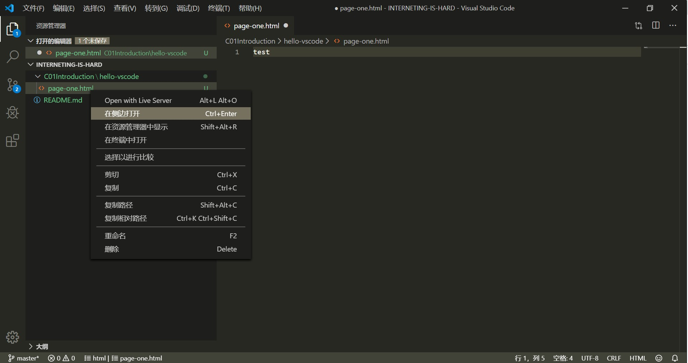

# 第一章：概述

教材：[Introduction](https://internetingishard.com/html-and-css/introduction/)

---

## HTML, CSS, & JAVASCRIPT

* **HTML**：HyperText Markup Language 超文本标记语言用于通过标记为原始内容添加含义
* **CSS**：Cascading Style Sheets 层叠样式表用于格式化标记的内容
* **JavaScript**：使内容和格式具有交互性

HTML，CSS 和 JavaScript 是完全不同的语言，但是它们都以某种方式相互引用。大多数网站都依赖这三种语言，但是每个网站的外观由HTML和CSS决定。

## 动手学习

该教程鼓励动手学习，本教程的全部内容都围绕具体的示例进行，并解释了 HTML 和 CSS 的概念方方面面。为了充分利用本教程，应该积极创建网页，并遵循每一章的每个步骤。应该键入每个代码，而不是将其复制粘贴到文本编辑器中。因为这是作为真正的 Web 开发人员实际要做的事情，手动输入示例代码可以增强肌肉记忆力。

## 使用工具

对于本教程，只需要一个就手的文本编辑器和浏览器。该笔记和代码编写测试基于 [Visual Studio Code](https://code.visualstudio.com/) 文本编辑器和 [Chrome](https://www.google.cn/chrome/index.html) 浏览器。

**Google Chrome 备用链接**：

- Mac [备用地址](http://www.chromeliulanqi.com/Chrome_Latest_Setup.exe)
- Windows 64位 [备用地址](http://www.chromeliulanqi.com/ChromeStandaloneSetup64.exe)
- Windows 32位 [备用地址](http://www.chromeliulanqi.com/beta.exe)

**VS Code 使用技巧**：[按我说的来，让 VS Code 更好用10倍 | VS Code 新手指南](https://mp.weixin.qq.com/s/LbSJjyB8xTa-ozpwZRmnxg)

* `Ctrl + Tab` 已打开文件标签间切换

* `Ctrl +P` 快速打开，输入关键字可以进行模糊搜索文件，按 `Enter` 可打开目标文件

* 分栏显示：右键选择文件 - > `在侧栏打开`

  
  
* 插件

  * [Chinese (Simplified) Language Pack for Visual Studio Code](https://marketplace.visualstudio.com/items?itemName=MS-CEINTL.vscode-language-pack-zh-hans) 软件汉化包
  * [Bracket Pair Colorizer](https://marketplace.visualstudio.com/items?itemName=CoenraadS.bracket-pair-colorizer) 括号着色匹配
  * [Code Spell Checker](https://marketplace.visualstudio.com/items?itemName=streetsidesoftware.code-spell-checker) 拼写检查
  * **[HTML Boilerplate](https://marketplace.visualstudio.com/items?itemName=sidthesloth.html5-boilerplate)** 基本的 HTML5 模板代码片段生成器
  * [Image preview](https://marketplace.visualstudio.com/items?itemName=kisstkondoros.vscode-gutter-preview) 图像预览
  * [Live Server](https://marketplace.visualstudio.com/items?itemName=ritwickdey.LiveServer) 启动具有实时重新加载功能的本地服务器，用于静态和动态页面开发
  * [Polacode-2019](https://marketplace.visualstudio.com/items?itemName=jeff-hykin.polacode-2019) 代码片段图片生成器
  * [VS Color Picker](https://marketplace.visualstudio.com/items?itemName=lihui.vs-color-picker) 采色器

**浏览器**：使用 Chrome 浏览器打开 `page-one-html`  文件，查看网页渲染效果。当在 VSCode 中修改代码并保存后，可以在浏览器中使用快捷键 `Ctrl + R` 重新渲染网页，查看修改结果。

**Git 课程推荐**：

* [用 Git 进行版本控制](https://cn.udacity.com/course/version-control-with-git--ud123/)
* [如何使用 Git 和 GitHub](https://cn.udacity.com/course/how-to-use-git-and-github--ud775)

## 基本的工作流程

在 VSCode 中编写代码（并保存），在浏览器中查看网页渲染效果。