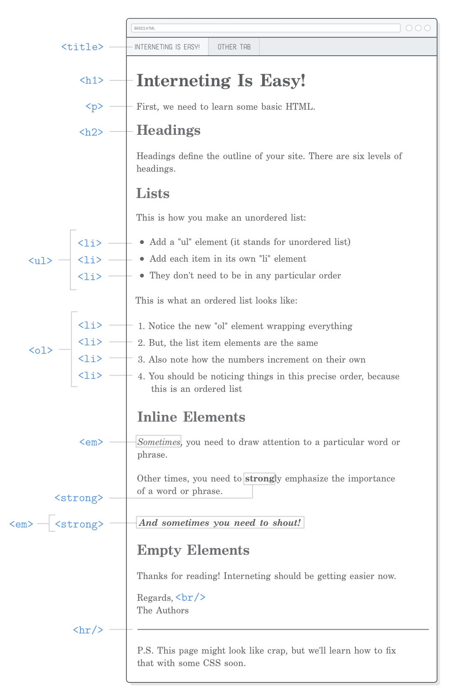

# 第二章：网页基础

教材：[Basic Web Pages](https://internetingishard.com/html-and-css/basic-web-pages/)

---

HTML 是使用标签「标记」原始的内容，以告诉网络浏览器希望如何显示不同的部分（不同标签一般对应不同的外观格式）。


类似于一些所见即所得 WYSIWYG What You See Is What You Get 文本编辑器，如 Microsoft Word，使用标题、段落、列表等对文本进行标记，在 HTML 文件中使用标签对内容进行标记。


## 网页结构

在目录 `basic-web-pages` 创建文件 `basics.html`，一个 HTML 文件代表一个网页。

**基本的 HTML 文件结构如下**

```html
<!DOCTYPE html>
<html>
    <head>
        <!-- Metadata goes here -->
    </head>
    <body>
        <!-- Content goes here -->
    </body>
</html>
```

* `<!DOCTYPE html>` 位于 HTML 文件第一行，该一特殊的语句用于告诉浏览器该这是一个 HTML5 网页文件

* `<html>` 该标签称为开始标签，`</html>` 称为结束标签。其他功能的标签结构类似。

* `<html>` 和 `</html>` 以及  标签中的内容构成 HTML 元素。整个网页需要在 `<html>` 标签中。

* `<head>` 元素中包含所有与网页相关的元信息 metadata，如 网页标题、CSS 样式表等。该元素中的内容并不会在网页上向用户显示。

* `<body>` 元素中包含大量其他元素，构成网页主体。

* `<!-- text -->` 示例中含有两条类似结构的标签是注释，即在渲染网页时浏览器会忽略的内容，但注释说明的内容对于开发者十分必要。

* 元素以嵌套的形式组成父子关系，形成树形结构。需要确保元素的层级嵌套顺序，不可重叠标签，否则会报错。

  ```html
  <!-- (Don't ever do this) -->
  <head>
      <title>Interneting Is Easy!</title>
  </head>
  ```

  

## 网页标题

标签 `<title>` 以设置网页的标题，该内容会出现在浏览器网页标签栏 Tab 和搜索引擎展示的条目中。

网页标题是网页的元信息，需要在 `<head>` 元素内添加，且为了便于阅读应该进行两次缩进。

**HTML 文件代码更新**

```html
<!DOCTYPE html>
<html>
    <head>
        <title>Interneting Is Easy!</title>
    </head>
    <body>
        <!-- Content goes here -->
    </body>
</html>
```


提示：缩进的空格数量应与开发团队开发习惯一致，可在 VSCode 中设置（菜单栏 `文件` -> `首选项` -> `设置` -> `文本编辑器` -> 编辑 `Tab Size`）


## 段落

标签 `<p>` 以增添独立段落，段落是网页的可视内容需要在 `<body>` 元素内添加，注意缩进处理。

**HTML 文件代码更新**

 ```html
<!DOCTYPE html>
<html>
    <head>
        <title>Interneting Is Easy!</title>
    </head>
    <body>
        <p>
            First, we need to learn some basic HTML.
        </p>
    </body>
</html>
 ```


## 标题

HTML 提供 6 级标题标签，从 `<h1>` 到 `<h6>` 数值越大等级越低，即字体越小，突出显示效果越弱。

标题是对网页不同部分进行区分的主要方法，对于用户和搜索引擎均是友好的，可以通过标题快速定位跳转到网页的指定区域。

**HTML 文件代码更新**

```html
<!DOCTYPE html>
<html>
    <head>
        <title>Interneting Is Easy!</title>
    </head>
    <body>
        <h1>Interneting Is Easy!</h1>
        <p>First, we need to learn some basic HTML.</p>
        
        <h2>Headings</h2>
        <p>Headings define the outline of your sites. There are six levels of headings.</p>
    </body>
</html>
```


## 无序列表

标签 `ul` 添加无序列表，其中每一项都需要用标签 `<li>` 包含。

无序列表适用于罗列物品清单、产品特点、正反观点比较、导航菜单等

**HTML 文件代码更新**

```html
<!DOCTYPE html>
<html>
    <head>
        <title>Interneting Is Easy!</title>
    </head>
    <body>
        <h1>Interneting Is Easy!</h1>
        <p>First, we need to learn some basic HTML.</p>
        
        <h2>Headings</h2>
        <p>Headings define the outline of your sites. There are six levels of headings.</p>
        
        <h2>Lists</h2>
        
        <p>This is how you make an unordered list:</p>
        
        <ul>
            <li>Add a "ul" element (it stands for unordered list)</li>
            <li>Add each item in its own "li" element</li>
            <lil>They don't need to be in any particular order</lil>
        </ul>
    </body>
</html>
```

:warning: [HTML 有严格规定](https://developer.mozilla.org/en-US/docs/Web/HTML/Element/ul)可内嵌的元素，对于 `<ul>` 元素可内嵌的子元素只有 `<li>` 元素，若需要内嵌其他元素则需要再内嵌在 `<li>` 元素中。更多的规则可以参考 **Mozilla Developer Network (MDN)** 或搜索引擎查找关键字 `MDN<some-element>`

```html
<!-- (This is bad!) -->
<ul>
    <p>Add a "ul" element (it stands for unordered list)</p>
</ul>

<!-- (Do this instead) -->
<ul>
    <li><p>Add a "ul" element (it stands for unordered list)</p></li>
</ul>
```


## 有序列表

标签 `<ol>` 添加有序列表，其中每一项也同样都需要用标签 `<li>` 包含。

有序列表适合罗列菜谱、说明指引或目录等。

**HTML 文件代码更新**

```html
<!DOCTYPE html>
<html>
    <head>
        <title>Interneting Is Easy!</title>
    </head>
    <body>
        <h1>Interneting Is Easy!</h1>
        <p>First, we need to learn some basic HTML.</p>
        
        <h2>Headings</h2>
        <p>Headings define the outline of your sites. There are six levels of headings.</p>
        
        <h2>Lists</h2>
        
        <p>This is how you make an unordered list:</p>
        
        <ul>
            <li>Add a "ul" element (it stands for unordered list)</li>
            <li>Add each item in its own "li" element</li>
            <lil>They don't need to be in any particular order</lil>
        </ul>
        
        <p>This is what an ordered list looks like:</p>
        
        <ol>
            <li>Notice the new "ol" element wrapping everything</li>
            <li>But, the list item elements are the same</li>
            <li>Also note how the numbers increment on their own</li>
            <li>You should be noticing things is this precise order, because this is an ordered list</li>
        </ol>
    </body>
</html>
```

无序列表中项目变换顺序对于上下文理解并不影响，而当项目顺序对内容理解有影响则可以使用有序列表，这对于搜索引擎、浏览器渲染和用户阅读都十分重要。

项目序号的其他样式会在 [第四章：CSS](../C04_HELLO_CSS/C04_HELLO_CSS.md) 中讲解。


## 强调（斜体）元素

标签 `<em>` 为文本设置强调样式，即文字斜体 italics 显示。

**HTML 文件代码更新**

```html
<!DOCTYPE html>
<html>
    <head>
        <title>Interneting Is Easy!</title>
    </head>
    <body>
        <h1>Interneting Is Easy!</h1>
        <p>First, we need to learn some basic HTML.</p>
        
        <h2>Headings</h2>
        <p>Headings define the outline of your sites. There are six levels of headings.</p>
        
        <h2>Lists</h2>
        
        <p>This is how you make an unordered list:</p>
        
        <ul>
            <li>Add a "ul" element (it stands for unordered list)</li>
            <li>Add each item in its own "li" element</li>
            <lil>They don't need to be in any particular order</lil>
        </ul>
        
        <p>This is what an ordered list looks like:</p>
        
        <ol>
            <li>Notice the new "ol" element wrapping everything</li>
            <li>But, the list item elements are the same</li>
            <li>Also note how the numbers increment on their own</li>
            <li>You should be noticing things is this precise order, because this is an ordered list</li>
        </ol>
        
        <h2>Inline Elements</h2>
        
        <p><em>Sometimes</em>, you need to draw attention to a particular word or phrase.</p>
    </body>
</html>
```

标签 `<em>` 是 inline element 或称为语句型元素（ phrasing content），这类元素所占空间基于其包含的内容（文字）长短，如 `<em>` 元素只是影响段落里的部分文字。

相对应的是 block element 或称为文档流型（flow content），这类元素占据一行空间，如 `<p>` 元素。

block elements 和 inline elements 在 [第五章：盒子模型](../C05_CSS_BOX_MODEL/C05_CSS_BOX_MODEL.md) 讲解其对于网页布局的作用。

> HTML5 出现之前，经常把元素按照 block、inline、inline-block 来区分。在 HTML5 中，元素不再按 `display`属性来区分，而是按照[内容模型](http://www.cnblogs.com/xiaohuochai/p/5046584.html)来区分，分为元数据型 metadata content、区块型 sectioning content、标题型 heading content、文档流型 flow content、语句型 phrasing content、内嵌型 embedded content、交互型 interactive content。
>
> *参考：[HTML5标签嵌套规则](https://www.cnblogs.com/xiaohuochai/p/5433698.html)*


## （更）强调（加粗）元素

标签 `<strong>` 是更明显的强调，即文字以粗体显示。

**HTML 文件代码更新**

```html
<!DOCTYPE html>
<html>
    <head>
        <title>Interneting Is Easy!</title>
    </head>
    <body>
        <h1>Interneting Is Easy!</h1>
        <p>First, we need to learn some basic HTML.</p>
        
        <h2>Headings</h2>
        <p>Headings define the outline of your sites. There are six levels of headings.</p>
        
        <h2>Lists</h2>
        
        <p>This is how you make an unordered list:</p>
        
        <ul>
            <li>Add a "ul" element (it stands for unordered list)</li>
            <li>Add each item in its own "li" element</li>
            <lil>They don't need to be in any particular order</lil>
        </ul>
        
        <p>This is what an ordered list looks like:</p>
        
        <ol>
            <li>Notice the new "ol" element wrapping everything</li>
            <li>But, the list item elements are the same</li>
            <li>Also note how the numbers increment on their own</li>
            <li>You should be noticing things is this precise order, because this is an ordered list</li>
        </ol>
        
        <h2>Inline Elements</h2>
        
        <p><em>Sometimes</em>, you need to draw attention to a particular word or phrase.</p>
        
        <p>Other times you need to <strong>strong</strong>ly emphasize the importance of a word or phrase.</p>
    </body>
</html>
```

如果需要跟进一步着重强调文字，可以同时使用 `<em>` 标签和 `<strong>` 标签（嵌套在一起，顺序不影响效果），其效果是加粗斜体。

```html
<p><em><strong>And sometimes you need to shout!</strong></em></p>
```

更多关于字体加粗或斜体的讲解可以查看 [第十四章：字体](..\C14_WEB_TYPOGRAPHY\C14_WEB_TYPOGRAPHY.md)。


## 结构 VS 外观

HTML 标签是提供语义信息的，虽然不同的标签可能会赋予不同文本特定的外观，但更详细的外观设定是通过 CSS 设置的；也就是说，HTML 是定义文档的结构，CSS 是定义文档的外观。

以前使用 `<i>` 和 `<b>` 分别表示字体的斜体和加粗，但在 HTML5 中分别以 `<em>` 和 `<strong>` 来表示，这是由于新的标签更具语义，也可以通过标签选择器在 CSS 为该语义的文本设置更显著可视的强调样式（如设置不同字体、不同颜色或更大的字号），关于 CSS 设置的更详细讲解可以查看 [第四章：CSS](../C04_HELLO_CSS/C04_HELLO_CSS.md) 。

>在默认情况下，它们的视觉效果是一样的。但语义是不同的。 `<em>` 标签表示其内容的着重强调，而 `<i>` 标签表示从正常散文中区分出的文本，例如外来词，虚构人物的思想，或者当文本指的是一个词语的定义，而不是其语义含义。（作品的标题，例如书籍或电影的名字，应该使用 `<cite>`。）
>
>参考：[<em> - HTML（超文本标记语言） | MDN](https://developer.mozilla.org/zh-CN/docs/Web/HTML/Element/em)


## 空元素

部分 HTML 元素只有一个标签，而非像开始标签和结束标签成对出现，换行和水平线标签就是这一类元素。

### 换行

标签 `<br/>` 告诉浏览器进行换行，该元素是「空」元素或称为「自闭合」元素，只有一个标签。

**HTML 文件代码更新**

```html
<!DOCTYPE html>
<html>
    <head>
        <title>Interneting Is Easy!</title>
    </head>
    <body>
        <h1>Interneting Is Easy!</h1>
        <p>First, we need to learn some basic HTML.</p>
        
        <h2>Headings</h2>
        <p>Headings define the outline of your sites. There are six levels of headings.</p>
        
        <h2>Lists</h2>
        
        <p>This is how you make an unordered list:</p>
        
        <ul>
            <li>Add a "ul" element (it stands for unordered list)</li>
            <li>Add each item in its own "li" element</li>
            <lil>They don't need to be in any particular order</lil>
        </ul>
        
        <p>This is what an ordered list looks like:</p>
        
        <ol>
            <li>Notice the new "ol" element wrapping everything</li>
            <li>But, the list item elements are the same</li>
            <li>Also note how the numbers increment on their own</li>
            <li>You should be noticing things is this precise order, because this is an ordered list</li>
        </ol>
        
        <h2>Inline Elements</h2>
        
        <p><em>Sometimes</em>, you need to draw attention to a particular word or phrase.</p>
        
        <p>Other times you need to <strong>strong</strong>ly emphasize the importance of a word or phrase.</p>
        
        <p><em><strong>And sometimes you need to shout!</strong></em></p>
        
        <h2>Empty Elements</h2>
        
        <p>Thanks for reading! Interneting shoud be getting easier now.</p>
        
        <p>Regards,<br/>
        The Authors</p>
    </body>
</html>
```

换行元素 `<br/>` 在格式化文本十分有用，如俳句、歌词等文本。

但需要注意，HTML 标签是由语义的，不可滥用换行标签 `<br/>` 来实现大范围的留空，而应该通过 CSS 进行样式设置。

### 水平线

标签 `<hr/>` 添加一条水平线，一般用于章节结束处、主题结束处、信件末尾或附言结束处，以分隔上下内容。

**HTML 文件代码更新**

```html
<!DOCTYPE html>
<html>
    <head>
        <title>Interneting Is Easy!</title>
    </head>
    <body>
        <h1>Interneting Is Easy!</h1>
        <p>First, we need to learn some basic HTML.</p>
        
        <h2>Headings</h2>
        <p>Headings define the outline of your sites. There are six levels of headings.</p>
        
        <h2>Lists</h2>
        
        <p>This is how you make an unordered list:</p>
        
        <ul>
            <li>Add a "ul" element (it stands for unordered list)</li>
            <li>Add each item in its own "li" element</li>
            <lil>They don't need to be in any particular order</lil>
        </ul>
        
        <p>This is what an ordered list looks like:</p>
        
        <ol>
            <li>Notice the new "ol" element wrapping everything</li>
            <li>But, the list item elements are the same</li>
            <li>Also note how the numbers increment on their own</li>
            <li>You should be noticing things is this precise order, because this is an ordered list</li>
        </ol>
        
        <h2>Inline Elements</h2>
        
        <p><em>Sometimes</em>, you need to draw attention to a particular word or phrase.</p>
        
        <p>Other times you need to <strong>strong</strong>ly emphasize the importance of a word or phrase.</p>
        
        <p><em><strong>And sometimes you need to shout!</strong></em></p>
        
        <h2>Empty Elements</h2>
        
        <p>Thanks for reading! Interneting shoud be getting easier now.</p>
        
        <p>Regards,<br/>
        The Authors</p>
        
        <hr/>
        
        <p>P.S. This page might look like crap, but we'll fix that with some CSS soon.</p>
    </body>
</html>
```

作为 HTML 标签水平线也是有语义的，不能为了美观随意使用该标签，若需要增添外观样式提高页面美感应该使用 CSS 的 `border` 属性。

标签 `<hr/>` 默认样式是水平线，可以通过 CSS 设置更多样的样式，如定制水平线上下所占的空间、水平分割符的样式等。

### 可选择斜杠

「空」元素后的斜杠 `/` 是可选择添加的，但为了更清晰地表示该该元素是「自闭合」的推荐使用斜杠 `/`，并且可以避免开发者错误地在文档中寻找这些元素的结束标签。

## 总结

网页是由 HTML 标签构成，每一个标签都为文本增添特定的语义，且标签是可嵌套的。

这一章编写的 `basic.html` 网页渲染如下：

