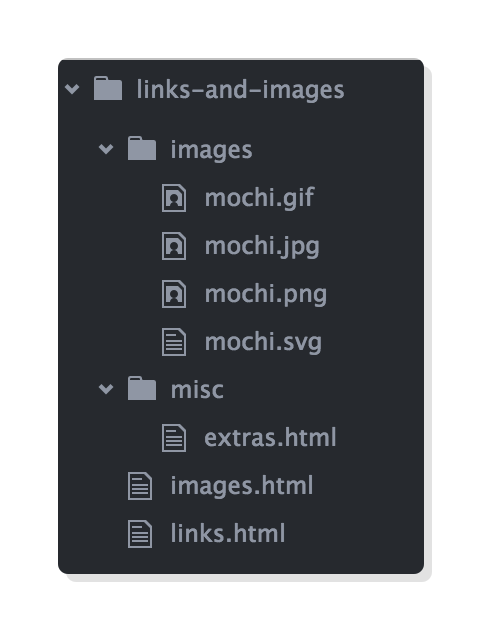

# 第三章：链接与图片

教材：[links and images](https://internetingishard.com/html-and-css/links-and-images/)

---

链接和图片是网页的基本要素，与其他元素不同，这两个元素与外部资源相关。

链接是指向其他 HTML 文档，图片则是拉取其他资源到网页。使用图片和链接元素需要学习一个知识点：属性 attributes。

实际上，这一章的主题是文件和目录组织，由于链接和图片涉及多文件，合理地组织文件对于网页开发十分重要。

## 配置

按照教材指引创建相应的文件和目录，下载所需[图片](https://internetingishard.com/html-and-css/links-and-images/images-4149f7.zip)并解压。




## 锚标签

标签 `<a>` 创建链接，`a` 是表示单词 anchor 即连接之意。

**在 `links.html` 文档的 `<body>` 元素内添加代码：**

```html
<p>This example is about links and <a>images</a>.</p>
```

但是仅使用该标签并未在网页中成功渲染链接。还需要设置该元素的属性。


## 链接

元素的属性 attribute 用于为其相关内容增添信息，如锚标签的属性 `href` 设置用户点击 `<a>` 元素时链接到何处。

不同元素可以设置不同属性，参考 [MDN](https://developer.mozilla.org/en-US/docs/Web/HTML/Element) 获取更详细规定。

**修改上一小节的代码：**

```html
<p>This example is about links and <a href='imges.html'>imgaes</a>.</p>
```

属性设置在开始标签里，属性名 `href` 在等号 `=` 左侧，右侧属性值需要在引号内（单引号 `''` 或双引号 `""` 均可）。

设置属性 `href` 以添加链接，之后网页可以对标记为链接的文本渲染默认样式，即蓝色字体且有蓝色下划线。


## 绝对、相对、根（目录）相对链接

网站是有一堆 HTML 文件构成的，并通过目录构成一个合理的组织结构，文件之间可以通过链接相互指向让用户进行访问。

在网页开发中一般使用 统一资源标识符 uniform resource locators（URLs）来指代文件地址，即元素 `<a>` 里的属性 `href` 设置的属性值。根据指向文件所在的位置可以采用不同的 URLs 形式，主要是指

* 绝对链接 absolute links
* 相对链接 relative links
* 根目录相对链接 root-relative links

### 绝对链接

绝对路径是一个完整的 URLs，由协议开头，紧跟着是服务器域名，最后是路径。如一个完整的 URLS `https://developer.mozilla.org/en-US/docs/Web/HTML` 对应的三部分是：

* **协议** `http://` 或 `https://`
* **域名** `developer.mozilla.org`
* **路径** `/en-US/docs/web/html`

**在 `links.html` 文档的 `<body>` 元素内添加代码：**

```html
<li>Absolute links, like to
	<a href='https://developer.mozilla.org/en-US/docs/Web/HTML'>Mozilla Developer Network</a>, which is a very good resource for web developers.</li>
```

绝对链接一般用于指向不同网站的资源，对于站内或存放在同一目录下的资源使用相对链接或根目录相对链接。

### 相对链接

相对路径是指以当前访问的文件所在的目录为参考点（起点），指向该目录下或子目录（可以包含多级子目录）下的资源。因此使用相对链接需要指向的资源使用同一访问协议，并在同一域名的服务器中。

**在 `links.html` 文档的 `<body>` 元素内添加代码：**

```html
<li>Relative links, like to our <a href='misc/extras.html'>extras page</a></li>
```

示例中属性 `href` 指向的资源是 `extras.html`，其定位是在当前文件 `links.html` 所在目录的子目录 `misc` 中，因此可以使用相对链接 `misc/extras.html` 进行访问。

若需要从子目录文件访问父目录的资源，则需要使用 `..` 句法，连续两点表示一个指向当前文件所在目录的父目录。

如在 `extras.html` 文件中访问其所在目录的父目录中的文件 `images.html`

**在 `links.html` 文档的 `<body>` 元素内添加代码：**

```html
<p>THis page is about miscellaneous HTML things, but you may also be interested in <a href='../links.html'>links</a> or <a href='../images.html'>images</a></p>
```

相对链接只包含文件内部的相对信息，不涉及外部资源信息，因此在移动或修改根目录等信息后（如重命名根目录），并不会破坏链接指向，无需大范围地更新链接。

当需要访问更上一级的目录需要使用更多的 `..` 句法，但是这种方式无法直观阅读，而容易造成编写定位错误，则应该使用根目录相对链接，而相对链接则更适合指向同一个目录或子目录下的资源。

### 根目录相对链接

与相对链接基于当前文件所在目录类似，根目录相对链接是基于当前网页所在网站的根目录。使用根目录相对链接访问资源的前提是需要将网站托管在服务器上，则根目录就是使用斜杠 `/` 表示。

:warning: [本教材](https://internetingishard.com/)的练习都是创建本地 HTML 文件进行的，而非将 网页部署在服务器上，因此无法在文件中使用根目录访问资源。

当使用服务器部署网站后，则可以设置属性 `href` 为 `/` 指向网站的主页。

```html
<!-- This won't work for our local HTML files -->
<li>Root-relative links, like to the <a href='/'>home page</a> of our website, but those aren't useful to us right now.</li>
```

与相对链接不同的是，根目录相对链接是基于根目录 `/` 的，因此可以在任何目录的文件中访问在同一根目录下的其他资源，而不需要在访问父目录资源时使用 `..` 句法返回上一级。

根目录相对链接更显性地描述资源的定位点，常用于网页开发中。	


## 链接目标

锚标签属性 `target` 设置打开链接的方式，其默认值是 `_self` 即在当前的页面打开链接，当需要在新的标签栏打开链接可以设置属性值为 `_blank`，此外还有其他的属性值可以参考 [MDN](https://developer.mozilla.org/zh-CN/docs/Web/HTML/Element/a)。

**在 `links.html` 文档的 `<body>` 元素内添加代码：**

```html
<li>Absolute links, like to
	<a href='https://developer.mozilla.org/en-US/docs/Web/HTML' target='_blank'>Mozilla Developer Network</a>, which is a very good resource for web developers.</li>
```

当元素有多个属性需要设置时，属性之间用空格或换行分隔。


## 命名约定

文件或目录对于用户十分重要，由它们构成的路径会出现在地址栏中，因此开发者需要遵循命名规范：

* 命名即尽可能不使用空格，若需要分隔单词应该使用 连字号 `-` 
* 单词都是用小写字母

若使用了空格命名 HTML 文件，如在目录 `links-and-images` 中创建 `spaces are bad.html` 文件，在浏览器中打开该文件，地址栏显示如下

```
links-and-images/space%20are%20bad.html
```

路径中的文件或目录名含空格时，浏览器会自动将其替换为 `%20` 字符，因为 URLs 中是不允许有空格构成的。


## 图像

标签 `` 为页面添加图片，其中属性 `src` 设置需要加载的图片资源的路径。

**语法：**

```html

```

图片元素 `` 属于「空」元素，即没有结束标签。

对于高分辨率图片和移动设备的窄屏幕需要更多的设置，以更良好地展示图片，更多相关讲解会在 [第十一章：响应式图片](../C11_RESPONSIVE_IMAGES/C11_RESPONSIVE_IMAGES.md)。

除了元素 `` 与图片相关外，还有元素 `<figure>` 和 `<figcaption>`，可以查看 [第十二章：HTML 语义标签](../C12_SEMANTIC_HTML/C12_SEMANTIC_HTML.md)。


## 图片格式

网页开发常见四种图片格式，各有作用与优缺点，适用场景也各不相同，合理使用相应的图片格式可以提高网页的质量和用户体验度：

* JPG
* GIF
* PNG
* SVG

### JPG 格式

`jpg` 格式的图片可以在较小的文件大小下容纳很宽的色域，适合存储照片一类色彩丰富的图片。

但该格式的图片不支持存储透明像素，因此仔细观察这类图片可以看到白色的边缘。

**在 `images.html` 文档的 `<body>` 元素内添加代码：**

```html
<p>This page covers common image formats, but you may also be looking for <a href='links.html'>links</a> and <a href="misc/extras.html">useful extras</a>.</p>

<h2>JPGs</h2>

<p>JPG images are good for photos.</p>


```

### GIF 格式

`gif` 格式的图片适用于存储简单的动画，但是其色域有限制，因此不适宜存储照片。

该格式支持透明像素，但只支持透明与非透明两种值，因此不可以用于存储半透明的像素。如果图片中有半透明的像素，且不含动画，则应该采用 `png` 格式的图片存储。

**在 `images.html` 文档的 `<body>` 元素内添加代码：**

```html
<h2>GIFs</h2>

<p>GIFs are good for animations.</p>


```

### PNG 格式

`png` 格式适用于存储任何非照片或动画的图片，由于在（肉眼可察）相同质量下 `png` 格式的图片文件比 `jpg` 格式的图片文件更大。

由于其很好地支持透明像素，且可容纳较广的色域，因此十分适合作为图标、技术图表、标志等图片格式。

**在 `images.html` 文档的 `<body>` 元素内添加代码：**

```html
<h2>PNGs</h2>

<p>PNGs are good for diagrams and icons.</p>


```

### SVG 格式

`svg` 格式与上述基于像素的图片格式都不同，它是基于矢量的图片格式，即该格式的图片可以无损地缩放，因此 `svg` 图片是响应式设计首要考虑的格式。

其适用场景与 `png` 格式相同，但需要注意一个问题是需要将文本字段转换为路径，以确保在各种浏览器中显示正常。如果图片中含有大量的文字可能会造成文件偏大，则应该选择 `png` 格式。

**在 `images.html` 文档的 `<body>` 元素内添加代码：**

```html
<h2>SVGs</h2>

<p>SVGs are <em>amazing</em>. Use them wherever you can.</p>


```


## 图片尺寸

图片元素 `` 使用图片默认的原始大小渲染图片，而在高分辨的屏幕中，基于像素的图片需要设置为原始大小的一半（以显示正常），可以通过元素的属性 `width` 设置图片在页面渲染展示的宽度。

类似的属性 `height` 设置图片在网页渲染展示的高度，当只设置属性 `width` 或 `height` 其中之一时，另一个维度会按比例缩放；当两个属性同时设置时，图片有可能会被拉伸缩放。

:warning: 设置属性 `width` 或 `height` 属性值时，不需要提供单位，由于基于像素的图片的单位已经默认为 `px` 像素（CSS 像素）。

**更新 `images.html` 文档的 `<body>` 元素内的代码：**

```html
<!-- In JPGs section -->


<!-- In GIFs section -->


<!-- In PNGs section -->

```

属性 `width` 和 `height` 十分有用，但是使用 CSS 设置图片尺寸，这样可以基于媒体查询实现响应式设计，详细讲解在 [第十章：响应式设计](../C10_RESPONSIVE_DESIGN/C10_RESPONSIVE_DESIGN.md) 中。


## 文字替代

图片元素 `` 属性 `alt` 可以为加载的图片添加「文字替代」描述，添加替代性描述是一种极佳的做法，这对于搜索引擎和纯文字浏览器（如由于视力障碍而使用文字转语音软件的人）都十分友好。

**更新 `images.html` 文档的 `<body>` 元素内的代码：**

```html
<!-- In JPGs section -->


<!-- In GIFs section -->


<!-- In PNGs section -->


<!-- In SVGs section -->

```

更多关于属性 `alt` 的例子可以参考 [官方规范](https://www.w3.org/TR/html5/embedded-content-0.html#alt)。


## 更多 HTML 属性

通过设置各种属性为 HTML 文档添加更多信息，如编写文档所使用的语言和字符集。

### 文档语言

元素 `<html>` 的属性 `lang` 设置网页的默认语言，如网页使用英语则应该在开始标签 `<html>` 中将属性 `lang` 设定为 `en`。

**更新所创建的所有 HTML 文档：**

```html
<html lang='en'>
```

如果不清楚开发使用的语言对应的代码，可以在该[网页](http://www.iana.org/assignments/language-subtag-registry/language-subtag-registry)中查询，`description` 描述的是国家/语言，对应的 `subtag` 为语言代码。

### 字符集

字符集影响着字符的渲染，类似于网页开发的字母表。使用适当的字符集才可让网页的字符正确地渲染，否则会出现「乱码」现象。

**在 `misc` 目录中的 `extras.html` 文档的 `<body>` 元素内添加代码：**

```html
<h2>Character Sets</h2>

<p>You can use UTF-8 to count in Turkish:</p>

<ol>
  <li>bir</li>
  <li>iki</li>
  <li>üç</li>
  <li>dört</li>
  <li>beş</li> 
</ol>
```

在网页中添加土耳其语的字符，当浏览器使用默认字符集渲染时，部分字符可能无法正常显示


在元素 `<head>` 内添加 `<meta>` 并在其中设置属性 `charset` 指定使用其他字符集，以正常渲染网页的字符。推荐使用目前网页开发中通用的字符集 UTF-8，该字符集包括了世界上大部分的字符。

**在 `misc` 目录中的 `extras.html` 文档的 `<head>` 元素内添加代码：**

```html
<meta charset='UTF-8'/>
```


## HTML 字符实体

HTML 字符实体是一类有特定功能的字符。由于部分字符不能在 HTML 文档中表示文本内容，即它们是 HTML 中的保留字符或者是键盘上没有按键（无法打印的字符），如果希望正确地显示预留字符，必须在 HTML 源代码中使用它们对应的字符实体。

### 保留字符

字符 `<`、`>` 和 `&` 等称为保留字符，因为它们在 HTML 语法中有特殊的作用，如 `<` 表示标签的开始，`>` 表示标签的结束。而 `&` 则是表示一个字符实体的开始。这些特殊的字符无法避免被浏览器识别编译，因此无法直接显示在页面。

在网页上显示这三个字符应该使用其对应字符实体：

| 保留字符 | 对应的字符实体 |
| -------- | -------------- |
| `<`      | `&lt;`         |
| `>`      | `&gt;`         |
| `&`      | `&amp;`        |

字符实体以 ampersand `&` 开始，以分号 `;` 结束，在其中插入保留字符对应的特殊编码，如以上列表所示 `lt`、`gt`、`amp` 分别对应于 小于号 less-than、大于号 greater-than、ampersand 的编码。

**在 `misc` 目录中的 `extras.html` 文档的 `<body>` 元素内添加代码：**

```html
<h2>HTML Entities</h2>
<p>There are three reserved characters in HTML: &lt; &gt; and &amp;. You should always use HTML entities for these three characters.</p>
```


HTML 有大量字符实体，可以在[这里](https://dev.w3.org/html5/html-author/charref)查询使用。

### 引号

弯引号 curly quote 可能并不重要，但在涉及字体和排版时这类符号很常见。与直引号 straight quote 不同，弯引号会向内「包裹」着字符。

有四种不同弯引号，其对应的字符实体如下：

* `&ldquo;` 左侧双引号
* `&rdquo;` 右侧双引号
* `&lsquo;` 左侧单引号
* `&rsquo;` 右侧单引号

**在 `misc` 目录中的 `extras.html` 文档的 `<body>` 元素内添加代码：**

```html
<p>If you&rsquo;re into &ldquo;web typography,&rdquo; you&rsquo;ll also find yourself using curly quotes quite a bit.</p>
```


> 从形态上看，引号有两种：直引号(straight quotes,也称dumb quote)和弯引号(curly quotes，也叫智能引号，smart quotes)。前者源于早期计算机字符系统对书写规则的简化；而后者则根植于出版印刷界的规范和传统。
>
> 参考：[引号字符种种](http://gerry.lamost.org/blog/?p=295757&utm_source=tuicool&utm_medium=referral)

### UTF-8 与 HTML 字符实体

以前的网页不支持特殊字符，因此只能使用字符实体来渲染特殊字符。而现在主流的 UTF-8 字符集几乎支持所有特殊的字符，所以如今可以之间插入特殊字符到 HTML 文件中而无需编写复杂的字符实体；而现在字符实体则是主要用作渲染打印保留字符，或为方便起见在编辑 HTML 时使用。


## 总结

一个网站的基本构成包括一堆 HTML 文件、图片和 CSS 文件，并将其合理地组织在一起。

现在应该将网页开发视为创作一个网站以提供一种优雅的方式给用户，探寻文件和目录中的资源。基于这种观点，创建一个组织合理的文件系统对于前端开发至关重要。

此外，这一章节学习了许多重要的元素属性，如 `lang` 和 `charset`。根据所学可以创建一个基本网页代码模板，以后所创建的每个网页都应该具有必备的类似结构和元素，并设置好相应的元素属性：

```html
<!DOCTYPE hmtl>
<html lang='en'>
    <head>
        <meta charset='UTF-8'>
        <title>Some Web Page</title>
    </head>
    <body>
        <h1>Some Web Page</h1>
        <!-- Rest of the page content -->
    </body>
</html>
```

