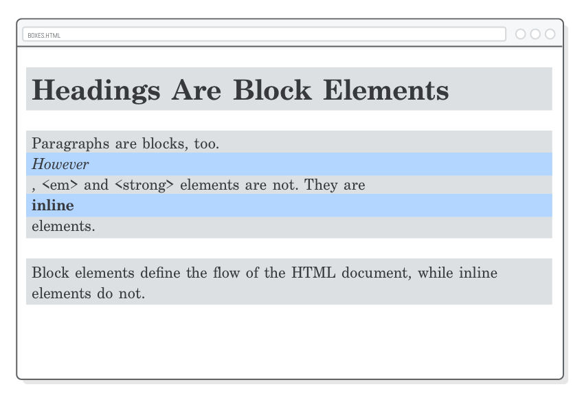
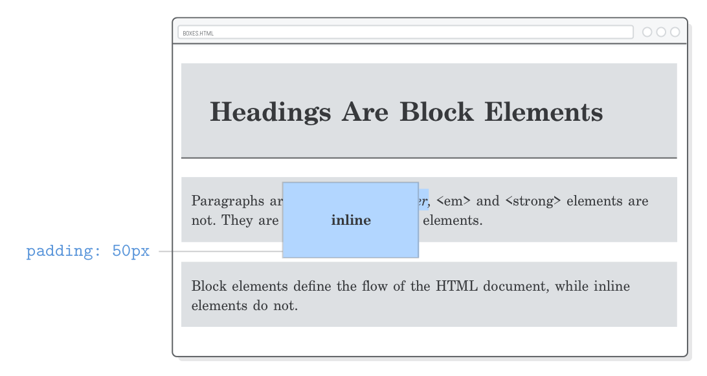

# 第五章：盒子模型

教材：[CSS box model](https://internetingishard.com/html-and-css/css-box-model/#setup)

---

这一章主要介绍使用 CSS 定义网页的元素布局，重点讲解 CSS 盒子模型，包括 padding 内边距、borders 边框、margins 外边距、block boxes 块级盒子、inline boxes 行内盒子等。

CSS 盒子模型是一系列规定网页布局的规则，CSS 以「盒子」为单位来设置 HTML 中每个元素的定位，通过设置盒子模型的属性来定制网页元素的布局方案。


## 配置

按照教材创建 `boxes.html` 和 `box-styles.css` 文档，并编写 HTML 模板代码。


## 块元素与行内元素

在网页上显示的每个 HTML 元素都是在一个「盒子」内渲染而成的，每个 HTML 元素默认属于两种不同的盒子之一：

* "block" boxes 文档流型（flow content）元素构成的块盒子，如元素 `<h1>`、`<p>`
* "inline" boxes 语句型（ phrasing content）元素构成的行内盒子，如元素 `<em>`、`<strong>`


**在 `box-styles.css` 文档中添加代码：**

```css
h1, p {
    background-color: #DDE0E3;    /* Light gray */
}

em, strong {
    background-color: #B2D6FF;    /* Light blue */
}
```

设置 CSS 属性 `background-color` 为 HTML 元素添加背景颜色，其中块元素背景色为浅灰，行内元素背景色为浅蓝色。


块盒子和行内盒子有不同的行为：

* Block box 块盒子：默认依次从上到下排布，称为 HTML 文档的「自然」或「静态」流。块盒子宽度基于父类容器的宽度自动设置，示例中块盒子宽度与浏览器窗口宽度一致。块盒子的高度默认基于其所容纳的内容，如元素 `<h1>` 在缩小浏览器窗口时会换行，则该元素对应的盒子高度会相应增大。
* inline box 行内盒子：并不会影响垂直间距（不可设置高度），并非用于设置网页空间布局，而是用于在区块内对元素的样式进行设置。行内盒子的宽度基于其所容纳的内容。


## 改变盒子行为

CSS 属性 `display` 可以设置 HTML 元素的盒子类型，覆盖其默认的盒子属性以改变其行为。

**更新 `box-styles.css` 文档的代码：**

```css
em, strong {
    background-color: #B2D6FF;    /* Light blue */
    display: block;
}
```

示例将语句型（ phrasing content）元素的 CSS 属性 `display` 修改为 `block`，即元素 `<em>` 和 `<strong>` 会具有 block box 行为，独占一行并与浏览器宽度相同。



通过设置 语句型（ phrasing content）元素 的 CSS 属性 `display` 为 `block`，更改其盒子行为并十分方便地对这些元素进行布局，如将行内元素 `<a>` 作为 按钮（元素 `<button/>` 其 CSS 属性 `display` 为 `inline-block`）使用，或格式化行内元素 `` 的布局。

**更新 `box-styles.css` 文档的代码：**

```css
em, strong {
    background-color: #B2D6FF;    /* Light blue */
    display: inline;    /* This is the default for em and strong */
}
```


## 内容，内边距，边框和外边距

CSS 盒子模型由一组设置网页元素外观样式的规则构成，每一个盒子（block box 和 inlink box）都有四个属性：

* **Content** 内容：元素内包含的文本、图片或其他媒体内容的空间
* **Padding** 内边距：盒子内容和边框之间的空间
* **Border** 边框：盒子内边距和外边距之间的空间
* **Margin** 外边距：在盒子模型边框外周的空间，可用于「留白」


## 内边距

CSS 盒子模型的属性 `padding` 设置选择的 HTML 元素的内边距的样式。

**在 `box-styles.css` 文档中添加代码：**

```css
h1 {
    padding: 50px;
}
```

示例将 HTML 元素 `<h1>` 的 block box 内边距四周扩大至 50 px，由于内边距位于盒子模型「内」（边框 border 以内的区域都是盒子内部），所以扩增的区域其背景色也是浅灰色。

如果希望设置元素的单侧内边距距离，可以设置相应的 CSS 属性：

* `padding-top` 盒子上方内边距
* `padding-bottom` 盒子下方内边距
* `padding-left` 盒子左方内边距
* `padding-right` 盒子右方内边距

**在 `box-styles.css` 文档中添加代码：**

```css
p {
    padding-top: 20px;
    padding-bottom: 20px;
    padding-left: 10px;
    padding-right: 10px;
}
```

设置内边距 padding 属性值时可以使用网页支持的单位，如 `px`、`em` 等，其中相对单位 `em` 是基于基础字体大小的，对于响应式设计十分有用。

### 简写格式

分别设置HTML 元素的 CSS 属性 `padding` 的各边的值时，可以使用简写格式：

* `padding: vertical horizontal` 提供两个值时，对应分别设置盒子的垂直和水平方向的内边距大小

  **更新 `box-styles.css` 文档的代码：**

  ```css
  p {
      padding: 20px 10px; /* Vertical Horizontal */
  }
  ```

  

* `padding: top right bottom left` 提供四个值时，对应分别设置盒子的上、右、下、左（顺时针）的内边距大小

  **更新 `box-styles.css` 文档的代码：**

  ```css
  p {
      padding: 20px 0 20px 10px; /* Top Right Bottom Left */
  }
  ```

  


使用哪一种形式设置类似于 `padding` 允许接收多个值的 CSS 属性，取决于个人编程习惯和团队编程规范。


## 边框

盒子模型的边框是指内边距 padding 外的一条线（样式可变），CSS 属性 `border` 设置选择的 HTML 元素的边框样式。

该属性可同时赋予多种数据类型的属性值，依次是边框线条粗细 `size`、边框样式 `style`、边框颜色 `color`。


**更新 `box-styles.css` 文档的代码：**

```css
h1 {
    padding: 50px;
    border: 1px solid #5D6063;
}
```

示例将 HTML 元素 `<h1>` 的 block box 边框设置为灰色细线。:warning: 边框直接紧挨着添加到内边距之外。

与 CSS 属性 `<padding>` 类似，边框属性也可以分别设置各边的样式，只需要将属性 `border` 与关键字 `-top`、`-bottom`、`-left` 或 `-right` 结合。

**更新 `box-styles.css` 文档的代码：**

```css
h1 {
    padding: 50px;
    border-bottom: 1px solid #5D6063;
}
```

示例只在 HTML 元素 `<h1>` 底部添加灰色细线。

为元素添加一个醒目的边框样式 `border: 1px solid red;` 对于调试十分有用，可以更清晰直观地观察盒子模型的内边距、外边距及整体的大小；调试结束后只需要把这一行 CSS 代码删除即可。

更多盒子边框样式的设置可查看 [border-style - CSS（层叠样式表） | MDN](https://developer.mozilla.org/zh-CN/docs/Web/CSS/border-style)。


## 外边距

盒子模型的外边距是指边框外的空间，即盒子之间的区隔空间。CSS 属性 `margin` 设置选择的 HTML 元素的外边距样式。

**更新 `box-styles.css` 文档的代码：**

```css
p {
    padding: 20px 0 20px 10px; /* Top Right Bottom Left */
    margin-bottom: 50px;    /* Add this */
}
```

示例为 HTML 元素 `<p>` 底部增加外边距空间至 50 px。

与 CSS 属性 `padding` 或 `border` 类似，盒子模型的外边距属性也支持简写格式。

外边距与内边距相似，但是它们两者的使用场景和行为存在差异：

* 内边距是在盒子内的，因此其背景颜色与盒子一致；外边距背景颜色一般是透明。
* 内边距属于元素的可点击范围内（如 HTML 元素 `<button/>` 的内边距可点击），外边距并不是可点击区域。
* 外边距存在垂直折叠，而内边距没有这一行为。

### 行内元素的外边距

行内元素与块元素的明显区别是相应盒子模型外边距行为差别，inline box 是完全忽略上下外边距（无法设置）。

**在 `box-styles.css` 文档中添加代码：**

```css
strong {
    margin:50px;
}
```


类似地，对于 行内元素的 CSS 属性 `padding` 也无法影响网页垂直方向的元素排布。

```css
strong {
    padding: 50px;
}
```



由于行内盒子的样式设置被限制在文本所在的区块内，因此对于整个页面的布局影响有限。

如果想在垂直空间设置网页布局，需要对 block box 进行设置（或将 inline 元素的 CSS 属性 `display` 设置为 `block`）。

:warning: 在设置 CSS 属性 `margin` 但上下外边距无法正常修改时，应该检查选择的元素的 CSS 属性 `display` 的属性值。


## 垂直外边距折叠

CSS 盒子模型一个奇怪的现象是 block box 存在「垂直外边距折叠」，即当垂直方向上两个具有外边距的盒子紧挨着，浏览器只会渲染出其中空间较大的外边距。

**更新 `box-styles.css` 文档的代码：**

```css
p {
    padding: 20px 0 20px 10px; /* Top Right Bottom Left */
    margin-top: 25px;
    margin-bottom: 50px;    /* Add this */
}
```

示例中为每个 HTML 元素 `<p>` 设置了上方外边距为 25 px 和底部外边距 50 px，但浏览器渲染网页时，两个段落之间空间间隔（外边距）只有 50 px，即较小的外边距「陷入」到较大的外边距中，发生了「垂直外边距折叠」。


应该注意 block boxes 这个行为，在设置多个元素之间的间隔时，区间大小是由具有最大外边距的元素决定的。

### 避免外边距折叠

在垂直方向是连续分布的元素的外边距会出现折叠，因此需要避免外边距折叠可以采取以下方式：

* 在其间插入另一个元素，且元素的 block box 盒子高度并非为零

  **在 `boxes.html` 文档中添加代码：**

  ```html
  <p>Paragraphs are blocks, too. <em>However</em>, &lt;em&gt; and &lt;strong&gt; elements are not. They are <strong>inline</strong> elements.</p>
  
  <div style='padding-top: 1px'></div>  <!-- Add this -->
  
  <p>Block elements define the flow of the HTML document, while inline elements do not.</p>
  ```

  在段落间插入 HTML 元素 `<div>` 并设置其 block box 的顶部内边距为 1 px，可以强制避免段落之间发生垂直外边距折叠。

* 只使用块元素的 `padding` 设置边距分隔，:warning: 由于内边距是不会发生折叠的。

* 只设置块元素垂直方向上一边的外边距，如所有块元素都只设置盒子的 `margin-top` 或 `margin-bottom`。

此外使用 [flexbox](../C08_FLEXBOX/C08_FLEXBOX.md) 布局也不存在外边距折叠，在现代网页设计中常常采用该灵活布局技术。


## 通用盒子

一般的 HTML 元素构成的盒子模型都具有特殊的语义；如果可以使用元素 `<div>` 或 `<span>` 来创建通用的盒子模型，由于这两个元素并不具有 HTML 语义，这样的盒子只是单纯用于样式设置。

HTML 元素 `<div>` 和 `<span>` 提供一个「容器」，分别创建是 block box 和 inline box，一般用于将任意多个由语义的元素嵌套在内，并为它们设置 CSS 样式。

**在 `boxes.html` 文档中添加代码：**

```html
<div>Button</div>
```

**在 `box-styles.css` 文档中添加代码：**

```css
div {
    color: #FFF;
    background-color: #5995DA;
    font-weight: bold;
    padding: 20px;
    text-align: center;
    border: 2px solid #5D6063;
    border-radius: 5px;
}
```

示例添加一个 HTML 元素 `<div>` 并为其设置了 CSS 样式，其中 CSS 属性 `border-radius` 设置盒子边框的[圆角](https://developer.mozilla.org/zh-CN/docs/Web/CSS/border-radius)大小（数值是指圆角对于的圆形半径）。

当网页中有多个 `<div>` 元素时，需要单独设置其中一个样式，这时候需要其他 [CSS 选择器](../C06_CSS_SELECTORS/C06_CSS_SELECTORS.md)。

**删除 `boxes.html` 文档中另一个不可视的 `<div>` 元素：**

```html
<div style="padding-top: 1px"></div>
```

​	

## 明确尺寸

不同 HTML 元素对应的盒子会默认自动创建适应内容的尺寸；我们可以通过元素的 CSS 属性 `width` 或 `height` 显式地定义盒子尺寸，覆盖了默认基于内容的盒子大小设置，如 侧边栏 sidebar 一般宽度占 250 px。

**更新 `box-styles.css` 文档的代码：**

```css
div {
    color: #FFF;
    background-color: #5995DA;
    font-weight: bold;
    padding: 20px;
    text-align: center;
    border: 2px solid #5D6063;
    border-radius: 5px;
    width: 200px;
}
```

示例显式地设置元素 `<div>` 盒子宽度为为 200 px，如果盒子文本内容超过预设宽度则文本会自动换行，同时盒子高度会适应性地增大，可以通过 CSS 属性 [`white-space`](https://developer.mozilla.org/zh-CN/docs/Web/CSS/white-space) 和 [`overflow`](https://developer.mozilla.org/zh-CN/docs/Web/CSS/overflow) 设置。


## content-box 与 border-box

通过 CSS 属性 `width` 设置盒子宽度时，默认是设置其 content 内容部分的宽度，而盒子是包括 content 内容、padding 内边距、border 边框，可能会造成浏览器渲染的盒子尺寸比预设大的情况。

HTML 元素对应的盒子 CSS 属性 `box-sizing` 设置了尺寸计算方式，默认值是 `content-box`，即盒子尺寸的大小设置 `width` 只针对内容宽度。


通过修改为 `border-box`，可以将盒子尺寸大小设置 `width` 包括边框、内边距和内容（即内容的尺寸会自动根据盒子总大小，以及边框和内边距大小而调整）。


**更新 `box-styles.css` 文档的代码：**

```css
div {
    color: #FFF;
    background-color: #5995DA;
    font-weight: bold;
    padding: 20px;
    text-align: center;
    border: 2px solid #5D6063;
    border-radius: 5px;
    width: 200px;
    box-sizing: border-box;    /* Add this */
}
```

示例将 HTML 元素 `<div>` 对于的盒子尺寸计算方式设置为基于边框计算，这样对于元素的尺寸设置更直观可控，应该在开发时都采用 `border-box` 的盒子尺寸计算方式。


## 盒子对齐

我们已经知道学习 HTML 元素的 CSS 属性 `text-align`，可用于设置文本或行内元素（对应的 inline boxes）在 block 元素内的对齐方式。

**在 `box-styles.css` 文档中添加代码：**

```css
body {
    text-align: center;
}
```

示例将 HTML 元素 `<body>` 内所有文本相对于父级块元素居中对齐，但 `<body>` 元素内的块元素，如 `<div>` 依然按照默认地居左对齐。


如果需要设置块元素整体在水平方向上的对齐方式，可以通过一下三种方式实现：

* auto-margins：自动分配外边距实现块元素居中对齐
* [floats](../C07_FLOATS/C07_FLOATS.md)：元素浮动实现块元素左或右对齐
* [flexbox 布局](../C08_FLEXBOX/C08_FLEXBOX.md)：实现复杂元素布局

:warning: block 层级的元素对齐与 CSS 属性 `text-align` 完全无关。

### auto-margins 居中

当块元素的 CSS 属性 `margin` 左右外边距设置为 `auto` 时，该元素就会相对于父级块元素居中对齐。

**更新 `box-styles.css` 文档的代码：**

```css
div {
    color: #FFF;
    background-color: #5995DA;
    font-weight: bold;
    padding: 20px;
    text-align: center;
    border: 2px solid #5D6063;
    border-radius: 5px;
    width: 200px;
    box-sizing: border-box;    /* Add this */
    margin: 20px auto;    /* Vertical Horizontal */
}
```


:warning: 设置块元素的左右外边距为 `auot` 以实现居中的方法，只有在设置了块元素的盒子宽度 `width` 才起作用，由于 block box 默认将宽度设置为父类容器的宽度，再设置作为外边距自动分配就没有意义了。


## 样式重置

不同的浏览器会对 HMTL 元素设置不同默认样式，为了使不同用户（使用不同浏览器）获得一致的体验，可以针对所有的 HTML 元素，使用通用 CSS 选择器 `*`，添加 CSS 代码。

**在 `box-styles.css` 文档顶部添加样式重置代码：**

```css
* {
    margin: 0;
    padding: 0;
    box-sizing: border-box;
}
```


示例将所有 HTML 元素的盒子外边距与内边距预设值修改为 0，并将盒子的计算方式更改 `border-box` 即基于外边框。

可能在实际开发中，会添加更复杂的重置样式，目的是避免浏览器加载的默认样式造成不可预知的样式结果。


## 总结

该章节主要介绍 CSS 盒子模型及相关属性：

* 所有元素对应于一个盒子， CSS 盒子无处不在
* 有两类盒子，inline 与 block 水平
* 盒子基本结构是内容 content、内边距 padding、边框 border、外边距 margin
* 盒子模型具有多种属性和行为特点

掌握操作 CSS 盒子模型的方法可以实现大部分的网页布局方式。

