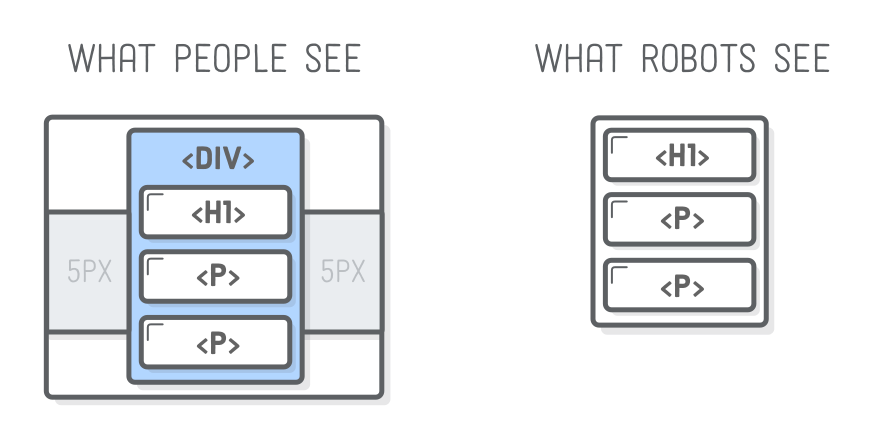
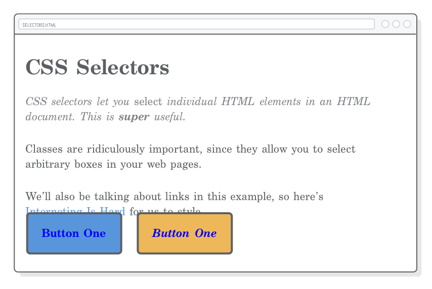

# 第六章：CSS 选择器

教材：[css selectors](https://internetingishard.com/html-and-css/css-selectors/)

---

CSS 选择器可以将样式应用到特定的 HTML 元素中。CSS 选择器有多种：

* 标签选择器 type/element selector：基于标签类型选择元素
* 类别选择器 class selector：基于 class 属性选择元素
* 子元素选择器 descendant selector：基于父元素选择后代元素
* 伪类选择器 pseudo-class selector：基于状态或逻辑选择元素
* ID 选择器 ID selector：基于 ID 属性选择元素


## 配置

根据教材创建 `selectors.html` 和 `styles.css` 文档，并编写预设代码。

文档 `selectors.html`

```html
<!DOCTYPE html>
<html lang='en'>
  <head>
    <meta charset='UTF-8'/>
    <title>CSS Selectors</title>
    <link rel='stylesheet' href='styles.css'/>
  </head>
  <body>
    <h1>CSS Selectors</h1>

    <p>CSS selectors let you <em>select</em> individual HTML elements in an HTML
       document. This is <strong>super</strong> useful.</p>

    <p>Classes are ridiculously important, since they allow you to select
       arbitrary boxes in your web pages.</p>

    <p>We’ll also be talking about links in this example, so here’s
       <a href='https://internetingishard.com'>Interneting Is Hard</a> for us to
       style.</p>

    <div>Button One</div>

  </body>
</html>
```


## 类别选择器

Class selectors 类别选择器可以选择特定的 HTML 元素设置 CSS 样式。

该选择器需要在相应的 HTML 元素内进行设置，并在 CSS 样式表中使用相应的选择器关键字：

* 需要被选中的 HTML 元素的开始标签中设置相应的属性 `class`，属性值几乎可以是任何值，习惯使用全小写和连字符构造属性名（类似于文件或目录名）。:warning: 类的属性值避免使用描述其外观的词汇，由于在响应式设计中，元素的外观可能会自动动态变化。
* 在 CSS 样式表中使用相应的选择器设置样式。使用句点 `.` 作为前缀，以表示使用的是类别选择器，其后为相应元素的 `class` 属性值。

**更新 `selectors.html` 文档的代码：**

```html
<p class='synopsis'>CSS selectors let you <em>select</em> individual HTML elements in an HTML document. This is <strong>super</strong> useful.</p>
```

**在 `styles.css` 文档添加相应代码：**

```css
.synopsis {
    color: #7E8184;    /* Light gray */
    font-style: italic;
}
```

示例为 HTML 文档第一段添加了类属性 `synopsis`，并在样式表中使用类别选择器为第一段添加样式，另第一段样式与其他段落不同。


## 更多 DIV

使用元素 `<div>` 和 `<span>` 可用于创建通用的 block box 或 inline box，并为其设置属性 `class` 就可以灵活地实现对区域化或特定的元素进行样式设置（为嵌套在通用盒子中的元素设置专属样式）。

**更新 `selectors.html` 文档的代码：**

```html
<div class='button'>Button One</div>
```

**在 `styles.css` 文档添加相应代码：**

```css
.button {
    color: #FFF;
    background-color: #5995DA;    /* Blue */
    font-weight: bold;
    padding: 20px;
    text-align: center;
    border: 2px solid #5D6063;
    border-radius: 5px;
    width: 200px;
    margin: 20px auto;
}
```


## 容器 DIV

元素 `<div>` 并不改变 HTML 文档的语义结构，其主要作用是对页面进行结构化的样式设置。

通过 `<div>` 将页面划分区块，可以方便地进行样式设置以呈现更具美感的页面；同时不会添加额外的语义混淆搜索引擎解析。

如将构成网页侧栏的所有 HTML 元素都内嵌于一个 `<div>` 元素中，并设置类属性为 `.sidebar`，即可为侧栏所有元素设置统一样式甚至是元素整体布局。



**在 `selectors.html` 文档添加相应代码：**

```html
<body>
    <div class='page'>    <!-- Add this -->
        <h1>CSS Selectors</h1>

        <p class='synopsis'>CSS selectors let you <em>select</em> individual HTML elements in an HTML document. This is <strong>super</strong> useful.</p>

        <p>Classes are ridiculously important, since they allow you to select arbitrary boxes in your web pages.</p>

        <p>We'll also be talking about links in this example, so here's <a href="https://internetingishard.com">Interneting Is Hard</a> for us to style.</p>

        <div class='button'>Button One</div>
    </div>    <!-- And this -->
</body>
```

**在 `styles.css` 文档添加相应代码：**

```css
.page {
    width: 600px;
    margin: 0 auto;
}
```

示例为 HTML 整个页面添加一个 `<div>` 容器，并将为通用盒子设置固定宽度 600 px 且居中对齐（内嵌的所有块级元素也居中对齐）。不管浏览器窗口大小如何改变，网页宽度都固定为 600 px 且居中位于窗口中。


## 复用类样式

多个 HTML 元素属性 `class` 可以设为同一属性值，这意味着可以复用对应的类样式。

**在 `selectors.html` 文档添加代码：**

```html
<div class='button'>Button Two</div>
```

示例添加了另一个 `<div>` 并为其设置了相同的类属性 `button` 即可复用相应的类样式。

此外，复用类样式的一个优点是只需要在样式表中进行修改，所有对应的 HTML 元素的样式都会同步更改，极大地提高了效率。


## 修改类样式

一个 HTML 元素属性 `class` 可以设置多个属性值，即可将多个类样式设置应用于一个 HTML 元素中，多个属性值之间使用 ` ` 空格分隔。

类样式可复用或覆盖的特点，可以灵活地设置 HTML 各元素的外观样式。

**更新 `selectors.html` 文档的代码：**

```html
<div class='button call-to-action'>Button Two</div>
```

**在 `styles.css` 文档添加相应代码：**

```css
/* under .button setting */

.call-to-action {
    font-style: italic;
    background-color: #EEB75A;    /* Yellow */
}
```

示例为 HTML 第二个 `<div>` 元素增添新的类属性 `call-to-action` ，并在样式表中进行相应的类样式设置，将第二个「按钮」字体设置为斜体，背景色为黄色。

### 顺序的重要性

将多个样式应用于同一个元素时，添加顺序会造成属性重新而影响最终的样式。

CSS 「层叠」特性在同一个样式表中也存在，由于示例的 `.call-to-action` 样式设置在 `.button` 样式设置之下，因此两者都对相同的属性 `background-color` 进行了设置，下方属性就会覆盖上方的属性值。

:warning: 在 HTML 元素内设置类属性的顺序对于样式覆盖并**无**影响，属性值的相对前后顺序并无差别；但如果 HTML 样式设置是通过多种方式实现时（如外部样式表，内部样式表，内联样式等），HTML 引入样式设置的顺序则对样式覆盖有影响。


## 子元素选择器

在设置嵌套元素的样式时，希望针对特定的子元素进行额外的样式设置（但不想重新为子元素添加新的类属性，以便于代码维护），可以使用子元素选择器。

子元素选择器就是将元素选择器（子元素的类型）与其他选择器（可以选中父类元素的选择器）结合构成的，并以空格 ` ` 分隔，如从标题中选择其内嵌的元素 `<em>` 进行样式设置：

```css
h1 em {
    /* Some other styles */
}
```


**在 `styles.css` 文档添加代码：**

```css
.synopsis em {
    font-style: normal;
}
```

示例选择 `.synopsis` 所选择的父类元素内的子类元素 `<em>` ，并设置字体样式。

子元素选择器可以更方便地实现复杂而精准的元素样式设置，而避免创建过多的类属性，更多的子类选择器的用法可参考 [子选择器 - CSS（层叠样式表） | MDN](https://developer.mozilla.org/zh-CN/docs/Web/CSS/Child_combinator)。

### 避免滥用

当子类元素嵌套层级较深时，避免过度使用子类元素选择器，因为造成代码不可复用而仅匹配单个元素。

```css
/* Try to avoid this */
.article h2 .subheading em {
    /* Special styles */
}
```


## 链接伪类选择器

除了在 HTML 文档中编写的元素内容信息外，网页在浏览器中渲染时生成了元素的状态信息（与用户的操作有关），如锚元素 `<a href>` 在浏览器中渲染为链接，允许用户与之交互（鼠标悬浮其上、点击链接、链接到指定资源等操作），浏览器已针对链接不同状态默认设置了不同样式。

伪类选择器可以指向元素处于的某个临时状态，将元素选择器和伪类选择相结合以设置特定状态下元素的样式。浏览器针对不同元素已内置不同的伪类选择器，类似于浏览器为我们针对各元素预设好了类别选择器（而不需自己手动设置类属性）。

### 基本链接样式

CSS 伪类选择器以冒号 `:` 开始，并结合状态相关的名称构成。

锚元素的常见伪类选择器如下：

* `:link` 指向链接未被用户浏览过的状态
* `:visited` 指向链接已被用户浏览过的状态
* `:hover` 指向链接被用户鼠标悬浮的状态
* `:active` 指向链接被用户点击时的状态

**在 `styles.css` 文档添加代码：**

```css
a:link {
    color: blue;
    text-decoration: none;
}

a:visited {
    color: purple;
}

a:hover {
    color: aqua;
    text-decoration: underline;
}

a:active {
    color: red;
}
```

示例使用伪类选择器为元素 `<a>` 多个不同状态设置不同样式，当未在浏览器中打开过链接时，字体为蓝色；鼠标悬浮在链接文字上时，字体为青色；当点击链接时，字体为红色；当在浏览器中已查看过链接指向的页面时，字体为紫色。

此外，请注意在设置字体颜色属性 `color ` 时，不仅仅可以使用颜色的十六进制代码，还可以使用[色彩关键字](https://developer.mozilla.org/zh-CN/docs/Web/CSS/color_value)。

### 已浏览和悬浮状态

可以通过多个伪类相结合来指向元素更具体的状态，如锚元素的伪类选择器 `:visited` 和 `:hover` 相结合可以指向链接已访问过并被鼠标悬浮的状态。

**在 `styles.css` 文档添加代码：**

```css
a:visited:hover {
    color: orange;
}
```

示例为访问过的链接设置鼠标悬浮状态下的样式，文字为橙色。:warning: 由于复杂的 CSS 内置构造，使该设置导致点击样式（字体为红色）破坏了。

### 已浏览和激活状态

上述示例造成的问题（点击样式无法显示）可以通过指定该特定状态的样式来解决。

**在 `styles.css` 文档底部添加代码：**

```css
a:visited:active {
    color: red;
}
```

:warning: 注意样式表中代码添加顺序会影响样式设置的覆盖，为了修正样式需要在**底部**添加新的样式设置代码。


## 按钮伪类选择器

伪类选择器不仅仅适用于文本链接类型的锚元素，还适用于图标链接类型的锚标签（即按钮），甚至可以结合其他选择器（不只是元素选择器）使用。

### 锚元素，非 DIV 元素

**更新 `selectors.html` 文档的代码：**

```html
<a class='button' href='nowhere.html'>Button One</a>
<a class='button call-to-action' href='nowhere.html'>Button Two</a>
```

将 HTML 元素 `<div>` 更改为锚标签 `<a>` 以便添加链接和使用伪类选择器设置相应状态的样式。



但由于锚标签是行内元素，其默认的样式破坏了原来的居中布局，需要将锚标签的 CSS 属性 `display` 设置为 `block`，并设置覆盖其他默认样式，如删除默认的下划线。

### 按钮样式

示例中通过类选择器 `.button` 可以选择锚元素，结合锚元素的伪类选择器可以为按钮不同状态设置不同样式。

**更新 `styles.css` 文档的代码：**

```css
.button:link,    /* Change this */
.button:visited {    /* Change this */
    display: block; /* Add this */
    text-decoration: none; /* Add this */
    color: #FFF;    /* The rest is the same */
    background-color: #5995DA;    /* Blue */
    font-weight: bold;
    padding: 20px;
    text-align: center;
    border: 2px solid #5D6063;
    border-radius: 5px;
    width: 200px;
    margin: 20px auto;
}

.button:hover,
.button:visited:hover {
    color: #FFF;
    background-color: #76AEED;    /* Light blue */
}


```

示例为按钮所有状态下字体都设置为白色，且背景在鼠标悬浮时变为浅蓝色，按钮被点击时恢复为蓝色。

使用类别选择器来选择锚标签，并结合伪类选择器设置状态样式，更方便代码的复用，只需要将锚标签的属性 `class` 设置为 `.button` 即可将其「转换」为可交互的按钮。

### 另一个按钮

示例基于类别选择器和伪类选择器 `.button:link` 对按钮样式进行设置，由于**特意性**更高，将下方基于类别选择器 `.call-to-action` 背景颜色的样式设置覆盖了。

为了避免第二个按钮样式设置被覆盖，需要作出类似的样式设置。

**更新 `styles.css` 文档的代码：**

```css
.call-to-action:link,
.call-to-action:visited {
    font-style: italic;
    background-color: #EEB75A;    /* Yellow */
}

.call-to-action:hover,
.call-to-action:visited:hover {
    background-color: #F5CF8E;    /* Light yellow */
}

.call-to-action:active,
.call-to-action:visited.active {
    background-color: #EEB75A;    /* Yellow */
}
```


## 结构伪类选择器

除了锚元素具有伪类选择器外，还有[很多 HTML 元素具有伪类选择器](https://developer.mozilla.org/zh-CN/docs/Web/CSS/Pseudo-classes)，以提供更消息的筛选信息，指向要选择的元素的特殊状态，如选择器 `Parent tagName:last-of-type` 选择（在给定的父类元素 `Parent` 内）元素类型匹配 `tagName` 的最后一个元素。

**在 `styles.css` 文档底部添加代码：**

```css
p:last-of-type {
    margin-bottom: 50px;
}
```

示例为最后一个段落扩大底部外边距至 50 px。

类似地，可以使用伪类选择器 `:first-type-of` 指向（给定父元素内）元素类型匹配的第一个元素。

**在 `styles.css` 文档底部添加代码：**

```css
p:first-of-type {
    color: #7E8184;
    font-style: italic;
}
```

示例为第一个段落设置字体为斜体，颜色为浅灰色。

通过伪类选择器添加额外信息，更精确地选择元素而无需改变 HTML 内容（为元素增添类属性），完全实现了内容与样式「分离」；但是伪类选择器一般被元素的类型限制，如果 HTML 元素类型改变了，需要修改相应的伪类选择器。

### 警告

伪类选择器十分复杂但是掌握其使用规则后是十分有用的工具。

:warning: 应该注意  `Parent tagName:first-of-type` 和 `Parent tagName:last-of-type` 伪类选择器是指向在作用区域中包含父元素的**所有匹配的子元素（后代元素）**，在复杂嵌套的网页结构中容易造成不可预知的结果。

**在 `selectors.html` 文档元素 `<div class='page>` 中底部添加代码：**

```html
<div class='sidebar'>
    <p>If this page had a sidebar...</p>
    <p>We'd have some problems with pseudo-classes.</p>
</div>
```

示例假设为页面添加侧栏，此时在网页的 `<body>` 元素中，存在两个容器（父元素），大容器是 `<div class='page'>`，内嵌 `<div class='sidebar'>`，并且分别也内嵌了元素 `<p>`。因此在使用伪类选择器设置第一个段落时，两个容器的第一个段落都会被指向并设置一样的样式。

避免伪类选择器指向嵌套的后代元素，可以使用[子选择器 `>（大于号）`](https://developer.mozilla.org/zh-CN/docs/Web/CSS/Child_combinator)（而非[后代选择器 ` `（空格）](https://developer.mozilla.org/zh-CN/docs/Web/CSS/Descendant_combinator)），只选择直接后代的元素（子元素）。`Parent>tagName:first-of-type` 左侧元素为祖先元素，右侧元素为需要匹配的后代元素类型。

**更新 `styles.css` 文档的代码：**

```css
.page > p:first-of-type {
    color: #7E8184;
    font-style: italic;
}
```


## ID 选择器

ID 选择器是最严格的元素筛选器，用法与类别选择器类似，但是每个 ID 属性值只能对应于一个元素，因此 ID 样式不可复用。

该选择器需要在相应的 HTML 元素内进行设置，并在 CSS 样式表中使用相应的选择器关键字：

* 需要被选中的 HTML 元素的开始标签中设置相应的属性 `id`，属性值习惯使用全小写和连字符构造属性名（类似于文件或目录名）。
* 在 CSS 样式表中使用相应的选择器设置样式。使用井号 `#` 作为前缀，以表示使用的是 ID 选择器，其后为相应元素的 `id` 属性值。

**更新 `selectors.html` 文档元素代码：**

```html
<a id='button-2' class='button call-to-action' href='nowhere.html'>Button Two</a>
```

**更新 `styles.css` 文档的代码：**

```CSS
#button-2 {
    color: #5D6063; /* dARK GRAY */
}
```

示例为第二个按钮设置 CSS 属性 `id`，并在样式表中使用 ID 选择器为该元素设置样式，将字体颜色改为深灰色。

由于 ID 选择器具有唯一性，如果需要复用样式，则需要为多个元素分别设置 ID 属性，再基于多个 ID 选择器统一设置样式，这样会造成代码难以维护。因此需要复用样式时推荐使用 class selector 类别选择器。

```css
/* (This is painful to maintain) */
#button-2,
#button-3,
#checkout-button,
#menu-bar-call-to-action {
    color: #5D6063;
}
```

### URL 片段

元素属性 `id` 唯一性是由于它具有另一个作用，即充当 URL 片段。URL 片段与 ID 选择器语法一样，在地址栏的 URL 后添加片段，会让浏览器跳转到相关元素所在的区域。


如果需要链接到当前页面的具体区域，可以将锚标签的属性 `href` 直接设置为对应元素的 ID 选择器（忽略完整的 URL）；如果需要链接到其他页面的具体区域，则属性 `href` 设置时需要添上完整的 URL（结合相应页面中对应元素的 ID 选择器）。

```html
<!-- Frome the same page -->
<a href='#button-2'>Go to Button Two</a>

<!-- From a different page -->
<a href='selectors.html#button-2'>Go to Button Two</a>
```

由于 ID 选择器的双重功能，因此不能滥用属性 `id`，避免由于修改了 URL 片段而忘记更新样式表，造成无法预估的结果。


## CSS 优先级

样式设置的顺序很重要，一般在外部样式表中依照从顶部往底部的顺序进行样式设置的实现，因此底部的设置会覆盖上部的样式设置。

此外，基于不同的选择器的样式设置优先级也不同，即不管样式设置在样式表相对位置如何，基于特定类型的选择器的样式设置权重会更重，会对基于另一种类型选择器作出的样式设置进行覆盖。

**在 `styles.css` 文档中已存在的 `.call-to-action` 规则集下方添加代码：**

```css
.call-to-action:link,
.call-to-action:visited {
    background-color: #D55C5f;    /* Red */
}
```

示例将第二个按钮（未点击或点击后的状态下）的背景色设置为红色。

如果将上述这段代码移至样式表顶部，则该样式设置会如预期地被覆盖，由于新样式使用也是使用伪类选择器（权重相同）。

**在 `styles.css` 文档删除上述代码片段，再在已存在的 `.call-to-action` 规则集上方添加代码：**

```css
#button-2 {
    background-color: #D55C5F;    /* Red */
}
```

由于新的样式设置使用 ID 选择器权限更高，即使将样式设置放置在旧样式设置代码上方，也不会被覆盖。第二个按钮背景颜色会变成红色。

CSS 选择器优先级顺序如下（权重从上到下依次减弱）：

*  ID 选择器：`#button-2`
* 类别选择器的伪类选择器：`.button:link`
* 元素选择器的伪类选择器 与 子元素选择器：`a:link` 与 `.synopsis em`（权重相同）
* 类别选择器：`.button`
* 元素选择器：`a`

CSS 优先级可能引起不可预期的结果，因此一种只是用类别选择器设置整个页面样式的方法学 [BEM](http://getbem.com/introduction/) 应运而生，但仍需要注意同级别的选择器设置样式的次序问题。


## 总结

这一章学习使用多种类型的选择器，以筛选出特定的元素（或元素状态）进行样式设置。类别选择器可以复用，因此它成为了前端开发中最常用的工具之一。

内容与样式分离是网页开发的基本思想，因此在开发流程中首先需要使用 HTML 元素为需要展示的原始内容标记语义，并为其添加相应的属性 `class`，最后再对不同的属性设置类样式。如果中途需要创建额外的结构（如侧栏），则可以使用容器 `<div>` 将多个元素内嵌，创造新的结构区域。