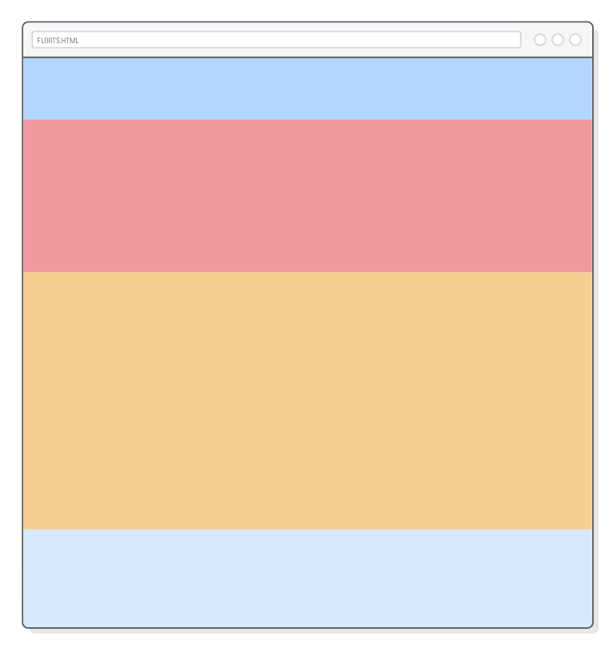
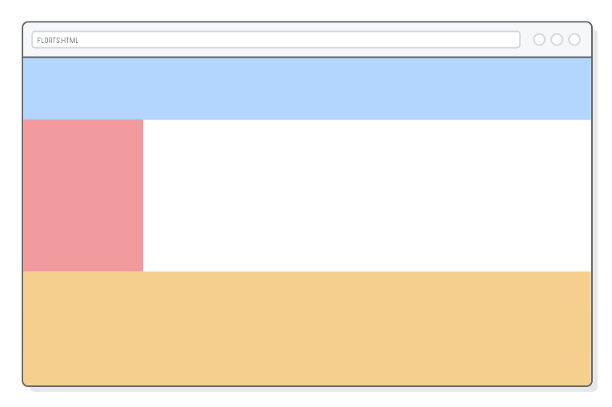
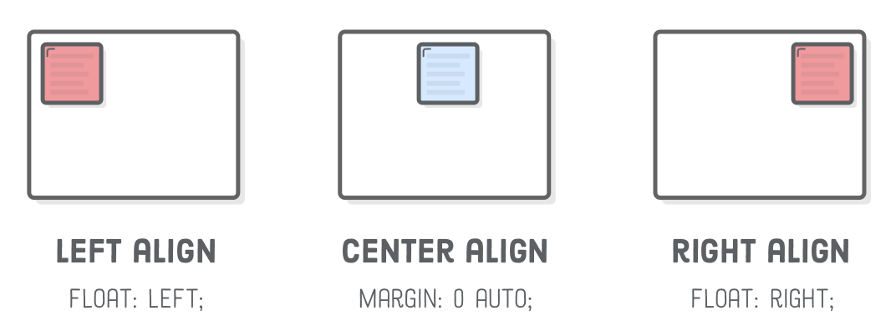
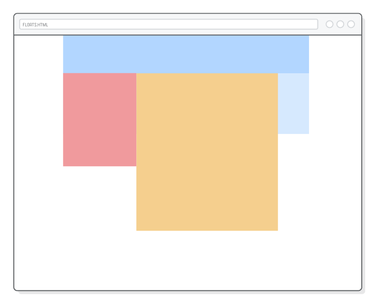
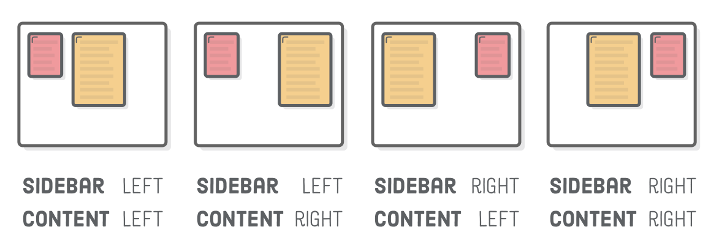
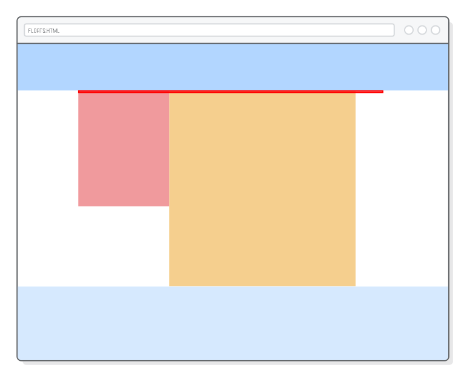

# 第七章：浮动

教材：[floats](https://internetingishard.com/html-and-css/floats/)

---

块元素默认地按照单列排布，即在限制在垂直方向上一个接一个布局。而浮动可以让块元素并排放置，实现水平方向上的布局，虽然这是老式的 Web 开发技巧（现代网页布局主要使用 [Flexbox](../C08_FLEXBOX/C08_FLEXBOX.md) 技术实现），但对于 CSS 布局认识十分有用。

浮动可以实现多种复杂的布局，常见的布局包括：

* 侧栏布局
* 固定宽度布局（居中）
* 等屏宽布局
* 多列布局
* 网格布局
* 杂志样式布局（文字围绕图片排列的布局）


## 配置

创建 `floats.html` 和 `styles.css` 文档，并编写模板代码。


## 默认 HTML 布局行为

HTML 元素默认布局行为是块元素会自动 100% 填充满父类元素的宽度，并且在垂直方向上依次排列，即限制为单列布局。

**在 `styles.css` 文档添加代码：**

```css
.menu {
    height: 100px;
    background-color: #B2D6FF;    /* Medium blue */
}

.sidebar {
    height: 300px;
    background-color: #F09A9D;    /* Red */
}

.content {
    height: 500px;
    background-color: #F5CF8E;    /* Yellow */
}

.footer {
    height: 200px;
    background-color: #D6E9FE;    /* Light blue */
}
```

示例为各类元素 `<div>` 添加各种背景和高度尺寸（通常元素会根据内容来自动适应性地调整盒子的高度，但在本章中我们更加关注布局，不会处理太多实际内容，因此进行显式的高度属性设置）。



当对其中一个块元素的宽度进行显式设置时，由于 HTML 元素的默认布局限制，网页会出现「留白」，即块元素依旧以单列布局分布。

**更新 `styles.css` 文档的代码：**

```css
.sidebar {
    width: 200px;    /* Add this */
    height: 300px;
    background-color: #F09A9D;    /* Red */
}
```




## 浮动一个元素

CSS 属性 `float` 设置块元素水平位置，属性值为 `left` 或 `right` 分别将块元素在「浮动」到父元素（容器）的左侧或右侧。

浮动到左侧或右侧与左对齐或右对齐不同，块元素设置了浮动属性相对于告诉其邻近的块元素它们可以「流动」以填充空余的位置（而不是像默认样式一样保持上下垂直排布）。

**更新 `styles.css` 文档的代码：**

```css
.sidebar {
    float: left;
    width: 200px;    /* Add this */
    height: 300px;
    background-color: #F09A9D;    /* Red */
}
```


示例将侧栏的 CSS 浮动属性设置为 `left`，侧栏会浮动到容器（`.content` 盒子）的左侧，下方邻近的盒子会填充空白的区域，这就获得了杂志样式布局。

类似的将 CSS 属性 `float` 设置为 `right` 可以将块元素浮动到右侧。如果需要取消块元素浮动可以将 CSS 属性 `flaot` 设置为 `left`。而要将块元素居中则需要设置盒子左右外边距属性，一般使用 `margin: 0 auto`。

:warning: 设置块元素左右（浮动）对齐或居中（外边距自动分配）对齐，其前提是先要显式限制块元素的宽度，否则块元素会基于父元素（容器）的宽度自动填充，则无左右对齐或居中的意义。



:warning: 内联元素对应的 inline box 是使用 CSS 属性 `text-align` 设置对齐方式的。


## 在父元素内浮动

块元素是在父元素（容器）内进行浮动的。

**在 `styles.css` 文档中添加代码：**

```css
.page {
    width: 900px;
    margin: 0 auto;
}
```

示例将容器 `.page` 显式设置宽度为 900 px，且居中页面。则子元素浮动范围会限制在容器 `.page` 中（而不是网页最左侧）。


## 多个元素浮动

当上方的元素浮动后，下方的盒子会「向上流动」，会出现两个元素部分重叠。

**更新 `styles.css` 文档中的代码：**

```css
.content {
    width: 650px;    /* Add this */
    height: 500px;
    background-color: #F5CF8E;    /* Yellow */
}
```

上述示例中（橙色）盒子 `.content` 向上流动将浮动的（红色）盒子 `.sidebar` 「包含」在其中，即侧栏容器是浮在内容容器上方。

如果红色的容器是图像则该布局是合理的；但是当前红色容器表示侧栏，内容盒子应该并排在侧栏的右侧更合理，则需要将内容盒子也设置为浮动，方向与侧栏一致为 `left`。

 **在 `styles.css` 文档中添加代码：**

```css
.content {
    float: left;    /* Add this */
    width: 650px;
    height: 500px;
    background-color: #F5CF8E;    /* Yellow */
}
```



示例为两个邻近的元素设置同方向的浮动，则这两个块元素会在水平方向上并排叠放，类似于将块元素默认垂直分布的规则旋转 90°。

通过为连续的块元素设置浮动，可以实现水平并排分布，排布方向根据元素浮动对齐属性值而定。



请留意由于内容盒子布局改变，盒子 `.footer` 的默认布局被破坏了。


## 浮动后

浮动的元素影响水平的空间排布，而对垂直方向的空间无贡献，因此上述示例盒子 `.footer` 会向上流动（即在垂直方向的定位不会受浮动的元素影响），并紧挨着最近的未浮动的块元素 `.Menu`。


浮动的块元素「跳出」了原来的文档流，浮动在父元素之上，对父元素的垂直高度没有贡献。

**更新 `styles.css` 文档中的代码：**

```css
.page {
    width: 900px;
    margin: 0 auto;
    border: 1px solid red;    /* Add this */
}
```


示例为父元素 `.page` 添加红色边框可以更清晰地观察页面容器此时的大小。

有两种方法解决浮动造成的重叠问题，将浮动元素的高度再次纳入父元素（容器）的高度计算中：

* 当容器内的浮动元素之下紧挨着还有（非浮动的）子元素，为子元素设置 CSS 属性 `clear` 
* 当容器内的浮动元素之下没有（非浮动的）子元素，为父元素设置 CSS 属性 `overflow`

### 清除浮动

「清除」浮动是指设置块元素的 CSS 属性 `clear`，以忽略该元素上方任何元素发生的浮动，使其不会「向上流动」，即类似于强制使其遵循默认的垂直流布局。

属性 `clear` 可以设置不同的属性值以忽略特定方向的元素浮动：

* `left` 忽略向左侧浮动的块元素
* `right` 忽略向右侧浮动的块元素
* `both` 忽略两侧浮动（所有）块元素

**更新 `styles.css` 文档中的代码：**

```css
.footer {
    clear: both;    /* Add this */
    height: 200px;
    background-color: #D6E9FE;    /* Light blue */
}
```


示例设置脚注元素属性 `clear` 令其忽略上方的所有浮动，因此预期的布局得以保留。

当块元素 `.footer` 移出了容器后，可以创建**等屏宽布局 full-bleed layout**。似乎在容器外部的元素中设置「清除」浮动，也可以将浮动元素的垂直高度计入文档流中，实际上并非如此。

「清除浮动」以固定元素的设置只有对**容器内部的子元素**才起作用，当元素移出容器该样式设置就被破坏了，而由于脚注已不在容器内才仍然不会「向上流动」。

**更新 `floats.html` 文档中的代码：**

```html
<!DOCTYPE html>
<html lang='en'>
    <head>
        <meta charset='UTF-8'>
        <title>Floats</title>
        <link rel="stylesheet" href="styles.css">
    </head>
    <body>
        <div class='menu'>Menu</div>

        <div class='page'>
            <div class='sidebar'>Sidebar</div>
            <div class='content'>Content</div>
        </div>

        <div class='footer'>Footer</div>
    </body>
</html>
```



示例将块元素 `.menu` 和 `.foot` 移出容器 `.page` 外，得到一个等屏宽布局 full-bleed layout，此时容器 `.page` 内只有浮动元素，观察红色边框可以发现该容器 `.page` 高度为**零**，因此浮动元素对于文档流布局的垂直高度无贡献。

### 隐藏滚动

为了将浮动元素高度纳入到容器的垂直高度中（对于容器背景的正确渲染很重要），可以通过设置容器的 CSS 属性 `overflow` 以将容器内所有浮动元素的高度纳入计算中，属性值设置为 `hidden` 即可。

**更新 `styles.css` 文档中的代码：**

```css
.page {
    width: 900px;
    margin: 0 auto;
    overflow: hidden;    /* Add this */
    background-color: #EAEDF0;    /* Add this */
}
```


示例为容器 `.page` 设置 CSS 属性 `overflow: hidden` 以隐藏浮动元素造成的元素「滚动」，将浮动元素的高度纳入容器的高度计算中。因此页面容器的灰色背景色会包括浮动元素。

有两种方法解决浮动造成的问题：

* 当容器内的浮动元素之下紧挨着还有非浮动的子元素，使用 CSS 属性 `clear` 「清除浮动」
* 当容器内的浮动元素之下没有非浮动的子元素，使用 CSS 属性 `overflow:hidden` 隐藏滚动

这两个选项的基本思想是告诉浏览器将浮动元素的高度合并到其容器元素的高度中，以便显示其背景。


## 等屏宽布局

上述示例由于容器 `.page` 需以将内容和侧栏限制在网页中部，显式设置了宽度却造成背景色未能铺满，因此需要在 `.page` 外层添加一个新的容器 `.container` 并设置的背景色，实现完全的等屏宽布局。

**更新 `floats.html` 文档中的代码：**

```html
<div class='container'>    <!-- Add this -->
            <div class='page'>
                <div class='sidebar'>Sidebar</div>
                <div class='content'>Content</div>
            </div>    <!-- Add this -->
```

**更新 `styles.css` 文档中的代码：**

```css
.page {
    width: 900px;
    margin: 0 auto;
}

.container {
    overflow:hidden;
    background-color: #EAEDF0;
}
```

示例为页面容器外层添加一个新的容器 `.container` 以设置背景色，同时将隐藏滚动设置移到该容器下。

多层嵌套的容器是典型的网页结构。不同的容器作用不同，如示例中容器 `.page` 限制页面内块元素的宽度，容器 `.container` 设置等屏宽布局（需要在其中设置隐藏滚动）。


## 等宽多列浮动

通过多元素浮动可以让块元素在水平方向上堆叠，实现多列布局。

**在 `floats.html` 文档中的添加代码：**

```html
<div class='footer'>
    <div class='column'></div>
    <div class='column'></div>
    <div class='column'></div>
</div>
```

**在 `styles.css` 文档中的添加代码：**

```css
.column {
    float: left;
    width: 31%;
    margin: 20px 1.15%;
    height: 160px;
    background-color: #B2D6FF; /* Medium blue */
}
```


示例为脚注容器 `.footer` 添加三个等宽的块元素（宽度设置为百分比 31% 即 $\frac{1}{3}$），并设置为浮动以实现三列排布。

与显式限制块元素的宽度（单位为 px）不同，将块元素的宽度设置为百分比时其宽度是基于父元素（容器）的宽度而定的。当更改浏览器窗口大小（父元素（容器） `.footer` 的大小随网页大小而变）则这些块元素的宽度也会相应地作出适应性变化，这是[响应式设计](../C10_RESPONSIVE_DESIGN/C10_RESPONSIVE_DESIGN.md)的基础。

类似地，根据浮动子元素是数量设置适当的宽度比例，可以实现任意（等宽或不等宽）列数的布局。


## 网格布局浮动

当添加更多的容器，部分块元素超出父元素的宽度时，它们会自动换行并构成网格布局。

**更新 `floats.html` 文档的代码：**

```html
<div class='footer'>
            <div class='column'></div>
            <div class='column'></div>
            <div class='column'></div>
            <div class='column'></div>
            <div class='column'></div>
            <div class='column'></div>
        </div>
```


示例为脚注容器添加更多的子元素，且宽度比例一样，因此新增的三个元素超过了容器的宽度并自动换行分布。

由于显式地设置容器 `.footer` 的高度，使背景色不可铺满子元素的所有区域。可以设置容器的 CSS 属性 `overflow`，通过隐藏滚动将容器包含的所有浮动元素的垂直高度纳入计算。

**更新 `styles.css` 文档中的代码：**

```css
.footer {
    overflow: hidden;
    background-color: #D6E9FE;    /* Light blue */
}
```


网格布局常用于作为画册展示，将多个浮动块元素放置在容器 `.page` 中，并在浮动元素中嵌套元素 `` 以添加图片。

但是当前现代网页开发主要使用 [Flexbox](../C08_FLEXBOX/C08_FLEXBOX.md) 实现各种布局。

### 关于命名规则

在布局中浮动元素作为布局单位，应该使用合适的命名以显示其正确的含义。

如示例中使用 `.column` 作为脚注的元素并不合适，由于在响应式设计中这些元素并不一定形成多列（在手机窗口大小只能被「压缩」为单列），因此应该避免使用描述外观的词语作为 `class` 属性值。应该使用更具通用性描述的词汇，如 `.footer-item`。


## 内容浮动

元素浮动后下方的块元素会「向上流动」并占据空余的位置，因此会存在元素重叠的部分；而块元素中的内容则不一样，它们会根据浮动元素所占据的空间，自动在容器中重新布局，如杂志格式中文字围绕图片分布。

**在 `floats.html` 文档的添加代码：**

```html
<div class='content'>

    

    <p>Lorem ipsum dolor sit amet consectetur adipisicing elit. Voluptas maiores error facere a, harum pariatur dolorem, sit perspiciatis esse culpa corporis assumenda obcaecati unde laboriosam repudiandae eos quaerat illum id.</p>

    <p>Lorem, ipsum dolor sit amet consectetur adipisicing elit. Laboriosam nam dolor optio. Quod, commodi! Consequuntur voluptatem quas modi voluptas quis rem corrupti aperiam. Similique a, iusto natus recusandae atque est.</p>

    <p>Lorem ipsum dolor, sit amet consectetur adipisicing elit. Et repellendus explicabo nulla! Minima facere voluptatibus sed soluta corrupti, suscipit earum possimus atque sint qui alias tempore esse inventore vero recusandae.</p>

    <p>Lorem ipsum dolor sit amet consectetur adipisicing elit. Harum placeat quae, obcaecati excepturi amet voluptas doloremque veritatis modi nulla maxime sequi ratione odit illo dolore soluta voluptatem. Inventore, odio esse.</p>

</div>
```

**在 `styles.css` 文档中添加代码：**

```css
.content {
    padding: 20px;
}

.article-image {
    float: left;
    width: 300px;
    height: 200px;
    margin-right: 20px;
    margin-bottom: 20px
}

p {
    margin-bottom: 20px;
    border: 
}
```


示例在容器 `.contain` 中添加图片和段落内容，并将图片设置为向左浮动，此外还设置了一系列盒子边距样式。

通过设置图片浮动可以实现杂志布局，虽然段落容器「向上流动」与图片容器部分重叠，但是其中文本内容处理浮动的方式不同，它们会自动排布避免遮挡。

段落内容使用了随机假文，在 Visual Studio Code 中使用关键字 `lorem` 创建。

> Lorem ipsum从15世纪开始就被广泛地使用在西方的[印刷](https://zh.wikipedia.org/wiki/印刷)、设计领域中，在[电脑排版](https://zh.wikipedia.org/w/index.php?title=電腦排版&action=edit&redlink=1)盛行之后，这段被传统印刷产业使用几百年的无意义文字又再度流行。由于这段文字以“Lorem ipsum”起头，并且常被用于标题的测试中，所以一般称为Lorem ipsum，简称为Lipsum。
>
> 参考：[Lorem ipsum - 维基百科，自由的百科全书](https://zh.wikipedia.org/zh-hans/Lorem_ipsum)

网页布局设计步骤一般是一个递归过程：先设置好底层的结构样式，如侧栏布局、导航栏大小等；接着再往内处理更细致的布局，如内容布局。如果网页存在复杂的嵌套结构，则需要多次递归进行各层样式设置。

### （内容）隐藏滚动

评论框布局一般是左侧为头像，右侧为评论内容，与杂志布局不同的是评论文字并不环绕在图像附近。

类似在水平方向上实现元素的隐藏滚动设置。

为了实现内容在「水平方向」隐藏滚动，可以对包含文本内容的块元素（一般是段落元素 `<p>`）设置 `overflow: hidden`。

**更新 `floats.html` 文档的代码：**

```html
<div class='footer'>
            <div class='footer-item'>
                <div class='avatar'></div>
                <h3 class='username'>Bob Smith</h3>
                <p class='comment'>Lorem ipsum dolor sit amet consectetur adipisicing elit. Pariatur unde molestias</p>
            </div>
            <div class='footer-item'></div>
            <div class='footer-item'></div>
            <div class='footer-item'></div>
            <div class='footer-item'></div>
            <div class='footer-item'></div>
        </div>
```

**在 `styles.css` 文档中添加代码：**

```css
.avatar {
    float: left;
    width: 60px;
    height: 60px;
    margin: 25px;
    border-radius: 40px;
    background-color: #D6E9FE;
}

.username {
    margin-top: 30px;
}

.comment {
    margin: 10px;
    overflow: hidden;    /* This is important */
}
```


示例在脚注的其中一个子元素中添加了一条评论（包括头像、标题、段落），并设置头像图标向左浮动，以及一些盒子边距的样式设置。

由于段落设置了 CSS 属性 `overflow: hidden` 因此破坏了原有的杂志样式，段落（内容）隐藏滚动与浮动元素在水平方向上左右并排分布。


## 总结

这一章学习了浮动元素，实现多个常见的网页布局，如侧栏、网格、杂志样式布局。

目前主流使用 Flexbox 布局方案，float 技术已过时，但其设计过程相似：我们仍将在容器内设置盒子的对齐方式，再在该盒子内设置子元素的布局，依此类推，直到完成所需的布局。