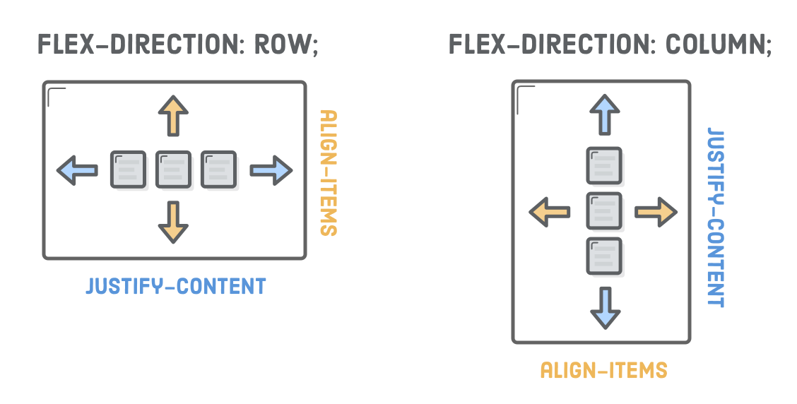
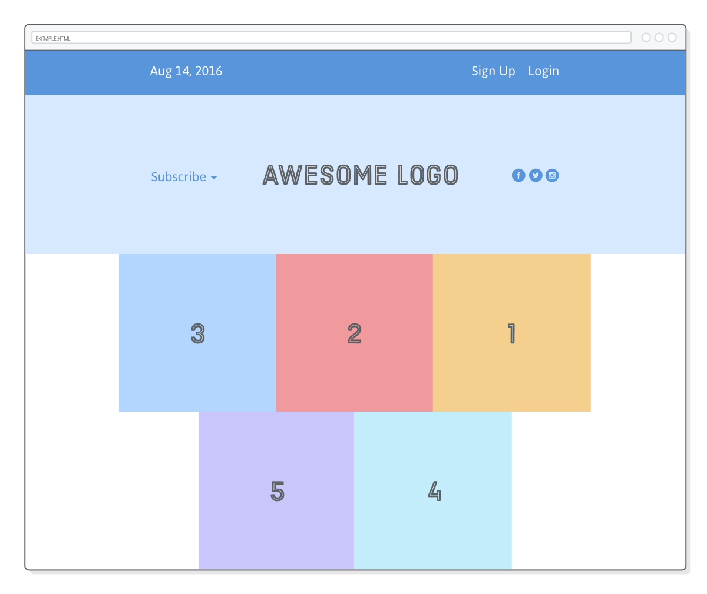
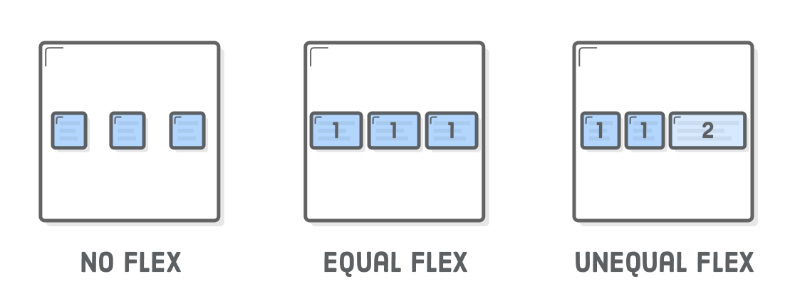

# 第八章：Flexbox

教材：[flexbox](https://internetingishard.com/html-and-css/flexbox/)

---

Flexible Box 或 Flexbox 弹性布局是目前实现网页布局的主流技术，flexbox 可以控制盒子的对齐方式、排布顺序、排布方向和大小。

Floats 技术早期本用于实现杂志样式布局而设计，因此只能控制块元素水平方向堆叠；在日常开发者应该尽可能使用 Flexbox 这种现代的开发技术。只有在实现文本围绕布局的样式时（如杂志样式），或者需要兼容旧浏览器时，才使用 floats 技术。


## 配置

创建目录 `flexbox` 并在其中创建 `flexbox.hmtl` 和 `styles.css` 文档，编写模板代码。最后下载所需的图片文件。

文档 `flexbox.html`

```html
<!DOCTYPE html>
<html lang='en'>
  <head>
    <meta charset='UTF-8'/>
    <title>Some Web Page</title>
    <link rel='stylesheet' href='styles.css'/>
  </head>
  <body>
    <div class='menu-container'>
      <div class='menu'>
        <div class='date'>Aug 14, 2016</div>
        <div class='signup'>Sign Up</div>
        <div class='login'>Login</div>
      </div>
    </div>
  </body>
</html>
```

文档 `styles.css`

```css
* {
  margin: 0;
  padding: 0;
  box-sizing: border-box;
}

.menu-container {
  color: #fff;
  background-color: #5995DA;  /* Blue */
  padding: 20px 0;
}

.menu {
  border: 1px solid #fff;  /* For debugging */
  width: 900px;
}
```

文件目录结构如下：


## Flexbox 概述

Flexbox 弹性布局使用两类盒子模型：

* flex containers 容器：内嵌多个 flex items 元素，并定义它们的布局
* flex items 项目：容器的（直接）子元素，作为布局设置的单位

弹性布局与 floats 布局类似，通过元素嵌套实现复杂的布局，即 flex items 在其容器内按设置排布，而 flex item 也可以作为容器，容纳的项目也可以进行布局设置。


## Flex 容器

通过设置 CSS 属性 `display: flex`  将 HTML 元素设置为 Flex 容器，即告诉浏览器该元素内部的所有（直接）子元素都使用 flexbox 模型而非默认的盒子模型。

:warning: 需要先显式地定义元素的 `display` 属性为 `flex`，容器及项目设置的 flexbox 特有属性才会被浏览器识别。这样也意味着在同一个网页中可以同时使用多种布局技术。


**在 `styles.css` 文件中添加代码：**

```css
.menu-container {
    /* ... */
    display: flex;
}
```

示例将盒子 `.menu-container` 作为 flexbox 容器，此时其中有一个（直接）子元素 `.menu` 作为 flexbox 项目。


## 一个 flex 项目的对齐

通过容器的 CSS 属性 `justify-content` 设置 flex 项目的水平方向对齐方式。

可以设置多种属性值，实现不同的对齐方式：

* `center` 居中
* `flex-start `左对齐（默认值）
* `flex-end` 右对齐
* `space-around` 每个项目两侧的间隔相等
* `space-between` 两端对齐

最后两个属性值针对多个 flex 项目才起作用。

**在 `styles.css` 文档中添加代码：**

```css
.menu-container {
    /* ... */
    display: flex;
    justify-content: center;    /* Add this */
}
```

示例将 flex 容器的属性 `justify-content` 设置为居中，则其中唯一的子元素（已显式限制盒子宽度为 900 px）居中对齐。

:warning: 浮动布局实现居中对齐是设置子元素的外边距属性 `margin: 0 auto;`；而 flexbox 布局是设置父元素的属性，此外还有很多布局操作也是在容器上进行设置。


## 多个 flex 项目布局

多个 flex 项目可设置的对齐方式会十分多样，如在容器的水平方向分散地排布。

**更新 `styles.css` 文件中的代码：**

```css
.menu {
    border: 1px solid #fff;    /* For debugging */
    width: 900px;
    display: flex;
    justify-content: space-around;
}
```

示例将 flex 项目 `.menu` 也设置为一个 flex 容器（嵌套在另一个 flex 容器中），并设置 `justify-content: space-around`，即将容器水平空间均等地分配给各项目两侧（因此项目之间的间隔比项目与边框的间隔大一倍）。


类似地，可以将属性 `justify-content` 设置为 `space-between`，则容器水平空间只会均等分配给两项目之间（项目之间的间隔都相等，两侧的项目与边框无间隔）。

**更新 `styles.css` 文件中的代码：**

```css
.menu {
    border: 1px solid #fff;    /* For debugging */
    width: 900px;
    display: flex;
    justify-content: space-between;
}
```


## flex 项目分组

由于容器只对其（直接）子元素进行排布，因此可以使用盒子 `<div>` 对项目进行内嵌分组，实现项目的更多样的分布。


**更新 `flexbox.html` 文档的代码：**

```html
<div class='menu'>
  <div class='date'>Aug 14, 2016</div>
  <div class='links'>
    <div class='signup'>Sign Up</div>      <!-- This is nested now -->
    <div class='login'>Login</div>         <!-- This one too! -->
  </div>
</div>
```

**在 `styles.css` 文档中添加代码：**

```css
.links {
    border: 1px solid #fff;    /* For debugging */
    display: flex;
    justify-content: flex-end;
}

.login {
    margin-left: 20px;
}
```

示例将子元素 `.singup` 和 `.login` 嵌套在另一个盒子 `.links` 中，此时容器 `.menu` 中只有两个项目。再将项目 `.links` 设置为 flex 容器，并设置其中嵌套的元素向右对齐。此外项目的盒子属性 `margin` 设置依然有效。（可删除调试代码）


## 交叉轴（垂直）对齐

除了通过设置容器的 CSS 属性 `justify-content` 实现 flex 项目在水平方向上不同样式的对齐以外，还可以通过设置容器的 CSS 属性 `align-items` 实现 flex 项目垂直方向上的不同对齐样式。


属性 `align-items` 可以设置多个属性值：

* `center` 居中对齐
* `flex-start` 顶部对齐
* `flex-end` 底部对齐
* `stretch` 项目占满整个容器的高度（如果项目未设置高度或设为 `auto`）
* `baseline` 项目的第一行文字的基线对齐

**在 `flexbox.html` 文档中盒子 `.menu-container` 下添加代码：**

```html
<div class='header-container'>
            <div class='header'>
                <div class='subscribe'>Subscribe &#9662;</div>
                <div class='logo'></div>
                <div class='social'></div>
            </div>
        </div>
```

**在 `styles.css` 文档中添加代码：**

```css
.header-container {
    color: #5995DA;
    background-color: #D6E9FE;
    display: flex;
    justify-content: center;
}

.header {
    width: 900px;
    height: 300px;
    display: flex;
    justify-content: space-between;
}
```


示例在容器 `.menu-container` 下添加了标题容器，由于未设置垂直的对齐样式，flex 项目使用默认的文档流分布，即紧贴容器顶部。

**更新 `styles.css` 文档的代码：**

```css
.header {
  /* ... */
  align-items: center;  /* Add this */
}
```


示例设置容器 `.header` 垂直对齐属性，属性值为 `center`，即 flex 项目居中对齐（容器宽度已显式限制为 900 px）。

使用属性值 `stretch` 可以将每个项目的高度都「扩展」至容器的整个高度，而无论其包含多少内容（项目的盒子高度默认是基于其包含内容而动态变化的）。

**更新 `styles.css` 文档的代码：**

```css
.header {
  /* ... */
  align-items: stretch;    /* Change this */
}

/* For debugging */
.social,
.logo,
.subscribe {
  border: 1px solid #5995DA;
}
```


示例将垂直对齐设置为 `stretch` 可以让项目盒子高度都扩展为与容器相同，而不基于内容的多少。

（删除调试代码，并将垂直对齐方式改为居中，以方便后续的学习）


## flex 项目换行

在 floats 布局中当部分块元素超出了父元素的宽度会自动换行，并形成网格布局；但在 flexbox 布局中，容器中的项目默认在一行排布，超出容器宽度就会溢出（在浏览器中增添横向滑条）。

为了实现项目超出容器宽度换行，可以设置容器 CSS 属性 `flex-wrap` 为 `wrap`。


**在 `flexbox.html` 文档中添加代码：**

```html
<div class='photo-grid-container'>
    <div class='photo-grid'>
        <div class='photo-grid-item first-item'>
            
        </div>
        <div class='photo-grid-item'>
            
        </div>
        <div class='photo-grid-item'>
            
        </div>
        <div class='photo-grid-item'>
            
        </div>
        <div class='photo-grid-item'>
            
        </div>
    </div>
</div>
```

**在 `styles.css` 文档中添加代码：**

```css
.photo-grid-container {
    display: flex;
    justify-content: center;
}

.photo-grid {
    width: 900px;
    display: flex;
    justify-content: center;
    flex-wrap: wrap;    /* Wrap flex items */
}

.photo-grid-item {
    border: 1px solid #fff;
    width: 300px;
    height: 300px;
}
```


示例在 HTML 元素 `<body>` 中添加 flex 容器 `.photo-grid-container`，并且在其中添加了 5 个项目（各包含一张图片）。通过设置容器属性 `flex-wrap: wrap` 可以实现项目换行，设置 `justify-content: center`  可以将项目水平居中排布。


## Flex 容器方向

Flex 容器方向是指容器内的项目排布的方向，通过 CSS 属性 `flex-direction` 可以设置容器方向，属性值分别是 `row` 和 `column 分别是指水平和垂直方向，默认为水平方向。

**更新 `styles.css` 文档的代码：**

```css
.photo-grid {
  /* ... */
  flex-direction: column;
}
```

示例将容器 `.photo-grid` 的方向改变为垂直方向，因此项目排布变成单列。

响应式设计的关键是在移动和桌面端提供适应的网页布局，flexbox 布局只需修改容器 CSS 属性 `flex-direction` 即可实现布局切换，是响应式布局的重要工具。

### 对齐注意事项

当容器的方向改变后，控制 flex 项目水平或垂直方向上对齐的属性作用也改变了。



**更新 `styles.css` 文档的代码：**

```css
.photo-grid {
  /* ... */
  flex-direction: column;
  align-items: center;      /* Add this */
}
```

由于将容器 `.photo-grid` 的方向改变为 `column`，则需要通过设置 `align-items: center` 将项目在水平方向上居中。

（将容器方向改为 `row` 以方便后续的学习）

## Flex 容器顺序

容器的方向除了有水平和垂直之分，还有从左往右或从右往左，以及从上到下或从下到上之分。

容器属性 `flex-direction` 可以设置多种属性值：

* `row` 项目从左往右排布
* `row-reverse` 项目从右往左排布
* `column` 项目从上向下排布
* `column-reverse` 项目从下向上排布


**更新 `styles.css` 文档的代码：**

```css
.photo-grid {
    width: 900px;
    display: flex;
    justify-content: center;
    flex-wrap: wrap;
    flex-direction: row-reverse;    /* <--- Really freaking cool! */
    align-items: center;
}
```



示例将容器方向改为 `row-reverse` 因此 flex 项目从右往左排布，并且设置了居中分布和自动换行。

通过设置容器 CSS 属性 `flex-direction` 可以方便地更改 flex 项目的排布顺序，而无需手动操作更高 HTML 元素的实际内容（对于搜索引擎，网页语义并未改变），实现了结构与样式的分离。

（将容器顺序修改回 `flex-direction: row`，方便后续学习）


## flex 项目顺序

除了可以通过容器设置 flex 项目布局，还可以通过设置单个 flex 项目的定位。

通过设置 flex 项目的 CSS 属性 `order` 可以改变元素在容器中的定位。flex 项目的 `order` 属性值都默认为 0，增加或减小属性值，该项目在容器（相对于其他项目）的定位会向左或向右移动。

实际上 flex 项目是按照其 `order` 属性值从小到大排布，而当项目具有相同的属性值，则按照元素在 HTML 文档中的相对先后顺序定位。

**在 `styles.css` 文档中添加代码：**

```css
.first-item {
    order: 1;
}

.last-item {
    order:-1;
}
```


示例将容器中第一个项目和最后一个项目定位对调。

项目属性 `order` 可以「跨行/列」进行定位设置，只要元素在同一个容器中即可。


## flex 项目对齐

容器中的 flex 项目对齐方式也可以单独定制，通过 flex 项目的 CSS 属性 `align-self` 可以设置该元素的水平对齐方式。

`align-self` 可以设置的属性值：

- `center`
- `flex-start`  (top)
- `flex-end`    (bottom)
- `stretch`
- `baseline`

与属性 `align-items` 的可用值一样。

**在 `styles.css` 文档中添加代码：**

```css
.social,
.subscribe {
    align-self: flex-end;
    margin-bottom: 20px;
}
```


示例将项目  `.social`  和 `.subscribe` 设置为底部对齐 `align-self: flex-end`，覆盖了在容器 `.photo-grid` 设置的居中对齐 `align-items: center`。


## 弹性项目

Flexible box 一个特点是项目的「弹性」，即项目的宽度可以进行收缩和拉伸以匹配其容器的宽度，各项目的伸缩比例还可以进行单独设置，以实现多种方式的布局。

通过项目的 CSS 属性 `flex` 定义该元素可分配得到的容器宽度的比例，即属性值是一个权重，默认值为 1。如当项目的 `flex` 属性设置为 2 时，可分配得到比其他项目多一倍的宽度空间。



**在 `flexbox.html` 文档中添加代码：**

```html
<div class='footer'>
            <div class='footer-item footer-one'></div>
            <div class='footer-item footer-two'></div>
            <div class='footer-item footer-three'></div>
        </div>
```

**在 `styles.css` 文档中添加代码：**

```css
.footer {
    display: flex;
    justify-content: space-between;
}

.footer-item {
    border: 1px solid #fff;
    background-color: #D6E9FE;
    height: 200px;
    flex: 1;
}

.footer-three {
    flex: 2;
}
```

示例在 HTML 元素 `<body>` 中添加了脚注，并设置为 Flex 容器，其中含义 3 个项目。其中项目的宽度通过对容器宽度按比例分配来确定，通过属性 `flex:1` 设置项目宽度占比均为 1，但项目 `.footer-three` 在下方通过 `flex:2` 覆盖原来的比例设置，即第三个项目可以比其他项目「扩增」速度大两倍，以获得容器更多宽度的空间。


:warning: 项目的 CSS 属性 `flex` 是将空间分配到项目本身中，即该属性设置项目本身宽度的分配；而容器的 CSS 属性 `justify-content` 是将容器的额外的空间（「留白」区域）在项目（项目的宽度已有显式定义或基于内容动态定义）之间分配，即该属性设置项目外的宽度分配。

### 静态项目宽度

可以将可变宽度的项目与固定宽度的项目混搭在一起进行排布。

以覆盖方式重新显式限制项目的宽度：

1. 设置项目 CSS 属性 `flex` 为 `initial` 令其宽度设置「退回」到可显式限制宽度的状态
2. 通过项目 CSS 属性 `width` 显式设置盒子宽度

**更新 `styles.css` 文档的代码：**

```css
.footer-one,
.footer-three {
  background-color: #5995DA;
  flex: initial;
  width: 300px;
}
```


示例为第一个项目 `.footer-one` 和第二个项目 `.footer-two` 重新显式设置宽度（覆盖原有按照比例分配容器宽度的方式）。

示例实现了一个常见的网页布局，即两侧项目宽度固定，中间宽度按照容器（浏览器窗口）宽度动态变化，如网页一般有一个宽度固定的侧栏（或多个侧栏），以及一个随窗口响应式变化的内容区域。

:warning: 若需要以覆盖方式重新显式限制项目的宽度，需要将项目 CSS 属性 `flex` 设置为 `initial`，否则显式的宽度样式设置 `width` 将会被忽略。也可以分别对每一个项目进行不同方式的宽度设置，而非覆盖的方式。


## flex 目录和 auto-margin

在普通的盒子模型中使用 `margin: 0 auto` 可实现（在容器中）居中分布；而在 flexible box 模型中，自动分配外边距是对项目进行分组的另一种方法，而不需要使用盒子 `<div>` 对项目进行嵌套分组。

**更新 `flexbox.html` 文档的代码：**

```html
<div class='menu-container'>
  <div class='menu'>
    <div class='date'>Aug 14, 2016</div>
    <div class='signup'>Sign Up</div>
    <div class='login'>Login</div>
  </div>
</div>
```

**在 `styles.css` 文档中添加代码：**

```css
.signup {
  margin-left: auto;
}
```

示例将原本通过添加盒子实现项目分组布局取消，改用设置项目 `.signup` 的左侧外边距实现左右两侧布局。

盒子的 `margin` 是给元素添加外边距间隔，在 flexbox 模型中设置 `margin-left: auto` 时，会计算当前的整个容器的可用空间，然后将所有这么多的空间都「吞并」，安排在 `.signup` 元素的左侧，结果将元素一直向右推，最终可以复现左右两侧布局。

> 如果在 Flex 项目使用了 **auto margin**，那么它的优先级高于在其他地方的对齐属性设置，相当于在其他地方的设置无效了。
>
> 参考：[[译]Flexbox：使用 Auto Margin 对齐](https://juejin.im/post/5dedb2fd6fb9a016323d7202)


## 总结

Flexbox 可以实现现代网页的多种布局：

* 使用 `display: flex` 创建一个 Flex 容器
* 使用 `justify-content` 设置 flex 项目的水平布局
* 使用 `align-items` 设置 flex 项目的锤子布局
* 使用 `flex-direction` 定义容器的方向
* 设置方向为 `row-reverse` 或 `column-reverse` 可以翻转项目排列顺序
* 使用 `order` 定制单个 flex 项目的次序
* 使用 `align-self` 定制单个 flex 项目的垂直布局
* 使用 `flex` 设置 flex 项目的盒子宽度（占比）

当设计师将网页原型交给你实现时，首要任务是在其上绘制分隔盒子，并确定它们如何堆叠，拉伸和收缩以实现所需的设计。完成操作后，就可以使用 flexbox 技术编写相应的布局代码。

flexbox 技术可适用于实现大多数网页布局，但是有些地方并不推荐使用，例如轻微地调整元素位置以并阻止它们与页面的其余部分进行交互，而推荐使用 `position` 设置。