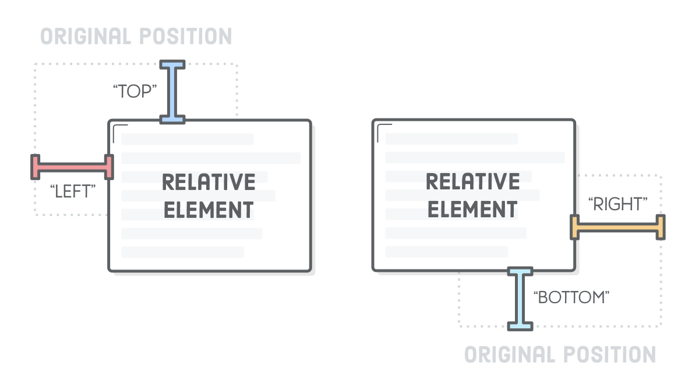
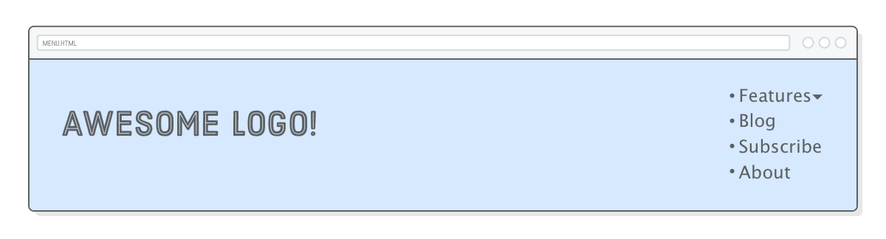
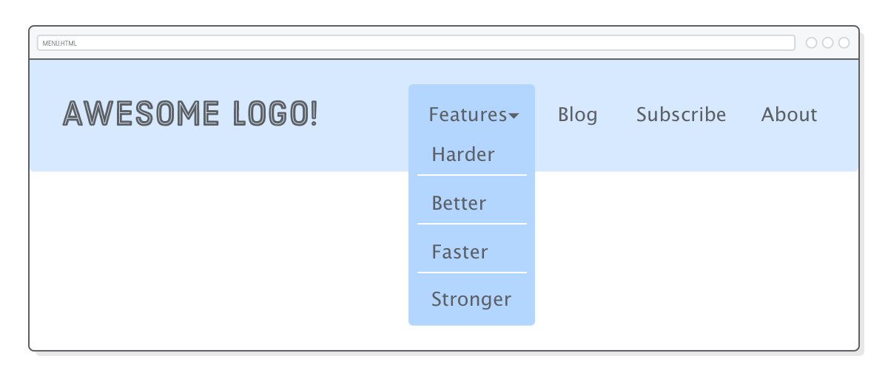

# 第九章：高级定位

教材：[advanced positioning](https://internetingishard.com/html-and-css/advanced-positioning/)

---

元素静态定位是指常见的文档流式布局，在 CSS 盒子模型、浮动模型、flexbox 模型布局方案中元素使用的就是静态定位，通过 CSS 语义式设置进行静态流式布局（如居中 `center` 等具有特定语义的 属性值）。

除此之外，CSS 还提供更高级的元素定位方式，分别是相对定位、绝对定位、固定定位。这些方式允许使用特定的坐标手动定位元素（如将该盒子放在其父元素的原点上方 20 像素和 50 像素的位置）。

网页大部分的元素都是使用静态流式定位，而少部分（如调整特定元素的位置或为 UI 组件设置动画而不弄乱周围的元素时）需要更精确的元素使用高级定位方式。


## 配置

按照教程创建目录 `advanced-positioning`，在其中创建 `shemes.html` 和 `styles.css` 文档，并编写模板代码。下载图片文件。


## 定位元素

元素的 CSS 属性 `position` 可以更改该元素的定位方案，其默认方式是 `static`。

当一个元素的 `position` 属性值不是 `static` 时，该元素称为**定位元素**：

- 属性值为 `relative `的元素：相对定位元素 relatively positioned element
- 属性值为 `absolute` 或 `fixed` 的元素：绝对定位元素 absolutely positioned element
- 属性值为 `sticky` 的元素：粘性定位元素 stickily positioned element

:warning:盒子可以同时设置为定位元素和 flexbox 容器，当两种布局的属性不冲突时（如容器可以设置其中内嵌的项目对齐方式，而定位元素可以设置容器的定位方式）均可实现。


## 相对定位

相对定位 `relative` 是以元素在静态流中的（原始）位置作为基准的，常用于实现轻推盒子的效果。


**在 `styles.css` 文档中添加代码：**

```css
.item-relative {
  position: relative;
  top: 30px;
  left: 30px;
}
```


示例将 Flex 容器中的项目 `.item-relative` 设置为相对定位元素，相对定位元素的移动方向以原始静态流布局的位置为基准，属性 `top` 和 `left` 定义了该元素偏移静态位置的距离，即向右侧和下方分布移动 30 px。

相对定位元素通过属性 `top`、`bottom`、`left`、`right` 设置该元素相对于静态位置偏移的方向和距离，类似于为元素设置了一个 (x, y) 坐标。而且属性值可以是**负数**，即向相反方向移动，如 `top: -30px` 和 `bottom: 30px` 偏移效果一致。

**更新 `styles.css` 文档的代码：**

```css
.item-relative {
    position: relative;
    bottom: 30px;
    right: 30px;
}
```




:warning: 相对定位元素偏离并不会对其他元素的定位造成影响，静态（原始）位置作为占位看待，其他元素的布局依然不变。可以将相对定位造成的元素偏移，看作是浏览器完成静态流页面布局**之后**再执行相对定位元素的渲染。


## 绝对定位

绝对定位 `absolute` 是以整个浏览器窗口（而不是元素的原始位置）作为基准的，由于不再与页面的静态流有任何关系，因此这是布局元素的最原始的手动方式。


**在 `styles.css` 文档中添加代码：**

```css
.item-absolute {
    position: absolute;
    top: 10px;
    left: 10px;
}
```


示例将 Flex 容器中的项目 `.item-absolute` 设置为绝对定位元素，则元素的定位以浏览器窗口为基准，通过元素 CSS 属性 `top` 和 `left` 设置偏移的方向和距离。

相对元素仍然保留着该元素的静态（原始）占位，而绝对定位则把元素从普通页面静态流式布局中完全「删除」。

**更新 `styles.css` 文档的代码：**

```css
.example {
  display: flex;
  justify-content: flex-start;  /* Update this */
  /* ... */
}
```


示例将容器 `.example` 内项目的对齐方式更改为向左对齐，可以看出在相对定位示例（第一行）中，定位元素在静态流式布局中仍然占有一个空间，但是在绝对定位的情况下该空间消失了。

绝对定位的这种行为在大多数情况下并没有那么有用，因为这意味着页面上的所有内容都必须进行绝对定位，否则静态元素与绝对元素会发生不可预测的重叠。

（将容器 `.example` 水平对齐方式更改为 `justify-content: space-around`，以方便后面学习）

### （相对的）绝对定位

当绝对定位的坐标参照体系更改为任意特定的容器时（而非只能是浏览器窗口），元素定位将更灵活。

绝对定位元素默认以其祖先元素（容器）中最近一个定位元素作为坐标参考元素，如果祖先元素中没有定位元素，则以浏览器窗口作为坐标参考定位。


**更新 `styles.css` 文档的代码：**

```css
.absolute {
  position: relative;
}
```


示例将容器 `.absolute` 设置为相对定位元素，则其中的子项目 `.item-absolute` 可以将容器作为绝对定位的参考系（而非浏览器窗口）。

:warning: 示例只是将元素 `.absolute` 设置为相对定位元素，但并未进行偏移样式设置，由于我们在此使用相对定位的唯一目的是让绝对元素重新关联到页面的正常静态流式布局中。这就是将绝对定位与静态流式布局结合在一起的方式，这样可以让绝对定位元素也实现响应式设计（跟随容器动态变化）。


## 固定定位

固定定位 `fixed` 也是以整个浏览器窗口作为基准的，元素也从静态流布局中移除，因此这也是布局元素的最原始的手动方式。与绝对定位的主要区别，在于固定元素不会随页面一起滚动（类似于钉在了窗口上，一直在固定区域显示）。


**在 `styles.css` 文档中添加代码：**

```css
.item-fixed {
    position: fixed;
    bottom: 0;
    right: 0;
}
```


示例将项目 `.item-fixed` 设置为固定定位元素，固定在窗口的右下角，当页面滚动时该元素依旧固定在该区域（而紫色的绝对定位元素会随着页面滚动）。

通过固定定位可以创建始终停留在屏幕顶部的导航栏，以及永不消失的烦人的弹出横幅(￣_￣|||)。


## 定位元素制作动效

网页动效是相对定位和绝对定位元素的主要用例之一。利用 JavaScript 修改元素的高级定位参数，以实现定位元素的移动动画，同时避免与周围元素发生任何形式的作用。

**在 `shemes.html` 文档元素 `<body>` 内（底部）添加代码：**

```html
<script>
    var left = 0;

    function frame() {
        var element = document.querySelector('.item-relative');
        left += 2;
        element.style.left = left + 'px';
        if (left >= 300) {
            clearInterval(id)
        }
    }

    var id = setInterval(frame, 10);
</script>
```


示例通过 JavaScript 代码不断更新相对定位元素 `.item-relative` 属性 `left` 的值，实现向右移动的动效。

使用相对定位元素来实现多种精美的 UI 动画，而如果使用 `margin` 或 `padding` 属性实现动效，则会不经意间改变容器中其他元素的静态流式布局。


## 定位元素制作菜单栏

结合所学的多种技术制作一个常见的支持下拉选择次级菜单交互的[导航栏](https://internetingishard.com/html-and-css/advanced-positioning/example/menu.html)。

* 使用列表创建导航栏和菜单栏（而非一堆 `<div>` 容器），以便搜索引擎更容易解读其语义

* 固定定位元素将导航栏固定在网页的顶部
* 相对定位元素将下拉菜单「附着」到固定定位元素（导航栏）上
* 使用伪类为锚标签选择多种样式

**创建 `menu.html` 文档并添加代码：**

```html
<!DOCTYPE html>
<html lang='en'>
    <head>
        <meta charset='UTF-8'>
        <title>Awesome!</title>
        <link rel="stylesheet" href="menu.css">
    </head>
    <body>

        <div class='header'>
            <div class='logo'></div>
            <ul class='menu'>
                <li class='dropdown'><span>Feature ▾</span></li>
                <li><a href="#">Blog</a></li>
                <li><a href="#">Subscribe</a></li>
                <li><a href="#">About</a></li>
            </ul>
        </div>

    </body>
</html>
```

**创建 `menu.css` 文档并添加代码：**

```css
* {
    margin: 0;
    padding: 0;
    box-sizing: border-box;
}

body {
    height: 1200px;
    font-size: 18px;
    font-family: sans-serif;
    color: #5D6063;
}

a:link,
a.visited {
    color: #5D6063;
    text-decoration: underline;
}

a:hover {
    text-decoration: underline;
}

.header {
    position: fixed;
    display: flex;
    justify-content: space-between;

    width: 100%;
    padding: 50px;
    background-color: #D6E9FE;
}
```



示例创建了一个导航栏的基本结构，并将其设置为固定定位元素以固定网页顶部。其中支持下拉的列表项以盒子 `<span>` 嵌套是为了与次级菜单的列表项形成区别。


## 内联菜单项

通过无序列表项创建的菜单栏和常见的不一样，由于列表的项目是 block element 块元素，需要设置列表 CSS 实属性 `display: inline` 转换为 inline element 内联元素，让列表项目都在同一行显示。

**在 `menu.css` 文档中添加代码：**

```css
.menu {
    margin-top: 15;
}

.menu > li {
    display: inline;
    margin-right: 50px;
}

.menu > li:last-of-type {
    margin-right: 0;
}
```


示例中使用（直接）子元素选择器将导航栏的列表项设置为 inline elements（使用子元素选择器而非后代选择器，由于嵌套的次级菜单也是由列表构成，其中的列表项需要竖向排布因此不需要设置为内联元素）。

列表及列表项设置了右侧外边距以相互分隔，但需要取消最后一个列表项右侧外边距，以保持设计语言统一，使用结构伪类 `:last-of-type` 选择该元素。

通过设置列表项外边距以相互区隔（但取消最后一个项目与容器边框的间隔）的方法十分常见。


## 次级菜单

下拉的次级菜单需要嵌套在相应的导航栏的项目中，形成合理的语义（即新增的元素都是与 Features 相关）便于搜索引擎解析。

**在 `menu.html` 文档添加代码：**

```html
<ul class='menu'>
  <li class='dropdown'><span>Features &#9662;</span>
    <ul class='features-menu'>           <!-- Start of submenu -->
      <li><a href='#'>Harder</a></li>
      <li><a href='#'>Better</a></li>
      <li><a href='#'>Faster</a></li>
      <li><a href='#'>Stronger</a></li>
    </ul>                                <!-- End of submenu -->
  </li>
  <li><a href='#'>Blog</a></li>          <!-- These are the same -->
  <li><a href='#'>Subscribe</a></li>
  <li><a href='#'>About</a></li>
</ul>
```

**在 `menu.css` 文档中添加代码：**

```css
.features-menu {
  display: flex;
  flex-direction: column;
  background: #B2D6FF;
  border-radius: 5px;
  padding-top: 60px;
}

.features-menu li {
  list-style: none;
  border-bottom: 1px solid #FFF;

  padding: 0 40px 10px 20px;
  margin: 10px;
}

.features-menu li:last-of-type {
  border-bottom: none;
}
```


示例为 Features 添加（嵌套）次级下拉菜单，除了为每一个列表项添加边距以相互分隔，还使用 `border-bottom` 为各项目添加了下划线（不应该使用 `text-decoration: underline` 添加下划线，因为这会改变元素语义）。

但由于次级菜单依然采用静态流式布局，因此依然占用父元素的空间并于其他邻近元素相互作用，破环了原有的导航栏分布。


## 次级菜单栏的（相对的）绝对定位

将次级菜单 `.features-menu` 设定为绝对定位，即可将该元素移出静态流式布局，恢复原有的导航栏分布。

**在 `menu.css` 文档中添加代码：**

```css
.features-menu {
  display: flex;
  flex-direction: column;
  background: #B2D6FF;
  border-radius: 5px;
  padding-top: 60px;

  position: absolute;      /* Add these */
  top: -25px;
  left: -30px;
}
```

为了将绝对定位元素 `.fetures-menu` 的参考坐标体系切换到 Features 元素，可以将对应的列表项设置为相对定位元素。

**在 `menu.css` 文档中添加代码：**

```css
.dropdown {
    position: relative;
}
```


## Z-index

在示例中次级菜单遮挡了导航栏，需要重新调整元素的叠放次序，通过（必须为定位元素）元素的 CSS 属性 `z-index` 控制元素在页面的深度，属性值可以是正或负的整数（负值表示元素在下方，而正值表示元素会出现在上方），默认值为 0。


**在 `menu.css` 文档中添加代码：**

```css
.dropdown > span {
  z-index: 2;
  position: relative;  /* This is important! */
  cursor: pointer;
}

.features-menu {
  /* ... */
  z-index: 1;
}
```



示例将 Feature 元素（通过子代选择器 `.dropdown > span` 指向）设置为相对定位元素，并将 `z-index` 设置得更高，而次级菜单元素的 `z-index` 就设置为第一级。现在功能标签出现在子菜单的之上。

此外还设置鼠标悬浮在该元素时的样式，更多鼠标样式可以查看[此处](https://developer.mozilla.org/zh-CN/docs/Web/CSS/cursor)。

:warning: 只有定位元素才可以通过属性 `z-index` 调整其深度。


## 伪类创建下拉菜单动效

可以利用伪类来指向链接的多种状态，如 `:hover` 指向鼠标悬浮时的链接，对元素的不同状态设置不同的样式可以实现交互式动效。

**更新 `menu.css` 文档中的选择器 `.features-menu` 代码：**

```css
.dropdown:hover .features-menu {    /* This used to be `.features-menu` */
  display: flex;                    /* Leave everything else alone */
  flex-direction: column;
  background: #B2D6FF;
  /* ... */
}
```

**在 `menu.css` 文档中添加代码：**

```css
.features-menu {
    display: none;
}
```


示例通过设置属性 `display: none` 将元素 `.fetures-menu` 默认隐藏，再结合锚元素伪类选择器和后代选择器，可以设置鼠标悬浮在指定锚标签状态下，才将次级菜单显示出来。

:bulb: 使用伪类选择元素的不同状态下，并利用 `display: none` 可以条件性地显示或隐藏元素。


## 总结

这一章学习了四种新的 CSS 布局方案：

* Relative 相对定位
* Absolute 绝对定位
* Relatively absolute 相对地绝对定位
* Fixed 固定定位

相对定位用于调整元素的位置，而不影响其周围的盒子布局。绝对定位使元素从页面的静态流中移出，并相对于浏览器窗口放置它们。而相对的绝对定位使元素可以重新关联到页面的静态流布局。最后，固定定位使我们可以制作不随页面滚动的元素。

导航栏示例很好地演示了网页设计的基本流程。首先，我们使用 HTML 创建了具语义的网页结构，然后编写了一些精美的 CSS 将盒子定位在我们想要的位置。