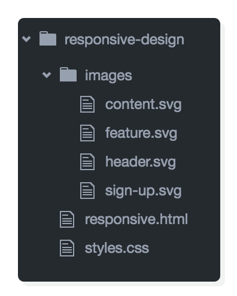
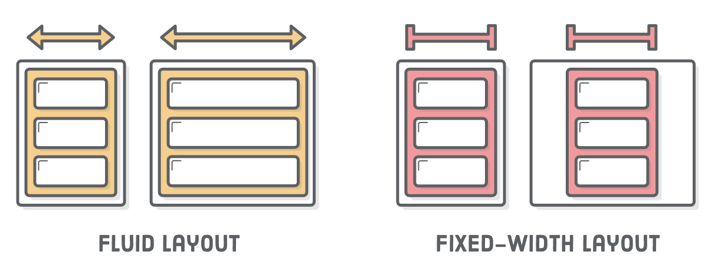
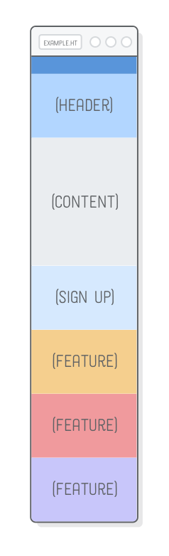
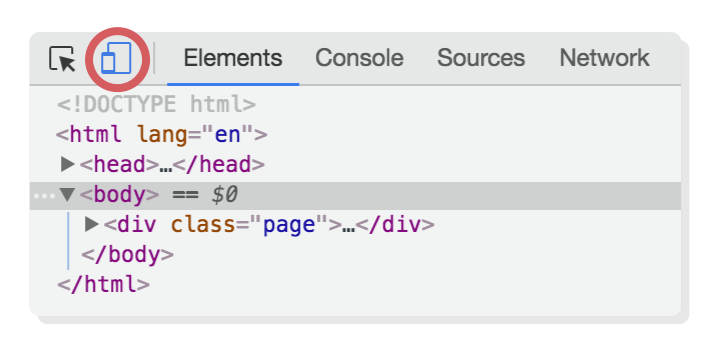

# 第十章：响应式设计

教材：[responsive design](https://internetingishard.com/html-and-css/responsive-design/)

---

「响应式设计」 responsive design 是一种前端设计和开发方法，它消除了网站的移动版和桌面版之间的区别，即使用同样的 HTML 文件，而网页样式则适配不同尺寸的屏幕（如手机、平板、宽屏显示器）而不同。这也是结构和样式分离的良好实践，网页内容在 HTML 文件中进行设置，而样式改变则通过 CSS 样式表进行修改。

响应式设计主要是通过 CSS 「媒体查询」 media queries 实现，即基于不同的设备（一般是屏幕宽度），而有选择性地采用或忽略特定的 CSS 规则集。


## 配置

创建 `responsive-design` 目录和 `responsive.html` 文档和 `styles.css` 文档，并编写模板代码。下载[图片文件](https://internetingishard.com/html-and-css/responsive-design/images-e9877a.zip)。

文档 `responsive.html`

```html
<!DOCTYPE html>
<html lang='en'>
  <head>
    <meta charset='UTF-8'/>
    <title>Responsive Design</title>
    <link rel='stylesheet' href='styles.css'/>
  </head>
  <body>
    <!-- There's nothing here! -->
  </body>
</html>
```



## CSS 媒体查询

CSS 媒体查询用于设置样式应用的触发条件，因此它们设置在 CSS 规则集外（包裹在内）。

媒体查询以关键字 `@media` 开始，其后包含一些条件语句以设置触发情况（多种条件通过逻辑符号相连），最后是以大括号 `{}` 包含 CSS 规则集。


图例中**媒体类型**设置为 `only screen` 是指其包含的样式设置是应用于屏幕显示条件下的（与之相对的是打印文档的条件，如在浏览器中按下快捷键 `Cmd + P` 或 `Ctrl + P` 打印网页）。**媒体特征**设置了参数 `max-width`（类似的还有参数 `min-width` 设置样式应用的屏幕尺寸范围，即当浏览器窗口（小于或等于）最大值为 400 px 时应用其包含的样式设置。

**在 `styles.css` 文档中添加代码：**

```css
* {
    margin: 0;
    padding: 0;
    box-sizing: border-box;
}

/* Mobile Styles */
@media only screen and (max-width: 400px) {
    body {
        background-color: #F09A9D;    /* Red */
    }
}

/* Table Styles */
@media only screen and (min-width: 401px) and (max-width: 960px) {
    body {
        background-color: #F5CF8E;    /* Yellow */
    }
}

/* Desktop Styles */
@media only screen and (min-width: 961px) {
    body {
        background-color: #B2D6FF;    /* Blue */
    }
}
```


示例媒体查询是基于屏幕尺寸大小，分布设置了手机、平板、桌面模式下网页的背景颜色样式。

媒体查询一般基于屏幕尺寸，因此媒体特性 `min-width` 和 `max-width` 十分常见，此外还有很多其他条件（[媒体类型](https://developer.mozilla.org/zh-CN/docs/Web/CSS/@media)和[媒体特征](https://developer.mozilla.org/zh-CN/docs/Web/Guide/CSS/Media_queries)）以使用。


## 设计的小提示

通过关键字 `@media` 设置不同场景下的样式，而响应式网页设计中实现[样式转变有多种模式](https://developers.google.com/web/fundamentals/design-and-ux/responsive/patterns?hl=zh_cn)，本章主要使用[活动布局模型](http://wf.uisdc.com/cn/layouts/rwd-patterns/#section-2)


网页布局设计一般由网页设计师完成，但是有两个常见的设计概念作为开发者也需要了解：

* fluid layout 流动布局 ：元素可以伸缩以填充其容器，当网页窗口大小更改时，元素的宽度也会相应地变动，如 flexbox 布局中盒子具有 flexible 「弹性」。
* fixed-width layout 固定宽度布局：元素的宽度固定（无论窗口大小如何改变），常用于实现元素居中。



一般网页在小屏幕中（如不同尺寸的手机和平板）采用 fluid layout，由于流动布局可以让网页元素十分方便高效地实现多种屏幕尺寸的适配，从手机到平板各种规格的屏幕；在大屏幕（如不同桌面端）采用 fixed-width layout。

### 选择断点

媒体查询设置的 `min-width` 或 `max-width` 参数值称为响应式网站的断点 breakpoint，即在该值实现网页布局的切换。

一般断点设置在移动端布局和桌面端布局切换处，在移动端使用流动布局可以很好地适配多种规格的屏幕，而在桌面的通过限制元素的宽度，可以很好地在大屏幕上展示网页。


## 移动（手机场景）优先的开发模式

一般先进行移动端布局的开发，因为窄屏幕的布局设计相对简单，该情境下的代码可以最大限度地复用（作为基础的样式，放置其他在媒体查询之外）。

**在 `responsive.html` 文档元素 `<body>` 内添加代码：**

```html
<div class='page'>
  <div class='section menu'></div>
  <div class='section header'>
    
  </div>
  <div class='section content'>
    
  </div>
  <div class='section sign-up'>
    
  </div>
  <div class='section feature-1'>
    
  </div>
  <div class='section feature-2'>
    
  </div>
  <div class='section feature-3'>
    
  </div>
</div>
```

**在 `styles.css` 文档中在通用选择器 * 和媒体查询之间添加代码：**

 ```css
.page {
  display: flex;
  flex-wrap: wrap;
}

.section {
  width: 100%;
  height: 300px;
  display: flex;
  justify-content: center;
  align-items: center;
}

.menu {
  background-color: #5995DA;
  height: 80px;
}

.header {
  background-color: #B2D6FF;
}

.content {
  background-color: #EAEDF0;
  height: 600px;
}

.sign-up {
  background-color: #D6E9FE;
}

.feature-1 {
  background-color: #F5CF8E;
}

.feature-2 {
  background-color: #F09A9D;
}

.feature-3 {
  background-color: #C8C6FA;
}
 ```



示例设置了移动手机端布局，通过设置容器 `.page` 的 CSS 属性 `display:flex` 实现流动布局，且设置了 `flex-wrap: wrap` 以更容易适配平板和桌面的。 

:warning: 将手机端场景下的布局作为基础样式（设置在其他媒体查询之上），而其他的场景样式下，通过媒体查询覆盖特定基础的样式，可以实现代码的复用以便于调试和维护（而不是将各种场景的样式设置分别放入其相应的媒体查询中）。


## 平板场景的布局

平板场景下的布局应该也使用 fluid layout 流动布局，以适配多种尺寸范围的屏幕。

**更新 `styles.css` 文档的代码：**

```css
/* Tablet Styles */
@media only screen and (min-width: 401px) and (max-width: 960px) {
  .sign-up,
  .feature-1,
  .feature-2,
  .feature-3 {
    width: 50%;
  }
}
```


示例将平板模式下 flex 项目 `.sign-up`、`.feature-1`、`.feature-2`、`.feature-3` 盒子宽度设定为相对值 50%（可以适配一定范围的平板屏幕），通过 Flex 容器的预设属性 `flex-wrap: wrap` 实现 2x2 网格布局（触发该布局需要将桌面端的浏览器窗口宽度调整到 400 px 和 960 px 之间），以利用平板更大的空间。


## 桌面场景的布局

桌面显示器一般都很宽，因此应该采用 fixed-width layout 固定宽度布局，避免元素被过分拉伸。

**更新 `styles.css` 文档的代码：**

```css
/* Desktop Styles */
@media only screen and (min-width: 961px) {
  .page {
    width: 960px;
    margin: 0 auto;
  }
  .feature-1,
  .feature-2,
  .feature-3 {
    width: 33.3%;
  }
  .header {
    height: 400px;
  }
  .sign-up {
    height: 200px;
    order: 1;
  }
  .content {
    order: 2;
  }
}
```

示例将容器 `.page` 宽度固定在 960 px，避免其中的 flex 项目被桌面宽屏过分拉伸；利用 flex 项目的属性 `order` 重排了元素的布局次序。

响应式设计一般从适用于移动端的基本样式开始构建，然后通过 `@media` 设置选择性应用的 CSS 规则集，以根据设备屏幕调整元素的宽度和网页布局，甚至可以在桌面场景中添加另一个媒体查询，为超宽屏显示器情况的设置更适配的布局。


## 禁用视窗缩放

在没有媒体查询实现网页多种样式之前，为了让基于桌面开发的网页可以在手机窄屏幕上显示完全，浏览器会默认使用一个虚拟的视窗（桌面大小）将网页渲染出来，再将其缩小以适合手机的屏幕大小，然后再让用户在必要时通过放大与之交互。

这种内置的虚拟视窗的渲染方式使我们设置的（基于屏幕/视窗大小）媒体查询失效，避免这种情况需要禁用视窗缩放功能，需要再 HTML 文件的元素 `<head>` 中添加元信息。

**在 `responsive.html` 文档中元素 `<head>` 内添加代码：**

```html
<meta name='viewport' content='width=device-width, initial-scale=1.0, maximum-scale=1.0' />
```

示例在 HTML 文档中添加元信息，以限制浏览器渲染网页时采用设备的宽度作为视窗宽度（即缩放比例为 1）。

为了测试手机环境下网页渲染效果，可点击 Google Chrome 浏览器的开发者工具中的 **Toggle Device Toolbar** 图标。




添加了元信息后，网页在移动端模拟器中布局和预期一样，可以正常触发响应式的设计布局。


## 总结

创建响应式网站可分为 3 步：

* 响应式设计（不同场景下的布局原型）
* 基础的 CSS 规则集（一般是移动端的布局样式和其他通用的样式设置）
* 通过媒体查询基于场景而条件性实现的布局样式和专属样式设置

