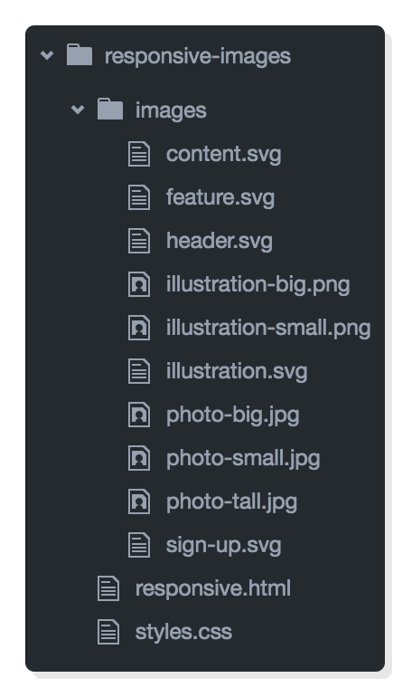
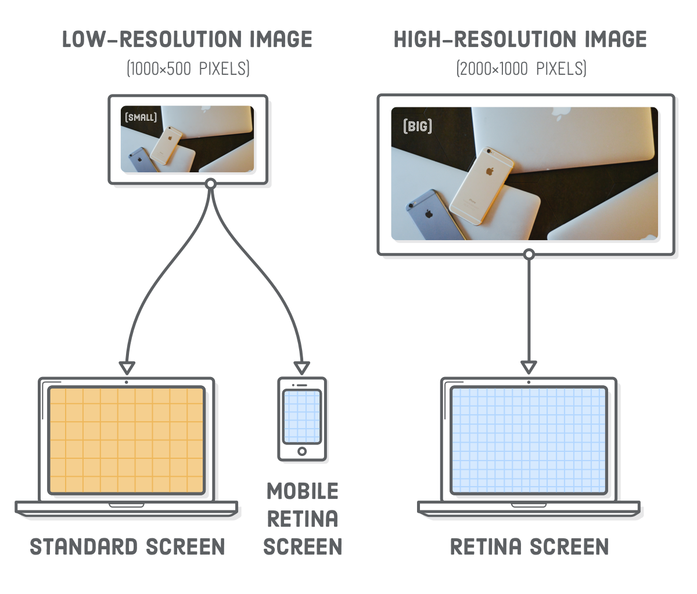
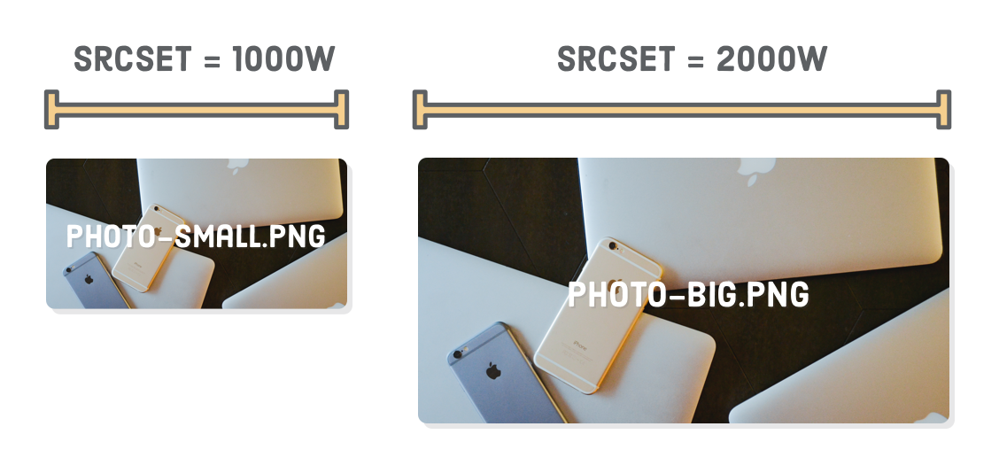
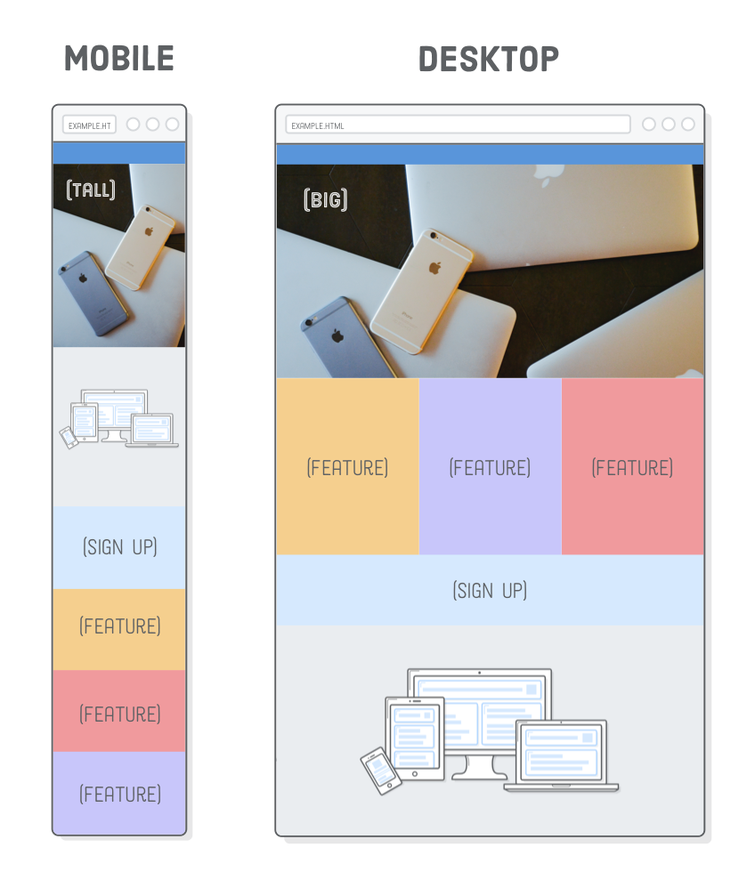

# 第十一章：响应式图片

教材：[responsive images](https://internetingishard.com/html-and-css/responsive-images/)

---

响应式设计使用媒体查询可以实现网页布局的切换，但是对于含有图片的网页，由于图片固有尺寸（原尺寸）的限制，图片元素无法通过简单的伸缩进行响应式变换，因此需要根据场景选择性加载不同的图片文件。

在实现响应式图片设计时，需要考虑 3 方面：

* 设备尺寸
* 图片尺寸
* 屏幕分辨率


## 配置

使用上一章创建的文档资料，并下载本章所需的[图片](https://internetingishard.com/html-and-css/responsive-images/responsive-images-5e8a2c.zip)添加到目录 `images` 下。



图片文件中有多个拷贝，并以后缀，如 `big`、`small`、`tall` 区分，响应式图片设计的核心就是让浏览器根据设备的尺寸和屏幕分辨率选择应加载合适的副本。


## 视网膜屏幕

视网膜屏幕是一种高分辨率的屏幕，一般该类型屏幕每英寸的像素是标准分辨率屏幕的两倍，即屏幕上每个（CSS 像素）像素（包含的物理像素/点）是标准分辨率屏幕的 4 倍。此外还有[很多类型的高分屏](http://screensiz.es/)，如 iPhone 6 Plus 每英寸像素是标准屏幕的 3 倍，本章主要关注 2x 高分辨率屏幕的情况。


> 由于不同的物理设备的物理像素的大小是不一样的，所以 CSS 认为浏览器应该对 CSS 中的像素进行调节，使得浏览器中 1 CSS 像素的大小在不同物理设备上看上去大小总是差不多 ，目的是为了保证阅读体验一致。为了达到这一点浏览器可以直接按照设备的**物理像素**大小进行换算，而 CSS 规范中使用**「参考像素」**来进行换算。
>
> **1 参考像素**即为从一臂之遥看解析度为 `96DPI` 的设备输出（即 1 英寸 96 点）时，1 点（即 /96 英寸）的视角。它并不是 1/96 英寸长度，而是从一臂之遥的距离处看解析度为 `96DPI` 的设备输出一单位（即 1/96 英寸）时视线与水平线的夹角。通常认为常人臂长为 28 英寸，所以它的视角是:
> **(1/96)in / (28in \* 2 \* PI / 360deg) = 0.0213 度。**
>
> 由于 CSS 像素是一个**视角单位**，所以在真正实现时，为了方便基本都是根据**设备像素**换算的。浏览器根据硬件设备能够直接获取 CSS 像素。
>
> 参考：[CSS像素、物理像素、逻辑像素、设备像素比、PPI、Viewport](https://github.com/jawil/blog/issues/21)


由于存在高分辨屏幕和小尺寸的手机屏幕，考虑带宽成本和用户体验，因此在视网膜设备上图像的（分辨率）大小必须是其最终显示尺寸的两倍，如在页面上添加 500×250 像素的图像，则相应的图像文件需要为 1000×500 像素；而在低分屏和小屏幕设备可以只加载小尺寸（分辨率）的图片。


## 响应式矢量图

由于 SVG 是基于矢量的图片格式，在拉伸图片时不会出现「像素化」模糊问题，很容易实现响应式图片设计。

**更新 `responsive.htm` 文档的代码：**

```html
<div class='section content'>
  
</div>
```

示例在容器 `.content` 添加了一张 SVG 图片，浏览器会自动将图片拉伸并填充容器。

但是图片固有的尺寸大小会造成问题。当手机窄屏幕的宽度比图片原有的尺寸还小（在 Chrome 浏览器中图片默认缩小极限是保持图片原有尺寸，因此无法自动缩小以适应视窗宽度；而 Firefox 则会自动处理该问题）则会破坏了布局，可以设置图片元素的盒子为相对宽度（百分比），以响应容器的宽度变化；当桌面端的浏览器视窗过大时会把图片过分拉伸，可以设置图片的最大宽度 `max-width`，以限制图片最大拉伸至图片原始大小。


**在 `styles.css` 文档中添加代码：**

```css
.illustration {
    width: 100%;
}
```

**更新 `responsive.htm` 文档的代码：**

```html
<div class='section content'>
    
</div>
```


示例在样式表中设置了图片的盒子宽度为相对宽度 `width: 100%` 以随容器宽度响应式变化；此外在 HTML 结构中设置了图片元素的内联样式 `max-width: 500px` 将图片的最大拉伸尺寸限制在原图尺寸大小。

:warning: 上述示例是极少数可以（正确）使用内联样式的情况，由于图片的原有物理尺寸更像是内容/结构信息，而非样式信息，因此可以将其设置在 HTML 文档中，而不是样式表内。


## 响应式位图

网页中还经常使用位图 raster image，如 `png`、`gif`、`jpg` 等格式，它们由一个个像素点组成，因此当图片放大超过了原始尺寸会容易造成「像素化」模糊问题，此外屏幕分辨率也会对位图显示有很大影响。

**更新 `responsive.htm` 文档的代码：**

```html
<div class='section content'>
  <div class='illustration'>
    
  </div>
</div>
```

**更新 `styles.css` 文档的代码：**

```css
.illustration img {
  width: 100%;
  display: block;
}
```

示例将内容容器中的图片换成了位图，但是由于 flexbox 布局会默认将项目高度设置为与容器 `.content` 高度相同（宽度也是），则会将位图拉伸变形，为了避免该问题将图片嵌套在盒子 `.illustration` 中，并在样式表中修改图片元素的 `display` 属性和宽度，让其居中并适应新盒子的宽度。

由于 2x 视网膜屏幕需要限制图片的显示大小 `max-width: 500px` 为图片 `illustration-big.png` 原始大小（1000x500）的一半。而对于低分辨率的屏幕可以选择较小的图片，示例对于高或低分辨率屏幕都只加载同一种尺寸的图片会造成流量的浪费。


## 响应式图片优化

为了实现图片加载优化，不同屏幕分辨率的设备应该发出不同的（分辨率）图片加载请求，HTML 提供了选择性加载图片的属性。

主要有三种图像加载的情景：

* 标准分辨率屏幕不需要加载高质量图片
* 具有视网膜屏幕的移动设备也可以使用标准质量的图像（因为屏幕较小，图片缩小比例很大，针对该情景下的优化可以节省较大的带宽）
* 桌面端使用较高质量的图像


## 针对分辨率优化（srcset 属性）

尺寸较大的图片文件需要占据的磁盘空间和带宽更多，通过元素 `` 属性 `srcset` 设置备用图像文件列表，以供浏览器基于屏幕的分辨率自动选择合适的图片加载。

**更新 `responsive.html` 文档的代码：**

```html
<div class='illustration'>
  
</div>
```


示例为元素 `` 添加了备用的图片源，当用户使用 `1x` 标准分辨率屏幕浏览网页时，浏览器会自动选择较小的图片文件 `illustration-small.png` 加载，而使用 `2x` 高分辨率屏幕浏览网页时，浏览器会自动选择较大的图片文件 `illustration-big.png` 加载。

实际开发中加载的图片除了（分辨率）大小不同外，其他都是相同的，而示例中为了区别不同图片源而为图片设置不同的颜色。

:warning: 需要设置图片元素的属性 `src`，以避免老旧的浏览器无法识别 `srcset` 属性，可以退回到 `src` 属性读取默认的图片源。

:bulb: 可以在浏览器的开发者工具中模拟屏幕的高分屏和低分屏。开启 Toggle Device Toolbar 模式，通过顶部的 `DPR` 切换像素比。


> DPR 含义：
>
> 该值也可以被解释为像素大小的比例：即一个CSS像素的大小相对于一个物理像素的大小的比值。
>
> 参考：[Window.devicePixelRatio - Web API 接口参考 | MDN](https://developer.mozilla.org/zh-CN/docs/Web/API/Window/devicePixelRatio)


## 针对屏幕宽度优化（srcset 属性）

仅基于屏幕的分辨率来判断加载图片，可能会造成在视网膜屏幕的小尺寸手机，也浪费带宽加载大图片的问题（因为手机屏幕显示尺寸较小，即使加载普通大小的图片，在进行很大比例的缩小后可以弥补低分辨率的不足，如宽度为 400 px 的 2x 视网膜屏幕，可以使用宽度为 960 px 的普通分辨率图片）。

应该采用第二种 `srcset` 设置方式，标注备用图片源的宽度（而非显式指定图片适用的屏幕 DPR 值），以供浏览器根据屏幕尺寸（图片最终显式的大小）和屏幕的 DPR 情况综合考虑，选择合适的备选图片。



**在 `responsive.html` 文档中添加代码：**

```html
<div class='section header'>
  <div class='photo'>
    
  </div>
</div>
```

**更新 `styles.css` 文档的代码：**

```css
.header {
  height: auto;
  justify-content: inherit;
  align-items: inherit;
}

.photo img {
  width: 100%;
  display: block;
}
```

示例为标题容器添加图片，并通过属性 `srcset` 设置备用的图片源，而且每一个图片源都显式标注了图片原始宽度（单位使用 `w` 而非 `px` ，这是仅用于这种图像优化方案的特殊单位）。



此外还需要显式地指定图片显示方式，通过**属性 `sizes`  提供一系列的媒体查询和（该媒体查询生效时）图像的渲染宽度的组合**（在图片元素的属性 `sizes` 使用的媒体查询应该与样式表的媒体查询（断点）相对应），以供浏览器在不同（视窗大小）情况下计算所需图片的尺寸大小。

示例表示在浏览器视窗宽度（大于或等于）最小值 960 px 时，图片宽度为 960 px；而浏览器视窗小于 960 px 时，图片宽度将等于 100% 的视窗宽度（[单位 `vw`](https://developer.mozilla.org/zh-CN/docs/Web/CSS/length) 表示 viewport width 视窗宽度，以视窗为基准的相对单位），即图片宽度和浏览器宽度一样，横向铺满视窗。

此外需要进行一些样式的更改以正确放置新的标题图像。


示例中低分辨率图片的宽度为 1000 px，这意味着在 2x 视网膜屏幕中，只要（在 Firefox 浏览器）浏览器视窗的宽度小于 500 px 即可加载该图片，而只有当窗口宽于 500 px 的高分屏才会加载宽度为 2000 px 的高分辨率图片。因此可以实现在手机窄屏幕加载较小（115 KB）的图片，当网页图片较多时，这种设计方案可以节省大量的带宽。

使用属性 `srcset` 进行响应式图片设计主要是优化数据存储和传输，提供良好的用户体验。

### 在 Chrome 测试

这项技术在 Chrome 浏览器也可以实现，但是由于 Chrome 浏览器会使用本地缓存，并始终使用高分辨率版本，这意味着仅通过缩小浏览器窗口范围可能无法看到浏览器加载低分辨率版本的图片。必须通过新建隐身窗口来避免本地浏览器缓存，并在加载页面之前调窄视窗来避免加载 `photo-big.jpg`。


## 美术设计（picture 标签）

美术设计 art direction 主要是针对响应式图片的显示设计进行优化。其设计方案是根据设备选择加载完全不同的图像来优化布局（而上述的方法则是加载同一画面的不同大小版本文件），如在桌面端加载宽度较大的图片，而在移动端则加载一个裁剪后高度更长的版本。


可以使用元素 `<picture>` 和（内嵌元素）`<source>` 设置多种图片源，并通过媒体查询来指导浏览器基于设备屏幕宽度而选择性加载合适的图片。

**更新 `responsive.html` 文档的代码：**

```html
<div class='section header'>
  <div class='photo'>
    <picture>
      <source media='(min-width: 401px)'
              srcset='images/photo-big.jpg'/>
      <source media='(max-width: 400px)'
              srcset='images/photo-tall.jpg'/>
      
    </picture>
  </div>
</div>
```



示例中元素 `<picture>` 是一个包装标签，内嵌了多个元素 `<source>` 以设置不同的图片源。其中属性 `srcset` 设置图片来源，属性 `media` 与样式表的媒体查询类似，定义加载当前图像的条件，如当视窗（大于或等于）最小宽度 401 px 时，加载 `photo-big.jpg` 图像；当视窗（小于或等于）最大宽度 400 px 时，加载 `photo-tall.jpg` 图像。

其中标签 `` 设置了默认的图片源，以供旧浏览器无法识别 `<picture>` 语法时回退使用。

使用元素 `<picture>` 显式指定图片加载的宽度条件，可以实现更合适的布局设计，但是却无法基于屏幕的分辨率进行文件的选择优化，一直需要加载较大的图片文件可能会降低用户体验度。


## 总结

响应式图片主要解决两个问题：

* 让图片适应不同尺寸的屏幕布局（将图片宽度设置为相对宽度 `width: 100%`，使其基于容器/页面的宽度变化而变化，以及限制最大宽度 `max-width` 避免图片被过度拉伸）
* 选择相匹配大小的图片文件加载（通过属性 `srcset` 设置备用图片源，基于屏幕分辨率或屏幕宽度（结合属性 `sizes`）让浏览器自动加载合适大小版本的图片；也可以通过元素 `<picture>` 手动设置断点，基于屏幕宽度加载不同的图片）

建议对于宽度小于 600 px 的图像，坚持使用 `srcset` 的 `1x` 或 `2x` 版本，让浏览器基于屏幕分辨率加载合适的图片（以显示清晰）；对于较大的图片，则使用属性 `srcset` 和 `sizes` 结合方法，让浏览器基于屏幕的宽度加载合适的图片（以节省带宽）。如果希望在不同设备上实现不一样的布局，则使用 `<picture>` 方法（以设计优先）。