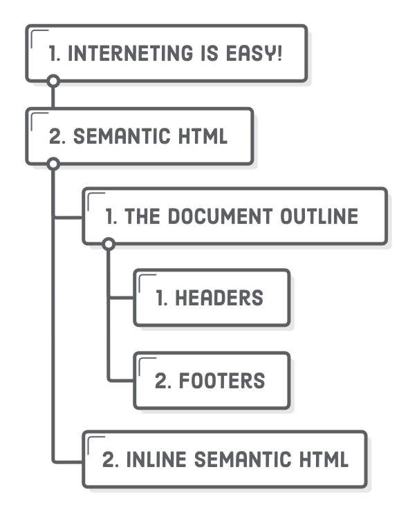
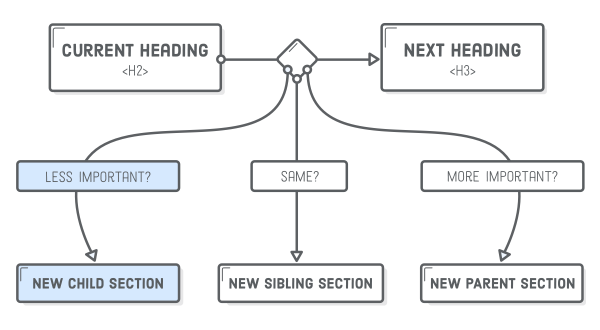
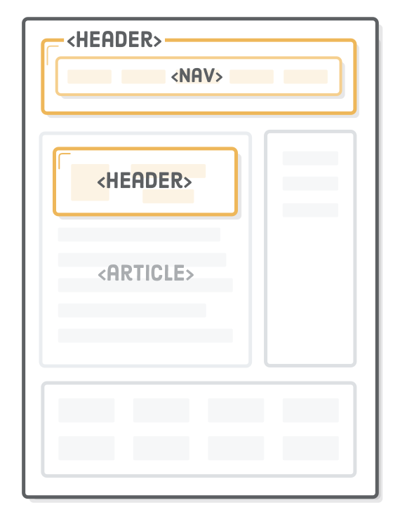

# 第十二章：HTML 语义标签

教材：[semantic html](https://internetingishard.com/html-and-css/semantic-html/)

---

语义化 HTML 是指我们所使用的 HTML 标记应传达内容的基本含义而非其外观样式。HTML5 有一套称为章节元素 sectioning elements 是专为在网页的总体布局中添加更多含义而设计的。


目前使用这些具有特定语义的标签构建的现代化网页，称为 semantic markup（而非使用通用的 `<div>` 标签，网页中存在大量的无语义 `<div>` 元素称为 `<div> soup`），可以使搜索引擎、屏幕阅读器和其他机器更容易识别网站的不同部分，同时方便维护。

 


## 配置

创建 `article.html` 文档，并编写模板代码。

文档 `article.html`

```html
<!DOCTYPE html>
<html lang='en'>
  <head>
    <meta charset='UTF-8'/>
    <title>Semantic HTML</title>
  </head>
  <body>

    <h1>Interneting Is Easy!</h1>
    <ul>
      <li><a href='#'>Home</a></li>
      <li><a href='#'>About</a></li>
      <li><a href='#'>Blog</a></li>
      <li><a href='#'>Sign Up</a></li>
    </ul>

  </body>
</html>
```


## 大纲

每一个 HTML 文档都应该有一个大纲结构，最基本的大纲由标题元素 `<h1>` 至 `<h6>` 构成，以便搜索引擎和屏幕阅读器识别网页的内容结构。

**在 `article.html` 中添加代码：**

```html
<h1>Semantic HTML</h1>
<p>By Troy McClure. Published January 3rd</p>
<p>This is an example web page explaining HTML5 semantic markup.</p>

<h2>The Document Outline</h2>
<p>HTML5 includes several “sectioning content” elements that
   affect the document outline.</p>

<h3>Headers</h3>
<p>The <code>&lt;header&gt;</code> element is one such sectioning
   element.</p>

<h3>Footers</h3>
<p>And so is the <code>&lt;footer&gt;</code> element.</p>

<h2>Inline Semantic HTML</h2>
<p>The <code>&lt;time&gt;</code> element is semantic, but it’s not
   sectioning content.</p>

<p>This fake article was written by somebody at InternetingIsHard.com, which
   is a pretty decent place to learn how to become a web developer.</p>

<p>&copy; 2017 InternetingIsHard.com</p>
```

示例添加了一些 HTML 标签和文本内容，模拟创建一篇博客文章。

通过标题标签可以创建大纲结构：

* 每个标题标签 `<h1>` 创建一个新的章节
* 每个标题后的次级标题标签被视为其下的小节。

使用 [HTML5 Outliner](https://gsnedders.html5.org/outliner/) 工具可以十分便捷地分析提取页面文档的大纲结构。



在使用标题标签构建网页大纲结构时，上下标题的层级关系起重要作用（而非标题实际绝对等级），如将 HTML 文档中最小的标题等级 `<h3>` 标签均改为 `<h4>`，并用 HTML5 Outliner 分析大纲结构依然可得同样的结果。

应该根据内容上下文的重要关系，采用合适的标题标签构建大纲结构，以方便搜索引擎区分识别网页中重要内容。




## article 标签

元素 `<article>` 用以表示网页中独立的文章内容部分，其包装的内容应该是完整的，即这部分内容即时「取出」后插入到其他网页也不影响理解的。

**更新 `article.html` 文档的代码：**

```html
<article>
  <h1>Semantic HTML</h1>
  <p>By Troy McClure. Published January 3rd</p>
  <p>This is an example web page explaining HTML5 semantic markup.</p>
  <!-- ... -->
  <p>This fake article was written by somebody at InternetingIsHard.com, which
     is a pretty decent place to learn how to become a web developer.</p>
</article>

<p>&copy; 2017 InternetingIsHard.com</p>
```

示例将网页的主体部分嵌套在元素 `<article>` 内，除了 `copyright` 信息，因为这是整个网页的注脚而不仅仅是文章主体的信息。

实际上，元素 `<article>` 类似于一个微型网页，它含义必要的文档大纲，即使只将这部分的内容移至其他网页也不会引起理解上的问题，如可以将 `<article>` 整体移到 [Flipboard](https://flipboard.com/) 作为其中一个条目。


### 使用多个 article 标签

一般博客文章、新闻文章或单个网页都只有一个主题，因此常常使用一个 `<article>` 元素，但是在目录或导航类型的页面可以使用多个 `<article>` 标签。如将大量博客帖子归类到一个页面，每一篇文章的概述都可以包装在单独的 `<article>` 元素中。

```html
<article>
	<h1>First Post</h1>
    <p>Some content</p>
</article>
<article>
	<h1>Second Post</h1>
    <p>Some more content</p>
    <h2>Sbusection</h2>
    <p>Some details</p>
</article>
<article>
	<h1>Last Post</h1>
    <p>Final bit of content</p>
</article>
```

示例通过多个 `<article>` 元素告诉表示该网页有三篇独立的文章，而仅使用一堆通用无语义的 `<div>` 元素或采用任意类名的一做法相比，语义化 HTML 使搜索引擎引擎、浏览器或其他试图解析网页内容的机器，更容易读取网页的内容，并提供更好的导航浏览体验。


## section 标签

标签 `<section>` 与 `<article>` 类似，也是用以包装部分内容的，但是包含的内容**不需要**独立于上下文。

类似于 `<div>` 元素，`<section>` 元素是 HTML5 中通用容器，但是比 `<div>` 具有语义。该标签的作用可以理解为***显式***手动地定义网页章节，以便为嵌套的内容设置新特定的样式（而不使用标题标签的默认样式）。

**更新 `article.html` 文档代码：**

```html
<section>     <!-- Add this -->
  <h2>The Document Outline</h2>
  <p>HTML5 includes several “sectioning content” elements that
     affect the document outline.</p>

  <h3>Headers</h3>
  <p>The <code>&lt;header&gt;</code> element is one such sectioning
     element.</p>

  <h3>Footers</h3>
  <p>And so is the <code>&lt;footer&gt;</code> element.</p>
</section>    <!-- And this -->

<section>     <!-- This too! -->
  <h2>Inline Semantic HTML</h2>
  <p>The <code>&lt;time&gt;</code> element is semantic, but it’s not
     sectioning content.</p>
</section>    <!-- Don't forget this -->
```

示例为页面的两部分添加了 `<section>` 标签，手动定义章节（大纲结构依然不变）。

### section 标签和文档大纲

使用 `<section>` 标签可以显式地手动定义章节，章节层级结构是基于元素的嵌套关系的（因此会破坏原来标题元素形成的层级结构，它们是根据上下文的相对等级关系的）。

**更新 `article.html` 文档代码：**

```html
<section>
  <h6>Inline Semantic HTML</h6>     <!-- Change this heading level -->
  <p>The <code>&lt;time&gt;</code> element is semantic, but it’s not
  sectioning content.</p>
</section>
```


示例在文档中插入的元素 `<section>` 破坏了原有的基于标题标签的相对层级关系，而是以元素嵌套关系形成新大纲结构，这意味着每个 `<section>` 内部使用的标题标签层级关系（独立）与外部的标题层级关系互不影响。

章节的名称是元素 `<section>` 内的第一个标题标签的内容，如果该元素内没有标题标签，则该章节为 `Untitled Section`。

**更新 `article.html` 文档代码：**

```html
<h2>Inline Semantic HTML</h2>
<section>
  <!-- This will be an "Untitled Section" -->
  <p>The <code>&lt;time&gt;</code> element is semantic, but it’s not
  sectioning content.</p>
</section>
```


示例创建的其中一个元素 `<section>` 内没有标题标签，因此在解析网页大纲时，这部分的章节没有标题。

应该尽量避免使用元素 `<section>` 手动显式创建章节，因为浏览器、屏幕阅读器和搜索引擎无法准确地解析标签 `<section>` 对文档大纲的影响，应该尽量使用语义清晰的标题标签。不应该作为独立内容的容器（而应该使用 `<article>` 元素），而且也不应该充当纯粹实现布局的容器（而应该使用 `<div>` 通用容器）。

仅在隐式定义网页部分实现不同样式设置时，替代通用盒子 `<div>` 元素以提供更多的语义信息。


## nav 标签

元素 `<nav>` 标记网页的导航部分，包括导航栏、侧边栏（链接到相关网页）或其他有大量相关链接集合的区域。


**更新 `article.html` 文档的代码：**

```html
<h1>Interneting Is Easy!</h1>
<nav>                                    <!-- Add this -->
  <ul>
    <li><a href='#'>Home</a></li>
    <li><a href='#'>About</a></li>
    <li><a href='#'>Blog</a></li>
    <li><a href='#'>Sign Up</a></li>
  </ul>
</nav>                                    <!-- This too! -->
```

示例为全站导航添加了 `<nav>` 标签。

对于搜索引擎而言该元素的语义信息十分有用，可以帮助机器快速发现页面的链接。

在单个页面上如果有多个链接集，则网页可以包含多个导航元素。


## header 标签

元素 `<header>` 与标题元素不同，用以标记介绍性内容，如在导航栏中的公司 Logo 或文章作者信息。

一般将网页名称、Logo 和主导航栏包含在 `<header>` 元素内，因为这些信息都是整个网页的概述信息。



**更新 `article.html` 文档的代码：**

```html
<header>
  <h1>Interneting Is Easy!</h1>
  <nav>
    <ul>
      <li><a href='#'>Home</a></li>
      <li><a href='#'>About</a></li>
      <li><a href='#'>Blog</a></li>
      <li><a href='#'>Sign Up</a></li>
    </ul>
  </nav>
</header>
```

示例为网页的导航栏添加了 `<header>` 标记。

该元素可以包含 `<section>`、`<article>` 或整个网页的概述内容，即在一个页面中可以设置多个 `<header>` 标签以标记网页不同部分的介绍信息。

**更新 `article.html` 文档的代码：**

```html
<article>
  <header>
    <h1>Semantic HTML</h1>
    <p>By Troy McClure. Published January 3rd</p>
  </header>

  <p>This is an example web page explaining HTML5 semantic markup.</p>
  <!-- ... -->
```

示例将文章标签 `<article>` 内的标题和作者信息添加 `<header>`  标记，以将第一个段落与文章余下段落区分开来，方便后续进行样式设置（类似于一个含义语义的 `<div>` 容器）。


## footer 标签

元素 `<footer>` 用以标记网页或文章的脚注信息，与元素 `<header>` 用法用类似（作用相反），常见的用例包括版权声明、页脚导航和博客文章末尾的作者履历等内容，同样在一个页面可以使用多个  `<footer>` 标签以标记网页的不同部分。


**更新 `article.html` 文档的代码：**

```html
<article>
  <header>
    <h1>Semantic HTML</h1>
    <p>By Troy McClure. Published January 3rd</p>
  </header>

  <p>This is an example web page explaining HTML5 semantic markup.</p>
  <!-- ... -->
  
  <footer>         <!-- Add this -->
    <p>This fake article was written by somebody at InternetingIsHard.com,
       which is a pretty decent place to learn how to become a web developer. This
       footer is only for the containing <code>&lt;article&gt;</code> element.</p>
  </footer>        <!-- And this -->

</article>

<footer>           <!-- This, too -->
  <p>&copy; 2017 InternetingIsHard.com</p>
</footer>          <!-- Don't forget to close it! -->
```

示例为页面的版权声明和文章最后的作者信息添加注脚标记。


## aside 标签

元素 `<aside>` 标记出额外添加的内容，一般这些内容与上下文无关，如嵌套在 `<article>` 中的赞助广告信息可通过该元素标记出来，以与文章内容有明显的区分。

此外元素 `<aside>` 适用于突出显示定义，统计信息或引文，并为该元素（及其包含的内容）设置与本文的其余部分不同的样式。


**在 `article.html` 文档中添加代码：**

```html
<article>
  <header>
    <h1>Semantic HTML</h1>
    <p>By Troy McClure. Published January 3rd</p>
  </header>
  <!-- Look! A fake advertisement! -->
  <aside class='advert'>
    
  </aside>
  
  <p>This is an example web page explaining HTML5 semantic markup.</p>
```

示例为文章添加了一张广告图，即使图像位于元素中，但由于使用了元素 `<aside> ` 标记了，因此屏幕阅读器可以解析图像与文章是无关的。

当元素 `<aside>` 在文章外标记内容时，表示所包含的信息是与整个网页的内容相「分离」，因此常常用于标记网页的侧边栏。

**在 `article.html` 文档中标签 `</article>` 和第二个脚注标签 `<footer>` 之间添加代码：**

```html
<aside class='sidebar'>
  <h2>Sidebar</h2>
  <p>Some sidebar content</p>
  <nav>
    <h3>HTML &amp; CSS Tutorial</h3>
    <ul>
      <li><a href='#'>Introduction</a></li>
      <li><a href='#'>Basic Web Pages</a></li>
      <li><a href='#'>etc...</a></li>
    </ul>
  </nav>
  <nav>
    <h3>JavaScript Tutorial</h3>
    <ul>
      <li><a href='#'>Introduction</a></li>
      <li><a href='#'>Hello, JavaScript</a></li>
      <li><a href='#'>etc...</a></li>
    </ul>
  </nav>
</aside>
```

示例为页面添加了两个导航栏，并使用元素 `<aside>` 标记。


## div 元素与网页布局

在前端开发中应该尽可能使用 HTML 语义标签创建网页，以方便机器正确解析页面结构。

但是当需要对特定的元素集合进行布局样式的设计时，而无法使用合适的语义标签进行标注时，可以使用通用容器 `<div>`。如希望使用 auto-margin 技术将页面居中，可以将整个页面包含在固定宽度的容器 `<div class='page'>` 中，再对容器进行相应的样式设置；或者使用 flexbox 布局，为了实现复杂的网页布局可能需要使用多个 `<div>` 将 flex 项目进行组合。

**更新 `article.html` 文档的代码：**

```html
  <body>
    <div class='page'>             <!-- Start of container div -->
      <header>
        <h1>Interneting Is Easy!</h1>
        <nav>
          <ul>
            <li><a href='#'>Home</a></li>
            <li><a href='#'>About</a></li>
            <li><a href='#'>Blog</a></li>
            <li><a href='#'>Sign Up</a></li>
          </ul>
        </nav>
      </header>
      <!-- ... -->
      <footer>
        <p>&copy; 2017 InternetingIsHard.com</p>
      </footer>
    </div>                         <!-- End of container div -->
  </body>
</html>
```

合理正确地使用语义元素可以为机器提供更详细的网页结构信息，但是不能滥用，如果找不到合适的语义元素，可以使用 `<div>` 通用容器，这样开发者可避免被不正确的语义标签所混淆和误解。


## 日期和时间标签

人类表示时间的格式有多种，为了让机器准确解析，可以使用标签 `<time>` 的属性 `datatime` 设置规范的日期，以便浏览器将其自动链接到用户的日历，并帮助搜索引擎清楚地识别日期。


当网页添加了 `<time>` 标签后，在 Google 搜索引擎的词条中会展示出相应的日期。

**更新 `article.html` 文档的代码：**

```html
<article>
  <header>
    <h1>Semantic HTML</h1>
    <p>By Troy McClure. Published <time datetime='2017-1-3'>January
       3rd</time></p>
  </header>
  <!-- ... -->
```

示例为文章的发布日期添加了时间标签，并通过属性 `datetime` 设置相应的规范的日期。日期格式时从大到小列出：年、月、日，可以添加具体的时间点（24 小时制）和相应的时区 。

```html
<time datetime='2017-1-3 15:00-0800'>January 3rd</time>
```

示例中 `-0800` 是相对格林尼治标准时间 GMT 的时区偏移量，表示太平洋标准时间。


## 地址

元素 `<adress>` 提供有关文章或网页作者的联系信息，与 `<time>` 类似并非结构标签，而是为网页提供元信息。

地址元素的默认样式和元素 `<em>` 一样（即字体为斜体）。

**更新 `article.html` 文档的代码：**

```html
<footer>
  <p>This fake article was written by somebody at InternetingIsHard.com, which
     is a pretty decent place to learn how to become a web developer. This footer
     is only for the containing <code>&lt;article&gt;</code> element.</p>
  <address>
    Please contact <a href='mailto:troymcclure@example.com'>Troy
    McClure</a> for questions about this article.
  </address>
</footer>
```

示例在文章的注脚中添加了作者的联系方式，其中[链接指向作者的邮箱](https://developer.mozilla.org/zh-CN/docs/Learn/HTML/Introduction_to_HTML/Creating_hyperlinks#%E7%94%B5%E5%AD%90%E9%82%AE%E4%BB%B6%E9%93%BE%E6%8E%A5)（通过 `mailto:` 语法实现，当点击一个链接或按钮时，打开一个新的电子邮件发送信息而不是连接到一个资源或页面）。

:warning: 不应该使用标签 `<address>` 来描述邮政地址，除非这些信息是联系信息的组成部分。


## 图片和标题

元素 `<figure>`  和 `<figcaption>` 分别标注一个独立的图形（如图表、插图甚至是代码片段）以及图片的描述性文字。

通过这两个标签组合，可以为内嵌在 `<figure>` 的标签 `` 所指向的图片添加可视描述（无论图片是否正常显示），相对应的是`` 标签的属性 `alt` 设置了（图片正常显示时）不可视的*替代性*描述。

```html
<section>
	<h2>The Document Outline</h2>
    <p>HTML5 inculdes several "sectioning content" elements that affect the document outline.</p>
    
    <figure>
    	, <section>, and <nav> elements' />
        <figcaption>New HTML5 semantic elements</figcaption>
    </figure>
</section>
```

元素 `<figcaption>` 与属性 `alt` 类似，都可以为浏览器和 SEO 提供图片信息。因此可以根据使用的图像类型，只使用可见的 `<figcaption>` 元素描述图片，降低代码冗余程度。


## 旧浏览器的 CSS 注意事项

本章介绍的 HMTL 语义元素都是 HTML5 标准中定义的，旧浏览器可能无法正确识别解析。因此需要添加以下代码，将这些元素行为设置为与通用容器 `<div>` 一致（即均为块元素，而非内联元素）。

```css
section, article, aside, footer, header, nav {
    display: block;
}
```


## 总结

使用 HTML 语义标签可以将网页结构信息准确传达给机器（而相应地通过 CSS 样式设置可以将网页结构信息传达给用户），这对于网页 SEO 很重要。

更多语义标签相关资源：

* [Schema.org microdata](http://schema.org/docs/gs.html) 可让您更改网站在搜索引擎结果中的外观
* [Twitter cards](https://dev.twitter.com/cards/getting-started) 定义如何在推文中显示您的网页
* [Open Graph metadata](https://developers.facebook.com/docs/sharing/webmasters#markup) 更改 Facebook 分享内容的方式