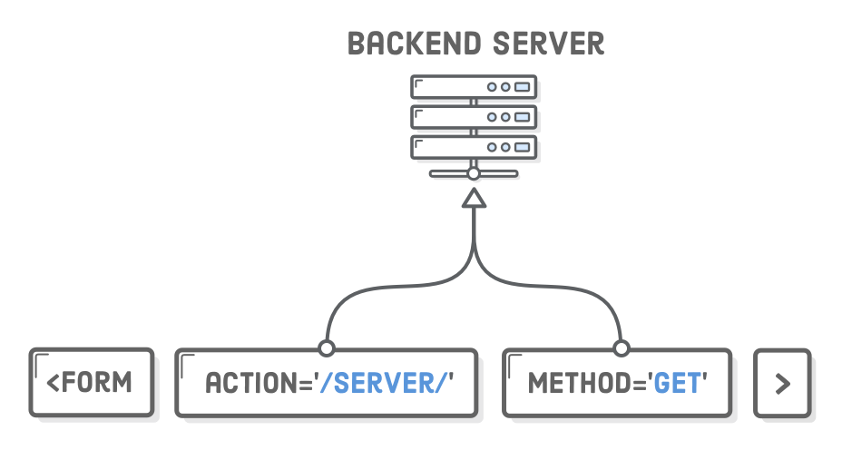
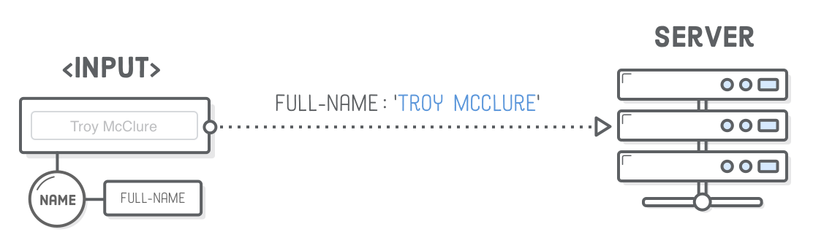
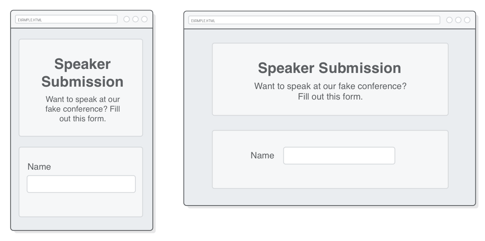
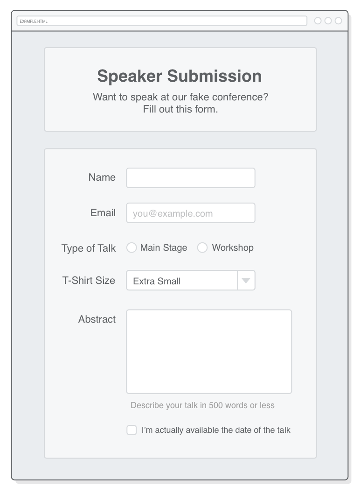

# 第十三章：表单

教材：[html forms](https://internetingishard.com/html-and-css/forms/)

---

HTML 的表单元素可以让你收集用户输入的信息，如邮件列表、联系地址表格、博客文字评论等。

表单有多种形式：

* Text Input 单行表单
* Textarea 多行表单
* Radio Buttons 单选按钮
* Checkboxes （多选）复选框
* Dropdown Menu （单选）下来菜单
* Button 按钮


HTML 表单的功能实现分两个方面

* 前端用户界面：表单的外观（由 HTML 和 CSS 定义）
* 后端服务器：处理表单的代码（将数据存储在数据库中，对用户输入的数据执行相关操作，如向用户提供的邮箱发送电子邮件等）

表单就是「金钱页面」，它们是电子商务网站销售产品的主要方式，许多公司通过表单的有效性来衡量其网站设计开发是否成功，这就意味着表格要经过无休止的 A/B 测试和优化。

> **A/B测试**为一种随机测试，将两个不同的东西（即A和B）进行假设比较。该测试运用统计学上的假设检定和双母体假设检定。 A/B测试可以用来测试某一个变量两个不同版本的差异，一般是让A和B只有该变量不同，再测试其他人对于A和B的反应差异，再判断A和B的方式何者较佳。
>
> 参考：[A/B测试 - 维基百科，自由的百科全书](https://zh.wikipedia.org/wiki/A/B%E6%B8%AC%E8%A9%A6)


## 配置

表单构建十分复杂困难，因此在开始编写代码之前，最好有一个能够设计好的页面原型，这对于表单尤为重要。

下图是这一章需要创建的（响应式）表单原型，包括多种类型的表单：

* 多种 text fields 输入框/文本框
* 一组 radio buttons 单选按钮
* 一个 dropdown menu 下拉菜单
* 一个 checkbox （复）选框
* 一个 submit button 提交按钮


创建 `forms` 目录，添加 `speaker-submission.html` 和 `styles.css` 文档，并编写模板代码。

文档 `speaker-submission.html`

```html
<!DOCTYPE html>
<html lang='en'>
  <head>
    <meta charset='UTF-8'/>
    <title>Speaker Submission</title>
    <link rel='stylesheet' href='styles.css'/>
  </head>
  <body>
    <header class='speaker-form-header'>
      <h1>Speaker Submission</h1>
      <p><em>Want to speak at our fake conference? Fill out
        this form.</em></p>
    </header>
  </body>
</html>
```

文档 `styles.css`
```css
* {
  margin: 0;
  padding: 0;
  box-sizing: border-box;
}

body {
  color: #5D6063;
  background-color: #EAEDF0;
  font-family: "Helvetica", "Arial", sans-serif;
  font-size: 16px;
  line-height: 1.3;

  display: flex;
  flex-direction: column;
  align-items: center;
}

.speaker-form-header {
  text-align: center;
  background-color: #F6F7F8;
  border: 1px solid #D6D9DC;
  border-radius: 3px;
  
  width: 80%;
  margin: 40px 0;
  padding: 50px;
}

.speaker-form-header h1 {
  font-size: 30px;
  margin-bottom: 20px;
}
```

预设的基本样式是基于移动（手机）优先的原则进行的布局。


## HTML 表单

[标签 `<form>`](https://developer.mozilla.org/zh-CN/docs/Web/HTML/Element/form) 以创建表单，可设置多种属性，其中 `action` 和 `method` 最重要，分别设置处理表单的服务器地址 URL 和数据传输的方法（常见为 `POST` 和 `GET`）。



属性 `action` 定义了处理表单数据的服务器地址 URL，即当用户点击 **Submit** 按钮时，用户在表单中输入的数据将会传输到 `action` 指定后端服务器（后端服务器通过  [Node.js](https://nodejs.org/en/)、[PHP](http://php.net/)、[Ruby on Rails](http://rubyonrails.org/) 构建数据处理程式）。

属性 `method` 定义了数据传输的方法，主要使用两种方法：

* [`POST`](https://developer.mozilla.org/zh-CN/docs/Web/HTTP/Methods/POST) 需要修改服务器上的数据时使用的方法
* [`GET`](https://developer.mozilla.org/zh-CN/docs/Web/HTTP/Methods/GET) 需要从服务器获取已存在的数据时使用的方法

**在 `speaker-submission.html` 文档中添加代码：**

```html
<form action='' method='get' class='speaker-form'>
</form>
```

**在 `styles.css` 文档中添加代码：**

```css
.speaker-form {
  background-color: #F6F7F8;
  border: 1px solid #D6D9DC;
  border-radius: 3px;
  
  width: 80%;
  padding: 50px;
  margin: 0 0 40px 0;
}
```

示例创建了一个空表单，并将数据提交的地址指向表单所在的页面（即当前页面，类似地也可以设置为 `action='#'`），还设定提交数据的方法为 `GET`，即从当前页面获取表单的数据。设置空表单的样式以和标题样式统一。


## 文本输入框/单行表单

标签 `<input/>` 创建输入框，以接受用户输入的数据。输入框类型有多种可以通过属性 `type` 设置，不同类型的文本框默认样式和功能不同（不同类型的输入框可以接受用户输入的信息类型不同，通过该属性可以进行基本的**数据类型验证**），当属性值设置为 `text` 时创建的是文本输入框。

文本输入框的属性 `name` 定义变量名称，该变量用以「存储」数据输入的信息，以便数据在传输给服务器后可以通过该变量名调用。

文本输入框可以通过属性 `value` 设置框内预先填充的文本。



文本输入框有一个「附加」的元素 `<label>` 以描述文本框（这是一个 HTML 语义标签，类似于元素 `<figcaption>` 图片的可视化描述），而为了实现文本输入框与标签的「配对」，元素 `<input/>` 的属性 `id` 和元素 `<label>` 的属性 `for` 需要设置为相同值。


:warning: 不应该使用 id 选择器设置元素样式，标签 `<input/>` 属性 `id` 只应该用于与标签 `<label>` 进行匹配。

**在 `speaker-submission.html` 文档中添加代码：**

```html
<div class='form-row'>
  <label for='full-name'>Name</label>
  <input id='full-name' name='full-name' type='text'/>
</div>
```

**在 `styles.css` 文档中添加代码：**

```css
.form-row {
  margin-bottom: 40px;
  display: flex;
  justify-content: flex-start;
  flex-direction: column;
  flex-wrap: wrap;
}

.form-row input[type='text'] {
  background-color: #FFFFFF;
  border: 1px solid #D6D9DC;
  border-radius: 3px;
  width: 100%;
  padding: 7px;
  font-size: 14px;
}

.form-row label {
  margin-bottom: 15px;
}

@media only screen and (min-width: 700px) {
  .speaker-form-header,
  .speaker-form {
    width: 600px;
  }
  .form-row {
    flex-direction: row;
    align-items: flex-start; /* To avoid stretching */
    margin-bottom: 20px;
  }
  .form-row input[type='text'] {
    width: 250px;
    height: initial;    /* default value, the height base on content */
  }
  .form-row label {
    text-align: right;
    width: 120px;
    margin-top: 7px;
    padding-right: 20px;
  }
}
```



示例为空表单添加了一个文本输入框，并为其添加标注为 `Name`。在样式表中通过媒体查询实现响应式设计，通过 flexbox 布局 `flex-direction` 让表单（文本输入框和标注文本）在手机端项目纵向排布，在桌面端项目横向排布。

其中选择器 `input[type='text']` 是一种新的选择器，即[**属性选择器** attribute selector](https://developer.mozilla.org/zh-CN/docs/Web/CSS/Attribute_selectors)，只有具有属性 `type` 且属性值为 `text` 的输入框元素会被选中。

此外输入框 `<input>` 还有[很多不同的属性可以设置](https://developer.mozilla.org/zh-CN/docs/Web/HTML/Element/Input)， 以提供更多的信息和功能：

* `required` 当属性值为 `true` 时，表示只有当此 `<input/>` 元素有值时，整个表单才能提交
* `minlength` 设定需要输入的字符最少数量
* `maxlength` 设定最多输入的字符数量（文本输入框所有数据都只能在一行内显示，通过限制最多输入的字数避免字符过多显示不全）
* `pattern` 检查控件值的正则表达式，即更高级的数据验证方法。


## 邮件输入框

当元素 `<input>` 的属性 `type` 设置为 `email` 可创建的是邮件输入框，只接受输入邮件格式的文本。

**在 `speaker-submission.html` 文档中添加代码：**

```html
<div class='form-row'>
  <label for='email'>Email</label>
  <input id='email'
         name='email'
         type='email'
         placeholder='joe@example.com'/>
</div>
```

**更新 `styles.css` 文档的代码：**

```css
/* To have another selector */
.form-row input[type='text'],
.form-row input[type='email'] {
  background-color: #FFFFFF;
  /* ... */
}

@media only screen and (min-width: 700px) {
  /* ... */
  .form-row input[type='text'],
  .form-row input[type='email'],    /* Add */
  .form-row select,                 /* These */
  .form-row textarea {              /* Selectors */
    width: 250px;
    height: initial;
  }
  /* ... */
}
```


示例在容器 `form-row` 中添加了一个邮件输入框，并设置了与文本输入框一致的样式，由于输入框类型很多，因此推荐使用 CSS 属性选择器为特定类型的 `<input>` 设置样式。

邮件输入框还设置了属性 `placeholder` 以在输入框为空时显示一些默认文本，示例中显示 `joe@example.com`，这是一种很好的 UX 设计以提示用户参照格式输入自己的值。

设置输入框的类型可以进行基本的数据验证。在Firefox中输入不是电子邮件地址的内容，然后在输入框之外单击（以使其取消激活输入状态）并验证其输入，输入框会变成红色，以向用户显示输入的值格式不正确。而在 Chrome 和 Safari 浏览器直至用户提交表单才会尝试进行验证。


为了在 Chrome 等其他浏览器中也可以实现即时的数据格式验证和反馈，可以使用输入框（状态）的伪类选择器 `:invalid` 和 `:valid` 分别设置「不合法」输入和「合法」输入的样式。

**在 `styles.css` 文档中添加代码：**

```css
.form-row input[type='text']:invalid,
.form-row input[type='email']:invalid {
  border: 1px solid #D55C5F;
  color: #D55C5F;
  box-shadow: none; /* Remove default red glow in Firefox */
}
```


示例为邮件输入框设置当输入不符合数据格式时的样式，红色边框和红色字体，以提醒用户更正输入的信息。

此外还可以使用伪类 `:focus` 设置输入框被激活（输入时）的样式，通过添加边框阴影等以提示用户目前输入的文本框，提供更好的用户体验度。

```css
.form-row input:focus {
	border: 2px solid #5D6063;
}
```

设置输入框的类型不仅仅可以进行基础的数据验证，还可以提供更好的用户体验，如智能手机浏览器解析到激活的文本输入框 `type ='email'` 属性时，它将为用户提供一个特殊的电子邮件专用包含 `@` 字符键盘，便于用户输入邮件地址。


## 单选按钮

当元素 `<input>` 的属性 `type` 设置为 `radio` 创建单选按钮。单选按钮由多个元素集合而成：

* `<fieldset>` 包含其他所有元素（相当于一个容器）
* `<legend>` 描述按钮集
* `<input>` 每个按钮
  * 所有的按钮 `name` 属性值必须相同，以表示属于同一集合（单选按钮的变量名唯一，以向服务器发送唯一选中的数据）
  * 每个按钮都需要预设 `value` 值，由于用户只能进行点击交互（而不能输入数据，因此发送给服务器的值需要预设）
  * 属性 `checked` 是一个布尔值（即不需要设置属性值），当该属性出现在元素 `<input>` 中表示该按钮/复选框被默认选中
* `<label>` 每个按钮对应的标记，其中 `for` 属性值需要与对应 `<input>` 的 `id` 值相同（以配对）

包括选项集的说明 `<legend>`，各选项的描述 `<label>` 和选项 `<input>`，并将这些元素都嵌套在元素 中。

**在 `speaker-submission.html` 文档中添加代码：**

```html
<fieldset class='legacy-form-row'>
  <legend>Type of Talk</legend>
  <input id='talk-type-1'
         name='talk-type'
         type='radio'
         value='main-stage' />
  <label for='talk-type-1' class='radio-label'>Main Stage</label>
  <input id='talk-type-2'
         name='talk-type'
         type='radio'
         value='workshop'
         checked />
  <label for='talk-type-2' class='radio-label'>Workshop</label>
</fieldset>
```

示例在页面添加了一个名为 `Type of Talk` 的单选按钮，含有两个备选项。


单选按钮的默认样式十分难看，而且 `<fieldset>` 并不支持 flexbox 布局（这是旧技术 float 作为备选项的一个很好的例子，即为旧的/复杂的元素设置布局），且其中包含大量的嵌套按钮，因此进行样式设计时需要更细致地设置。

**在 `styles.css` 文档中添加代码：**

```css
.legacy-form-row {
  border: none;    /* remove default black border outline */
  margin-bottom: 40px;
}

.legacy-form-row legend {
  margin-bottom: 15px;
}

.legacy-form-row .radio-label {
  display: block;
  font-size: 14px;
  padding: 0 20px 0 10px;
}

.legacy-form-row input[type='radio'] {
  margin-top: 2px;
}
  
.legacy-form-row .radio-label,
.legacy-form-row input[type='radio'] {
  float: left;
}

@media only screen and (min-width: 700px) {
  /* ... */
  .legacy-form-row {
    margin-bottom: 10px;
  }
  .legacy-form-row legend {
    width: 120px;
    text-align: right;
    padding-right: 20px;
  }
  .legacy-form-row legend {
    float: left;
  }
}
```


示例去除了默认样式的外边框，使用 float 技术设置单选按钮的布局，手机端使用两行布局；桌面端使用单行布局（因此所有元素都设置为 `display: float`）

其中将按钮集描述元素 `<legeng>` 宽度设置为 `width: 120px` 其中文字右对齐，目的是与其上方的表单文字对齐统一。

还可以对按钮样式进行定制（结合使用属性 `checked` 可以定制选中状态下的按钮样式），但设置方法较复杂。

参考：[Custom Radio Buttons](https://css-tricks.com/snippets/css/custom-radio-buttons/)

其中一种形式是先利用 CSS 裁剪隐藏默认的各选项按钮，再利用伪类选择器 `::before` 在 `<label>` 前插入定制化的按钮未被选中的样式（可以用**图片**的形式呈现更多样的图案），再结合 `checked` 和 `::before` 伪类选择器设置按钮被选中的样式。

```css
#foo:checked::before,
input[type="checkbox"] {
    position:absolute;
    clip: rect(0,0,0,0);
    clip: rect(0 0 0 0);
}

#foo:checked,
input[type="checkbox"] + label::before {
    content: url('checkbox.png');
}

input[type="checkbox"]:checked + label::before {
    content: url('checkbox-checked.png');
}
```

当然也可以采用规则的图像样式，并添加更多的细节，具体示例可参考：

* [Completely CSS: Custom checkboxes, radio buttons and select boxes](https://kyusuf.com/post/completely-css-custom-checkbox-radio-buttons-and-select-boxes/) | Kenan Yusuf
* [`<input type="radio">` - HTML（超文本标记语言） | MDN](https://developer.mozilla.org/zh-CN/docs/Web/HTML/Element/Input/radio#Styling_radio_inputs)


## 下拉菜单

标签 `<select>` 创建下拉菜单，可以将它作为单选按钮的替代品（交互方式不同），不同的是下拉菜单是包含一系列元素 `<option>` 表示各选项的（并非由多组 `<label>` 与 `<input>` 配对构成）。

标签 `<select>` 的属性 `name` 设置变量名，以储存发送给服务器被用户唯一选中的数据，而需要发送的数据已在各选项 `<option>` 的属性 `value` 中预设。

元素 `<label>` 是描述整个下拉菜单的（而非分别描述各选项）。

**在 `speaker-submission.html` 文档中添加代码：**

```html
<div class='form-row'>
  <label for='t-shirt'>T-Shirt Size</label>
  <select id='t-shirt' name='t-shirt'>
    <option value='xs'>Extra Small</option>
    <option value='s'>Small</option>
    <option value='m'>Medium</option>
    <option value='l'>Large</option>
  </select>
</div>
```

示例为页面添加了一个下拉菜单模拟衣服码数选择器。

下拉菜单有多个内嵌的元素，而且在不同的系统中其默认样式也不同，如在 iOS 中点击元素 `<select>` 会激活一个原生的滚动 UI 组件，可以更轻松地浏览选项菜单，因此进行样式设置时需要考虑更多细节。


**在 `styles.css` 文档中添加代码：**

```css
.form-row select {
  width: 100%;
  padding: 5px;
  font-size: 14px;            /* now it work in Chrome */
}

@media only screen and (min-width: 700px) {
    /* ... */
    .form-row input[type='text'],
    .form-row input[type='email'],
    .form-row select {
        width: 250px;
        height: initial;    /* based on content height */
    }
    /* ... */
}
```

示例对字体和菜单的宽度即内边距进行小改动，可能部分浏览器不能正确显示，可以先将其默认外观样式取消，如针对 Chrome 和 Safari 浏览器设置 `-webkit-appearance: none;`（该属性前缀 `-webkit` 表示只能应用于 Chrome 和 Safari 浏览器，由于它们是使用 WebKit 引擎的），但 [MDN](https://developer.mozilla.org/en-US/docs/Web/CSS/-moz-appearance) 不推荐这样的方法。

由于下拉菜单在各平台的默认样式差距较大，进行样式设置可能会出现不可预估的情况，因此推荐使用单选按钮或JavaScript UI 小部件构建下拉菜单，如 [Bootstrap Dropdowns](https://getbootstrap.com/docs/4.4/components/dropdowns/) 和 [jQuery Selectmenu](https://jqueryui.com/selectmenu/)。

更多下拉菜单的问题可以查看 [高级设计 HTML 表单 - 学习 Web 开发 | MDN](https://developer.mozilla.org/zh-CN/docs/Learn/HTML/Forms/Advanced_styling_for_HTML_forms)。


## 多行表单

元素 `<textarea>` 创建多行的文本输入编辑控件，以接收用户输入的大量（文本）数据，适合用于收集个人简介，短文和评论等。需要设置元素的属性 `name` 以创建存储数据的变量。

:warning: 元素 `<textarea>` 与元素 `<input/>` 不同，后者是「自闭合」/「空」元素），因此默认文本是在开始标签和结束标签之间（并非在属性 `value` 设置）。

元素 `<label>` 描述多行文本输入编辑控件（注意需要设置相应的属性进行配对）。

**在 `speaker-submission.html` 文档中添加代码：**

```html
<div class='form-row'>
  <label for='abstract'>Abstract</label>
  <textarea id='abstract' name='abstract'></textarea>
  <div class='instructions'>Describe your talk in 500 words or less</div>
</div>
```

**在 `styles.css` 文档中添加代码：**

```css
.form-row textarea {
  font-family: "Helvetica", "Arial", sans-serif;
  font-size: 14px;

  border: 1px solid #D6D9DC;
  border-radius: 3px;

  min-height: 200px;
  margin-bottom: 10px;
  padding: 7px;
  resize: none;
}

.form-row .instructions {
  color: #999999;
  font-size: 14px;
  margin-bottom: 30px;
}

@media only screen and (min-width: 700px) {
  /* ... */
  .form-row .instructions {
    margin-left: 120px;
  }
}
```

示例在页面中添加了一个多行文本输入编辑控件，并取消了（默认）可让用户调整输入控件尺寸大小的功能 `resize: none`，并设置外边距将下方的补充描述文本与上方文本对齐。


## 复选框

当元素 `<input>` 的属性设置为 `checkbox` 时创建复选框，与单选按钮类似，只是复选框可以选中多个选项，因此不需要为各选项的属性 `name` 设置同一个值（反而应该设置不同的变量值存储各选项预设的 `value` 数据，也不需要将选项包含在元素 `<fieldset>` 选项集中）。

**在 `speaker-submisssion.html` 文档中添加代码：**

```html
<div class='form-row'>
  <label class='checkbox-label' for='available'>
      <input id='available'
             name='available'
             type='checkbox'
             value='is-available'/>
      <span>I’m actually available the date of the talk</span>
  </label>
</div>
```

**在 `styles.css` 文档中添加代码：**

```css
.form-row .checkbox-label {
  margin-bottom: 0;
}

@media only screen and (min-width: 700px) {
  /* ... */
  .form-row .checkbox-label {
    margin-left: 120px;
    width: auto;
  }
}
```



示例在页面添加了一个复选框，以让用户确认是否可以按时出席演讲。

其中复选框和附加的文字（内联元素）内嵌在元素 `<label>` 内，这也是一种正确的用法，可以将 `<label>` 与 `<input>` （在结构上）相关联，当然最好再通过设置相应的属性进行匹配。

将容器的宽度设置为 `auto` 可以让盒子基于其内容调整长度。


## 提交按钮

在表单内的元素 `<button>` 创建提交按钮。当用户点击提交按钮时，浏览器会对所有的输入框 `<input/>` 进行数据校验，只有当所有验证通过才会将表单提交给表单属性 `action` 指向的 URL。

**在 `speaker-submission.html` 文档中添加代码：**

```html
<div class='form-row'>
  <button>Submit</button>
</div>
```

**在 `styles.css` 文档中添加代码：**

```css
.form-row button {
  font-size: 16px;
  font-weight: bold;

  color: #FFFFFF;
  background-color: #5995DA;

  border: none;
  border-radius: 3px;

  padding: 10px 40px;
  cursor: pointer;
}

.form-row button:hover {
  background-color: #76AEED;
}

.form-row button:active {
  background-color: #407FC7;
}

@media only screen and (min-width: 700px) {
  /* ... */
  .form-row button {
    margin-left: 120px;
  }
}
```

示例在表单内创建一个提交按钮，并通过按钮伪类选择器 `:hover`、`:active` 设置鼠标悬浮和点击按钮时的不同样式。


上图是输入框有「不合法」文本时，点击提交按钮时显示的错误信息。（修正数据，以便尝试提交）

示例表单的数据提交方式是 `GET`，因此表单的数据会添加到 URL （示例设置 `action=''` 即指向当前页面所在的地址）之后，以问号 `?` 分隔；各项数据存储在属性`name` 定义的变量名中（通过赋值符号 `=` 相连）；各项数据之间以 `&` 分隔。


点击 `Submit` 按钮可以在浏览器地址栏观察到 URL 改变

```
speaker-submission.html?full-name=Rick&email=rick%40internetingishard.com&talk-type=workshop&t-shirt=l&abstract=Derp.&available=is-available
```

后端服务器收到请求，会从 URL 中解析出用户填写的信息。


## 总结

本章介绍了最常用的 HTML 表单元素，通过多种形式收集用户的输入信息：

* `<input type='text'/>` （单行）文本输入框
* `<input type='email'/>` 邮件输入框
* `<input type='radio'/>` 单选按钮
* `<select>` and `<option>` 下拉菜单
* `<textarea>` 多行表单
* `<input type='checkbox'>` 复选框
* `<button>` 提交按钮

`<label>` 添加表单的标注信息

表单信息一般传递给指定的服务器进行处理，而反馈方式有两种：

* 使用属性 `action`  将表单数据发送到后端 URL，然后该 URL 重定向到成功或错误页面（该方法不需要任何 JavaScript）
* 使用 AJAX 提交表单而不离开页面。通过使用 JavaScript 操作 HTML 将成功或错误消息显示在同一页面上。