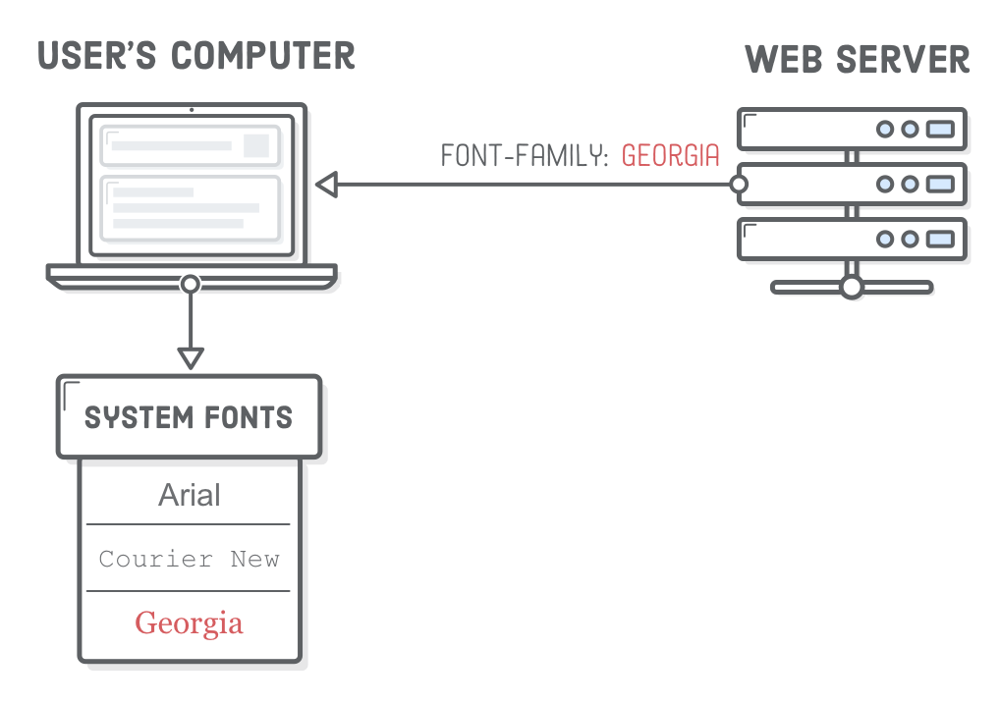
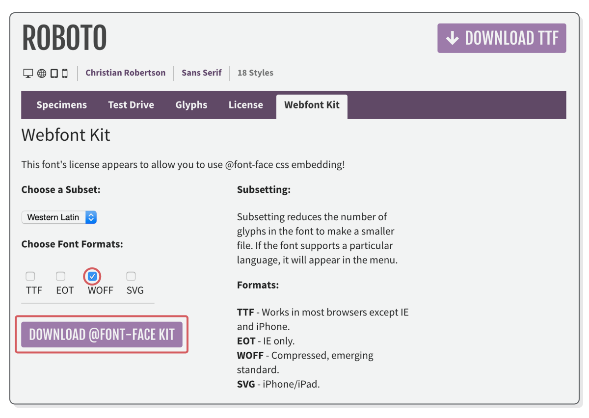
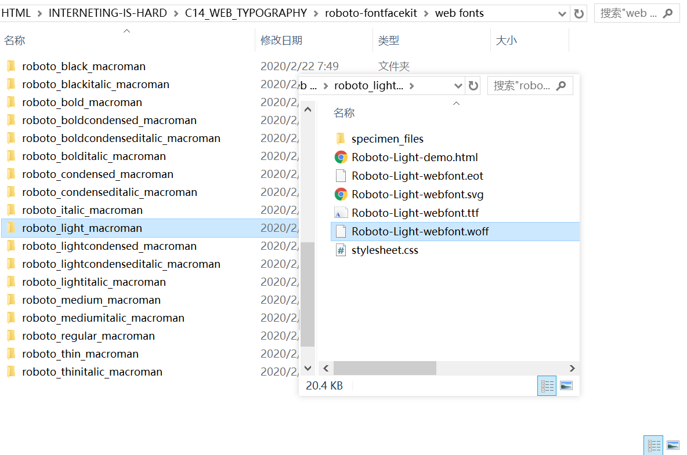
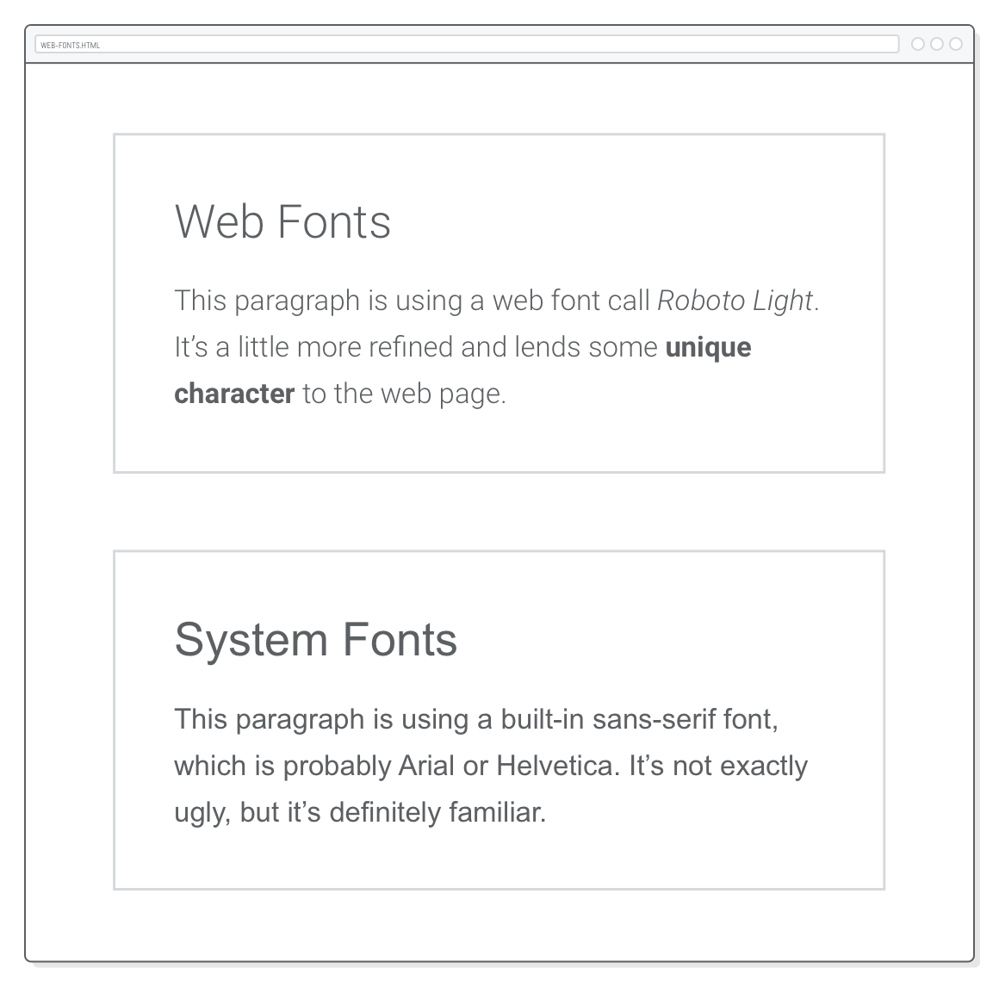
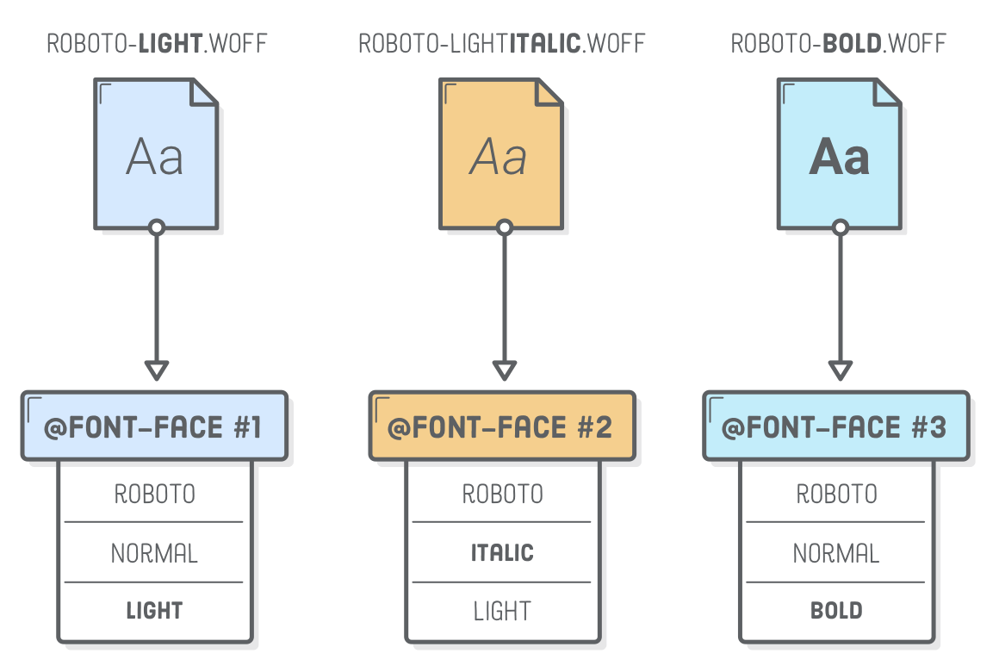
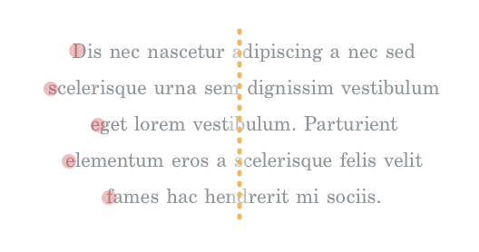
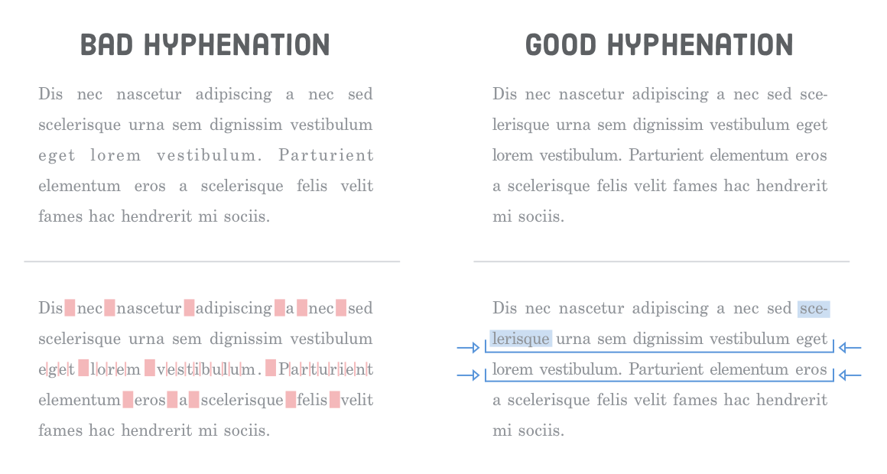

# 第十四章：字体

教材：[web typography](https://internetingishard.com/html-and-css/web-typography/)

---

网页字体排版是指网页中所有文本的外观，如字形、字体（如斜体）、缩进、文本对齐方式、行距等。

本章除了讲解用于实现字体排版样式的 CSS 属性外，还会介绍文字排版的原则和概念，让网页内容更易读以提高信息传递的效率。


## 网页字体简史

在最初前端工程师只能使用 「网页安全字体」，这是一类预装在各种系统的字体，还不能从服务器加载定制的字体文件。如果需要特殊的字体，只能将它们转换为图片插入到元素 `` 中。

### 定制字体

在大约 2010 年，浏览器开始支持定制化网页字体，浏览器支持从服务器下载字体文件，并在页面渲染出定制化字体。



但是各浏览器和设备支持的字体文件格式不同，因此会出现称为 [Bulletproof `@font-face` syntax 的语法](https://www.paulirish.com/2009/bulletproof-font-face-implementation-syntax/)，以实现支持多种浏览器。

```css
@font-face {
  font-family: 'Graublau Web';
  src: url('GraublauWeb.eot?') format('eot'), url('GraublauWeb.woff') format('woff'), url('GraublauWeb.ttf') format('truetype');
}
```
当时主流的四种网页字体文件格式：

| File Format | Browser/Device                      |
| ----------- | ----------------------------------- |
| `.svg`      | Very old Safari (iOS and Desktop)   |
| `.eot`      | Internet Explorer                   |
| `.ttf`      | Everything except Internet Explorer |
| `.woff`     | Newer browsers                      |

:bulb: 桌面端字体文件格式一般是 `.otf` 或 `.ttf`，一般用于图形设计，如 Adobe Illustrator 软件中。

### WOFF 字体文件格式

Web Open Font Format（WOFF）对网页字体文件进行标准化后，大部分的浏览器都支持 `.woff` 格式。而先进的浏览器还支持最新的 `.woff2` 格式（文件更小，提升用户体验度）。

因此需要使用自己定制的文字时，可以采用 `.woff` 格式。


## 获取网页字体

|                             官网                             | 价格 |        质量        | Selection |
| :----------------------------------------------------------: | :--: | :----------------: | :-------: |
|        [Font Squirrel](https://www.fontsquirrel.com/)        | 免费 |       :star:       |    多     |
| [Google Fonts](https://fonts.google.com/)/中文镜像 [1](http://www.googlefonts.net/)，[2](http://www.googlefonts.cn/) | 免费 |    :star::star:    |    少     |
|          [Fontspring](https://www.fontspring.com/)           | 付费 | :star::star::star: |    多     |

:warning: 注意使用/购买用于网页版本的字体。


## 配置

这一章将实现该[示例网页](https://internetingishard.com/html-and-css/web-typography/example/final/web-fonts.html)。下载初始化模板文件并解压，每一个 HTML 文件将会使用 `typo.css` 添加字体样式，以演示不同的字体排版样式。


## 本地托管字体

有两种不同的方法为网页添加定制化字体，分别是本地托管和在线托管。

使用本地托管的定制化网页字体的步骤：

* 下载网页字体到本地并添加到项目目录中
* 在样式表中添加网页字体文件（链接）
* 在样式表中使用导入的定制化字体

### 1. 下载 WOFF 文件

在 Font Squirrel 中下载免费的字体 [Roboto](https://www.fontsquirrel.com/fonts/roboto) 并解压，获得多个文件夹，每个文件夹中包含的是该字样/字体家族 typeface/font family 的不同字体 font faces，其区别在于字形的不同，如 light、regular、bold、italic 和 condensed 等。

我们使用称为 `roboto_light_macroman` 的字体，打开相应的文件夹并将其中的 `.woff` 格式文件复制到项目目录下。



:warning: 下载时请切换到 Webfont Kit 标签栏，并选择 WOFF 格式。



### 2. 链接字体文件

在样式表的*顶部*使用 `@font-face` 添加定制化字体文件（链接）。

:warning: 网页字体的引入必须在样式表的顶部添加（由于样式表内规则集的层叠关系），以便在后面样式设置中可以使用。

**在 `typo.css` 文档的顶部添加代码：**

```css
@font-face {
    font-family: 'Roboto';
    src: url('Roboto-Light-webfont.woff') format('woff');
}
```

在 `@font-face` 规则集设置定制化字体，属性 `font-family` 设定该字体的名称（即在样式表内部该字体的别名，可以时任意的名称，但是为了直观易用应选取与字体相关的词语），以便后续在样式表的其他规则集中引用；属性 `src` 指中 `url()` 中填写的是该字体文件的路径（可以是绝对路径、相对路径、根目录相对路径，而相对路径是以样式表 `typo.css` 为参照），`format()` 填写的是该字体文件的格式。

### 3. 使用字体

在 CSS 规则集中使用属性 `font-family` 设置相应元素内文本使用字体，属性值为 `@font-face` 中设定的别名。

:warning: 避免用户浏览器不支持 CSS 所设定的字体，因此该属性一般设置多个属性值（一般包括操作系统内建字体），以备用。

**更新 `typo.css` 文档的代码：**

```css
body {
  font-family: 'Roboto', sans-serif;   /* Add 'Roboto' here */
  /* ... */
}
```

此时所有网页字体均为 `Roboto-Light-webfont`，为了可以演示该定制字体与默认字体的区别，可以使用页面特异性的*网页内部的样式表*，只为网页 `web-fonts.html` 第二个容器 `.system-fonts` 文本字体设定默认字体 `sans-serif`。

**在 `web-fonts.html` 文档的元素 `<head>`内添加代码：**

```css
<style>
  .system-fonts {
    font-family: sans-serif;
  }
</style>
```




## 字体族和字形

一个字体族/字样 font family/typerface 通常有多个字形 font face，字形由*字体样式*和*字重*组成。

字体样式有多种，如 roman/upright 直立（默认）、italic 意大利/斜体、condensed 紧密等；字重是指字体的粗细，在 CSS 中由数字 100 至 900 表示，或者通过关键字 `balck`（即 900）、`bold`（即 700）、`regular`（即 400）表示。

:warning: 有的字体字重关键字并不能与数字 100 至 900 一一对应。


上图是 Roboto 字体族的字形可视化图标。我们使用其中的 Roboto Light，该字体有多种样式。

:bulb: 字形的样式和字重不同组合形成的外观可能十分不同，特别在在高质量的字体中，每个字形都通过精细的手工制作以提供流畅的阅读体验，这在许多衬线字体的斜体和罗马字体中尤为明显。


上图示例中是 Century Schoolbook FS 的罗马体/直立体和斜体。

### 仿造

由于字形有多种样式，因此应该提供相应的 WOFF 文件，以备页面需要使用不同的样式（如 HTML 页面有元素 `<em>` 或 `<strong>` 需要使用斜体和加粗体）；当缺失相应样式的字体文件时，浏览器会自动仿造样式，当这种自动转换合成的字形质量较低，一般难以区分。


上图示例分别是（上方）浏览器仿制的粗体和（下方）字体原生的粗体。

**在 `web-fonts.html` 文档中添加代码：**

```html
<section class='section section--gray'>
  <h2>Web Fonts</h2>

  <p>This paragraph is using a web font call <em>Roboto Light</em>. It’s a
  little more refined and lends some <strong>unique character</strong> to
  the web page.</p>
</section>
```


示例的第一个容器中元素 `<em>` 和 `<strong>` 默认样式是斜体和粗体，由于使用的字体 Roboto 在本地托管中并没有这两种字形样式，因此浏览器自动合成（仿造）了。

**在 `typo.css` 文档中添加代码：**

```css
/* This will only work in Firefox */
em, strong {
  font-synthesis: none;
}
```

避免浏览器自动合成字形，可以将元素的属性 `font-synthesis` 设置为 `none`（只对 Firefox 浏览器起作用）。

### 多种字形

由于字形都是在同一字体族下的，只是字重和字形样式不同，因此在样式表中设置不同的字体字形文件的链接时，可以使用相同的 `font-family`，再用不同的相匹配的 `font-style` 和 `font-weight` 区分。

将以下两个字体文件复制到项目目录下：

- `roboto_bold_macroman/Roboto-Bold-webfont.woff`
- `roboto_lightitalic_macroman/Roboto-LightItalic-webfont.woff`

**在 `typo.css` 文档中添加代码：**

```css
@font-face {
  font-family: 'Roboto';
  src: url('Roboto-Light-webfont.woff') format('woff');
  font-style: normal;
  font-weight: 300;
}

@font-face {
  font-family: 'Roboto';
  src: url('Roboto-LightItalic-webfont.woff') format('woff');
  font-style: italic;
  font-weight: 300;
}

@font-face {
  font-family: 'Roboto';
  src: url('Roboto-Bold-webfont.woff') format('woff');
  font-style: normal;
  font-weight: 700;
}

/* ... */
body {
  font-family: 'Roboto', sans-serif;
  font-weight: 300;
  /* ... */
}

/* You can omit below */
em {
  font-style: italic;
}

strong {
  font-weight: bold;  /* Or 700 */
}
```

示例添加了字体 Roboto 的斜体和粗体字形的文件，通过相同的 `font-family` 属性值表示它们是同一字体族关系，并使用不同的 `font-style` 和相对应的 `font-weight` 区分。规则集 `@font-face` 不仅链接字体文件，还显式地描述了字体的字重、字形等信息。



使用字体时通过 `font-family` 和 `font-weight` 或 `font-style` 结合指定字体字形。

:bulb:字重 `font-weight` 属性值可以使用关键字或相应的数字。对于元素 `<em>` 和 `<strong>` 会默认调用相应的字形，因此示例中最后两个规则集可以省略。

:warning: [不要为每一种字形创建不同的 `font-family`](https://internetingishard.com/html-and-css/web-typography/#multiple-font-faces-the-wrong-way)（浏览器不能根据元素所需的默认样式自动选择字体），这会造成极其繁琐的后续操作。


## 在线托管字体

使用在线托管的字体，如 [Google Fonts](https://fonts.google.com/)/中文镜像 [1](http://www.googlefonts.net/)，[2](http://www.googlefonts.cn/)，只需要将字体的链接添加到 HTML 元素 `<head>` 内，浏览器会在加载页面时下载所需的字体文件。

在 [Google Fonts](http://www.googlefonts.net/) 搜索并（点击字体右上角的红色加号）选择多个所需的字体，并在弹出菜单中复制代码，添加到 `history.html` 文档中：

**在 `history.html` 文档的元素 `<head>` 内（在 `typo.css` 样式表的链接下方）添加代码：**

```html
<link href="https://fonts.googleapis.com/css?family=Alfa+Slab+One|Droid+Sans+Mono|Lato|Libre+Baskerville|Lobster|Questrial|Rokkitt|Rufina|Sorts+Mill+Goudy|UnifrakturMaguntia" rel="stylesheet">
<style>
    .blackletter {
      font-family: 'UnifrakturMaguntia', cursive;
    }
    .old-style {
      font-family: 'Sorts Mill Goudy', serif;
    }
    .transitional {
      font-family: 'Libre Baskerville', serif;
    }
    .didot {
      font-family: 'Rufina', serif;
    }
    .slab {
      font-family: 'Rokkitt', serif;
    }
    .fat-face {
      font-family: 'Alfa Slab One', cursive;
    }
    .grotesque {
      font-family: 'Roboto', sans-serif;
    }
    .geometric {
      font-family: 'Questrial', sans-serif;
    }
    .humanist {
      font-family: 'Lato', sans-serif;
    }
    .display {
      font-family: 'Lato', sans-serif;
    }
    .monospace {
      font-family: 'Droid Sans Mono', monospace;
    }
</style>
```

示例为网页添加了一个网页外部样式表，来自 Google Fonts 的在线样式表（点击链接可以查看样式表的内容，主要是大量的 `@font-face` 规则集），并再添加页面内样式表为[相应的容器设置不同字体](https://internetingishard.com/html-and-css/web-typography/example/final/history.html)。

:warning: 请务必避免在一次性使用过多的字体，因为每一个字体对应一个 `.woff` 或 `.woff2` 文件，使用越多的字体意味着浏览器加载文件所需的时间更长。需要在性能和设计美学之间取得平衡。


## 段落缩进

将段落分离是网页字体排版的基本，以更清晰地展示文本。

有两种方式分离段落：

* 段首缩进，使用属性 `text-indent` 设置元素第一行的缩进大小
* 段落之间设置（比行边距更大的）边距，使用属性 `margin-bottom` 设置段落（块元素）之间的边距


**在 `indents.html` 文档的元素 `<head>` 内添加代码：**

```html
<style>
  .paragraph-indent p {
    text-indent: 1em;
    margin-bottom: 0;
  }
  .paragraph-indent p:first-of-type {
    text-indent: 0;
  }
  /* DESIGNERS WILL JUDGE YOU FOR THIS */
  .never-both p {
  	text-indent: 1em;
    margin-bottom: 1em;
  }
</style>
```

示例分别使用段首缩进和段落的间距实现段落的区分。

缩进大小使用相对（字体的）单位 `em`，以便在页面缩进时也可以保持缩进的字符数量。

:warning: 请不要像第三个容器 `.never-both` 同时使用两种方法，因为会造成视觉上的冗余。


## 文本对齐

网页文本对齐使用属性 `text-align` 进行设置，可以采用多种属性值：

* `left` 左对齐
* `right` 右对齐
* `center` 居中
* `justified` 两端对齐


上图示例描述人阅读文本的行为，一般是视觉焦点从一个单词到另一个单词、从一行到另一行依次跳跃。

文本对齐会影响用户的潜意识，使他们采用特定的阅读方式，因此符合用户阅读习惯的文本对齐方式，使得网页更易于阅读。

### 左对齐

除了标题或短文本可以选择其他排版方式的余地，大部分文本应该采用左对齐。因为这种对齐方式在左侧形成一个垂直「锚点」，让读者读完一行后可以方便定位到下一行。


网页文本的默认对齐方式就是左对齐，当也可以显式进行定义。

**在 `alignment.html` 文档的元素 `<head>` 内添加代码：**

```html
<style>
  .left {
    text-align: left;
  }
</style>
```

当然如果使用的语言书写方式是从右到左（如 Arabic 阿拉伯语），则文本排版应该默认采用右对齐。

### 居中

居中对齐并不能为读者提供每一行的视觉「锚点」，阅读时在行间跳跃容易造成视觉焦点定位混乱，因此只适用于长度较短的文本，特别是诗歌、歌词或标题。



**在 `alignment.html` 文档的元素 `<head>` 内添加代码：**

```html
.center {
  text-align: center;
}
```

:warning: 排版时应该注意保持设计语言统一，如段落标题采用了居中对齐，则所有标题的对齐方式都应该一样。

### 右对齐

右对齐和居中一样由于缺少左侧的视觉「锚点」，只能在特定的环境下适用，如位于图片左侧的描述性文字，可以使用右对齐与图片的边框「贴合」。

**在 `alignment.html` 文档的元素 `<head>` 内添加代码：**

```html
figcaption {
  display: none;
}
@media only screen and (min-width: 900px) {
  figure {
    position: relative;
  }
  figcaption {
    display: block;

    font-style: italic;
    text-align: right;
    background-color: #FFFFFF;

    position: absolute;
    left: -220px;
    width: 200px;
  }
}
```


示例将元素 `<figure>` 设置为 `position: relative` 作为 `<figcaption>` 绝对定位的参考坐标系，并将描述性文字（使用右对齐）贴在图片的左侧。

### 两端对齐

两端对齐是通过巧妙地调整单词/字母之间的间距并用连字符将长单词分开，直到每一行的宽度相同，来创建合理的文本排布。但是很多浏览器没有内建的 hyphenation engine 断字/连字引擎，导致两端对齐时在部分单词或字母之间产生十分糟糕的明显不一致的大区间，这些不均匀的空间使眼睛很难在文本上水平移动流畅阅读。



**在 `alignment.html` 文档的元素 `<head>` 内添加代码：**

```html
.justify {
  text-align: justify;
}
```

示例将最后一个容器 `.justify` 文本对齐方式设置为两端对齐。

应该尽量避免在网页排布中使用两端对齐方式。


## 垂直方向的文本空间

设置文本的垂直方向空间主要使用三个 CSS 属性：

* `margin-top` 或 `padding-top`：顶部外边距或顶部内边距（元素之间）
* `margin-bottom` 或 `padding-bottom`：底部外边距或底部内边距（元素之间）
* `line-height`：行高（元素内，行间）

在传统的印刷术中，行高被称为 leading 行距，因为打印机使用很少的铅条来增加文本行之间的间距。

设定垂直方向的空间一般原则是：

* 给文本间预留足够的留白
* 在整个页面上使用一致的间距

为了演示过于紧凑或不一致的行距和垂直方向的文本空间，请在 `spacing.html` 文档中添加样式。

**在 `spacing.html` 文档的元素 `<head>` 内添加代码：**

```html
<style>
  .messy {
    line-height: 1.2em;
  }
  .messy h2 {
    line-height: .9em;
  }
  .messy:last-of-type {
    line-height: 1.5em;
  }
  .messy:last-of-type h2 {
    margin-bottom: .3em;
  }
  .messy .button:link,
  .messy .button:visited {
    margin-top: 0;
  }
</style>
```


改变 `margin`、`padding` 或 `line-height` 可以造成排布混乱，因此在网页开发时需要留意这些属性设置。


## 行长

行长 line length 或 小节 measure 是指文本的水平长度，即一行中可容纳的字符或单词个数。

行长主要与三个 CSS 属性相关：

* `width`
* `margin-left` 或 `padding-left`
* `margin-right` 或 `padding-right`

行长会潜意识里影响读者的阅读效率，眼睛从段落的左边缘向右移动需要消耗能量，并且它扫描的距离越远，疲劳的速度就越快，过长还使读者在完成一行跳回到下一行的开头时更容易造成视觉混乱。

根据经验将一行中的字符数限制为 80 个左右比较好，这就是很多网站限制桌面端布局的宽度或在宽屏幕时切换为多列布局的原因。

为了演示不限制行长时糟糕的阅读体验，在 `line-length.html` 文档中设置样式。

**在 `line-length.html` 文档的元素 `<head>` 内添加代码：**

```html
<style>
  @media only screen and (min-width: 580px) {
    .not-so-manageable {
      max-width: 100%;
      margin-left: 2em;
      margin-right: 2em;
    }
  }
</style>
```

示例将第二个容器 `.not-so-manageable` 设置为 `max-width: 100%`（覆盖了 `typo.css` 样式表中对容器 `.section` 属性 `max-width: 540px` 限制），将容器在桌面端可拉伸以填充浏览器窗口的整个宽度。由于行长较宽，因此内容感觉有些难以消化。


## 其他基本的排版指南

* 对于整页元素 `<body>` 的字体大小设定为 14 px 至 20 px 之间
* 在需要使用弯引号或撇号时，通过 HTML 字符实体 `&rsquo;`、`&lsquo;`、`&rdquo;`、`&ldquo` 输入
* 使用适当的破折号 `&ndash;`、`&mdash;` 和其他符号，如 `&copy;`
* 除非设置悬停状态的样式，请勿使用 `text-decoration:underline` [添加下划线以突出文本](https://love2dev.com/blog/html-css-underline/)（HTML 元素 `<u>` 可以添加具语义的下划线，但并语义广泛，如表示拼写错误）
* 考虑性能负担之后，尽可能使用字体原生的字形（如斜体）而非浏览器自动合成的字形

更多关于文本排版的实用指南可参考 [Practical Typography](http://practicaltypography.com/summary-of-key-rules.html)


## 总结

这一章有两个目标，以便更好地理解设计师的要求，并开发出设计良好的网页：

* 了解网页字体排版的机制和用于排版的基本 CSS 属性。

- 了解设计师对排版的看法

---

这就是 [HTML & CSS is Hard](https://internetingishard.com/html-and-css/) 的所有教程，通过学习掌握了开发网页所需的 HTML 和 CSS 专业技能，现在缺乏的是经验，因此下一步是基于设计原型从头开始构建一系列网页来练习巩固所习得的这些新技能。